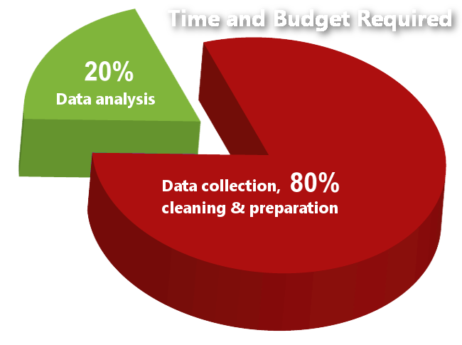

In this blog post, I am going to reflect on my **first ever data science internship**!

But before we start what is data science really? Data Science is a buzz word that has been increasingly (mis)used over the years. It is a really broad term and, at first glance, not very tangible. Under the umbrella term Data Scientist fall job titles such as Data Analyst, Data Engineer, Machine Learning Engineer, and now I am going to throw a weird one in so pay attention. Statistician. You can go ahead and look up what all of these job descriptions demand but ultimately, the biggest take away is that Data Scientists are people who work with data (duh!).

So what am I going to cover?

* I am going to talk about what I have larned in the first three months of my data science internship
* What I wished I had known before starting my data science internship
* Some advice to students wanting to pursue a data science internship

Let's get started!

### What I Have Learned in My Data Science Internship

I am a third-year Statistic major doing my data science internship at the BC Cancer Agency where we analyze data of cancer patients. I am working on a project where we assess whether women with a certain type of Endometrial Cancer need treatment or if they are doing fine without any treatment. We are doing this in form of a meta-analysis of individual patient data. As a quick explanation, a meta-analysis of individual patient data is data that is being collected from various publications and then combined into a big data set ready for analysis. The data we have collected/requested from different parts of the world looks very untidy with lots of missing values. So, the first thing I did was read papers that are associated with the data we have collected and comparing it to our data set. Through this, we could improve our data and replace missing values with real ones.

The next thing I did was create a summary statistics table stratified by the different places (11 places in total) from where we acquired the data. It took me a few days to assess all the available summary statistics packages that would let you create a table stratified by the factor levels of a particular column. I went through a lot of documentation, appreciated well written vignettes, tried a lot, and finally created the table I needed. After that, I conducted an explanatory data analysis and again, compared, with visualizations, the data from the different locations. All of the findings I gathered, supported me in assessing the biases of the data. I could see clear differences in how the data was collected, which data points were prevalent, and how all of this could affect our analysis. I reported the findings to my supervisor and we are currently right in our analysis.

The table was created by the arsenal package and shows the summary statistics of the gapminder data set in the gapminder library stratified by continent.

### What I Wished I Had Known for My Data Science Internship

The beginning of a new job is usually rocky and there are a few things I wished I had known before I started. The first thing is Git. Git is not hard to pick up but I wished I had known before how to use it, and how to use it efficiently. In particular, the branching process is very tricky and it can become rather complicated and messy very fast. Especially, when it comes to merging conflicts. Fortunately, my supervisor requested me to present [Gitflow](https://jeffkreeftmeijer.com/git-flow/) in one of our meetings to make the workflow in our team standardised and straight forward. This was a good way for me to dive deeper into Git and to improve my understanding of it.

As a Statistics major and Economics minor, I also wished I had more exposure to more coding and Computer Science courses. Having yet to take my two lower division Computer Science requirements, I wished my knowledge about writing functions and making even the most complicated code readable with a clean function is something I wished I was better at. Writing basic If/Else statements and For loops is something I can do, but I am new when it comes to algorithmic thinking, which is often a necessary skill in the industry.

### Advice to Students Wanting to Land a Data Science Internship

My first advice to students who want to do an internship as a Data Scientist is to have at least the fundamentals down for Computer Science and Statistics. You do not have to have a ton of experience, and 3-4 undergraduate courses in each discipline gets you very far. You can easily pick up what you need on the job with one semester's worth of Computer Science courses. My next advice is to be familiar with Git and the Command Line. Know at least how commit, push, create a new branch, and create branches off of other ones. If you are good with the Command Line you can easily navigate through files, and use Git or Docker in there. Everything which will make your life easier.

Another necessity is to be familiar with at least one programming language. At the BC Cancer Agency, we use mostly R. I personally learned R through some data analysis that I did on [Kaggle](https://www.kaggle.com/), [Data Camp](https://www.datacamp.com/), books and courses. Within your Statistics degree, you learn how to do statistics in R. However, you are not being taught how to use R as a coder. Hence, your code can get messy as you are not trained to make your code efficient, readable, and well structured. So, if you are like me and have not had exposure to computer science, you can go on [Coursera](https://www.coursera.org/) or an algorithm site such as [Project Euler](https://projecteuler.net/) in order to become a better coder. If you have not had a lot of exposure to R and computer science, then I strongly recommend [Data Camp](https://www.datacamp.com/) or [R for Data Science](https://www.amazon.ca/Data-Science-Transform-Visualize-Model/dp/1491910399/ref=sr_1_1?ie=UTF8&qid=1532318545&sr=8-1&keywords=r+for+data+science), as they require no prior programming knowledge and will jump-start your familiarity with R and Data Science.

R Studio

In conclusion, I am happy with my data science internship so far and I learned a lot of new things. It helps that one of my co-workers is a Computer Science student and that I can always turn to him to get help. I was also exposed to some new technology at my workplace that I want to implement in my workflow very soon such as Docker. Work is very different from university and therefore, an internship as a data scientist is a great learning experience. I encourage everyone to do it!

Thanks for reading the post and when you are interested why I switched from an Economics to a Statistics major, you can check it out [here](http://thatdatatho.com/2018/05/21/switching-economics-major-statistics-major/.

Other interesting articles about data science interships can be found [here](https://towardsdatascience.com/my-first-data-scientist-internship-7f7aa2ee4040) and [here](https://www.linkedin.com/pulse/bittersweet-experience-nationwide-data-science-intern-akosa/).