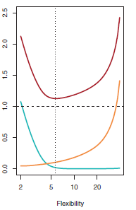
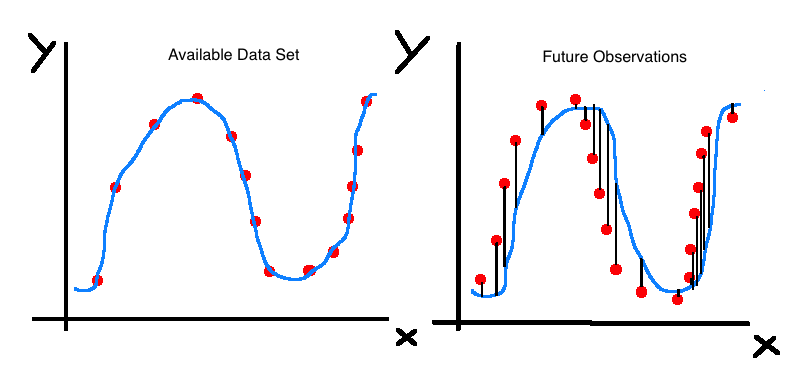

Untitled
================
Pascal Schmidt
October 8, 2018

In this blog post, we are explaining the **bias-variance trade-off** in machine learning.

In this post, we went over the definition of bias and talked about bias (systematic error) and consistency (random error). I would highly recommend you checking it out since it makes it much easier to understand the **bias-variance trade-off**.

When explaining the bias-variance trade-off in machine learning we often talk about the importance of model building when wanting to achieve high accuracy (predictability). We always aspire the lowest test set error which will occur when finding the right balance between bias and variance for our model. When talking about bias and variance we also must talk about **overfitting**, since these two concepts are highly interconnected.

What we are going to cover:

-   Do we want to **explain** or do we want to **predict**? It is very important to know your intentions. If you want a model that explains well you'll deal differently with the bias-variance trade-off in comparison to if you want to predict.
-   Explaining the bias-variance trade-off in machine learning and how it is related to the test set error.
-   What role does overfitting play in explaining the bias-variance trade-off in machine learning?
-   How to avoid overfitting in statistical modelling?

So let's get started!

### To Explain or to Predict?

#### Explanatory Modelling

There are two ways how we can approach modelling. One way is to build a model that explains well and the other one is to build a model that predicts well. Explanatory models use statistical models for testing a causal explanation. In such models, a set of underlying features that are measured by variables *X* are assumed to cause an underlying effect, measured by variable *Y*. So, researchers come up with a causal hypothesis that they want to test. For example: "by reading this blog post, you will become a more knowledgeable Data Scientist". The aim of the final model is to find the explanatory variables that support the hypothesis or not. Maybe, if you are reading this blog post, you are also reading other blog posts. In addition to that, you are very curious and willing to learn so you also read books and watch videos about machine learning. These variables are all correlated with becoming a more knowledgeable Data Scientists. So, in conclusion, we want to know whether reading this blog post is an explanation of becoming a more knowledgeable Data Scientists or whether other variables explain this causal relationship. It is all about explaining what causes more knowledgeable Data Scientists and not about predicting the amount of knowledge a certain Data Scientist has.

#### Predictive Modelling

Predictive models have the purpose of predicting future observations. The goal of these models is to predict the output value *Y* for new observations given their input value *X*. Predictive models are often treated as a black box where we do not care about the input or the shape of the input. We are only interested in how accurate our black box algorithm can predict. Predictive modelling is not purposeful for explaining causal relationships because we are often blind to our input variables..

In summary, in explanatory models $\\hat{f}$ represents an underlying causal function, where *X* is assumed to cause *Y*. In predictive models $\\hat{f}$ captures the association between *X* and *Y*. However, direct interoperability is not required (although desirable).

### Explaining The Bias-Variance Trade-Off in Machine Learning for Explanatory- and Predictive Models

Let's have a look at the bias-variance formula:

$E(Y-\\hat{Y}) = E\[f(x) + \\epsilon - \\hat{f}(x)\]^2$

$= \[f(x) - \\hat{f}(x)\]^2 + var(\\epsilon)$

$= Var(Y) + Bias^2 + Var(\\hat{f})$

The first term is the error that is unavoidable (irreducible error). This error even exists when the model is correctly specified. The second term is the bias (systematic error). The definition of bias is "a deviation from the truth" which can't be eliminated by averaging many samples or many models. The third term is the estimation variance. This error can be eliminated by averaging many samples or many models.

Let's come back to explaining the bias-variance trade-off in machine learning with help of the equation. When you look at it, then it becomes clear what the difference between an explanatory- and predictive model is. For the explanatory model, the goal is to minimize the bias. We want to obtain the most accurate representation of the underlying theory. In contrast, when we are concerned with accuracy, then we want to minimize the combination of bias and variance. This is the so-called bias-variance trade-off. When we are interested in a predictive model, then we are not necessarily seeking a model that tells the truth (no bias). We will happily accept a slightly wrong model (increase in bias) as long as it minimizes the test set error.

In Galit Shmueli's paper "To Explain or To Predict", he has provided an example where a wrong model has better predictability than the right (true) model. This can occur with very noisy data, when the predictors are correlated (multicollinearity), or when the sample size is small.

In summary, when we want to investigate a causal hypothesis we want to reduce the bias as much as possible and find the true model. However, when we are interested in a predictive model, we want to minimize the test set error by finding the right amount of bias and variance.

### How is the Bias Variance Trade-Off Related to the Test Set Error?

As already mentioned in the above paragraph, the bias variance trade-off is only interesting for predictive modeling. When we are interested in predictions, we always want to achieve the highest accuracy or equivalently minimize the test set error. In order to achieve that we often sacrifice finding the true model for an increase in accuracy.

Here is a visualization from the book "An Introduction to Statistical Learning" which is explaining the bias-variance trade-off in machine learning very well.

On the y-axis we have the test mean squared error and, on the x-axis, we have the model flexibility. The blue curve represents the squared bias, the orange curve represents the variance, the red curve represents the mean squared error. The dashed line represents the irreducible error. When we have a very inflexible model, then we have a low variance for future observations but a high bias. On the other hand, we can trade in variance for bias. So, the more flexible our model is, the less biased it is. However, the variance becomes very high. Consequently, we have to find the right amount of bias and variance, which minimizes our test set error. It is often not possible to observe the true test set error and that's why the bias variance trade-off is so often discussed in machine learning.

### Explaining the Bias-Variance Trade-off in Machine Learning in Context of Overfitting

For me it was very hard to grasp the intuition behind overfitting even though it is such a simple concept in machine learning. It was not until someone showed me these graphs until I understood what is meant by this concept.

In the first plot we see the true shape of the data set. We built a model (looks like a cubic polynomial), which perfectly fits the data. The model we built has zero bias because the line goes perfectly through all the dots. We captured the true shape perfectly! In both plots our bias is basically zero. Remember that bias means deviation from the truth. The blue shaped curve is almost identical to the shape which the dots form even though it does not directly go through them. Because of the low bias however, our model has a crazy amount of variance as we can see in the right-hand plot. In this one, we are using our model to predict future data and are getting a large variance because our future data deviates a little from our original data set.

Let's come back to explanatory- and predictive models. Now we see again why we don't care about the bias-variance trade-off in machine learning when we want to explain. In both plots, the line perfectly describes the relationship between *X* and *Y*. In both plots, the true shape is a cubic spline and we see the "causal" relationship between *X* and *Y* in both plots. However, when we want to predict, the error bars are very large for the second plot (we have overfitted). Hence, the [bias-variance trade-off](https://arxiv.org/pdf/1101.0891.pdf) matters for predictive models.

The plots above show a model that is less flexible and where we did not overfit. Our model suffers from bias because it does not capture the true shape of our data. However, on the right-hand side we can see that the variance is definitely lower than in our first plot. Hence, we will achieve higher predictability because of a better bias-variance trade-off choice. On the other hand, the model we used in these plots do not describe the relationship between *X* and *Y* very well. Consequently, once more, the bias variance trade-off is irrelevant for explanatory models.

### How to Achieve the Right Bias Variance Trade-Off

In order to achieve a good bias-variance ratio, several shrinkage methods have been developed. For example, ridge regression, the lasso, principal components regression, and partial least squares regression. These methods shrink the coefficients (bias the estimates) in order to reduce variance. Then there are also ensemble methods such as bagging, boosting, random forests. These methods combine multiple models to produce more precise predictions by averaging predictions from different models.

Explaining the bias-variance trade-off in machine learning is something that has multiple layers. Understanding explanatory models and predictive models is an important prerequisite. It also helps to understand overfitting in order to grasp the concept better.

I hope you have enjoyed this blog post. If you liked it, you might also be interested in the [Parsimony versus Accuracy](http://thatdatatho.com/2018/03/26/how-important-is-parsimony-versus-accuracy/) blog post.

Here is a link to a fantastic paper which explains the [bias variance trade-off](https://arxiv.org/pdf/1101.0891.pdf) and also explanatory- and predictive models.
