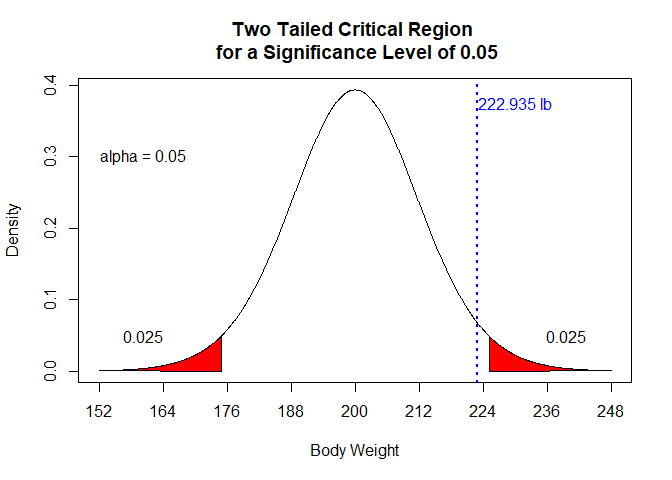

What is a P-Value
================
Pascal Schmidt
January 22, 2018

In all introductory statistics courses, p-values are easily calculated and reported. But was is a p-value really? A p-value is rarely understood properly, despite its common use in hypothesis testing. So, in this doument, I will try my best to remove common misunderstandings and will try to actually answer the question: "what is a p-value".

This blog post got greatly inspired by [this](http://blog.minitab.com/blog/adventures-in-statistics-2/understanding-hypothesis-tests-significance-levels-alpha-and-p-values-in-statistics) phenomenal post about p-values.

What we are going to cover:

-   Definition of a p-value
-   Explaining the p-value in terms of hypothesis testing
-   Show you visualizations to easily make you understand a p-value
-   Interpretation of a p-value
-   Common misconceptions
-   Concluding thoughts on a p-value

### Definition of a p-value

A p-value is the probability of observing a test statistic as extreme or more extreme than the observed test statistic, given our null hypothesis is true (huh wait what….?).

Has this definition answered your question of "What is a p-value"? Probably not and I have to admit the definition is quite confusing. But well, at least we know now that it is a probability. So, let’s illustrate what it means with an example.

First, we need some data

``` r
library(plotrix)
```

    ## Warning: package 'plotrix' was built under R version 3.4.4

``` r
source(here::here("scripts/Setup_Pvalue.R"))

# calculating critical values
critical_region_two <- qt(c(.025, .975), df = 19)
critical_region_one <- qt(0.95, df = 19)
```

### Two Tailed Critical Region for a Significance Level of 0.05

``` r
deg_free <- length(weight_distribution) - 1
x <- seq(from = -4, to = 4, length.out = 1000)
y <- dt(x, df = deg_free)

plot(x, y, 
     type = "l", 
     xaxt = "n", 
     xlab = "Body Weight", ylab = "Density", 
     main = "Two Tailed Critical Region \n for a Significance Level of 0.05")

axis(1, 
     at = -4:4, 
     labels = c(152, 164, 176, 188, 200, 212, 224, 236, 248))

polygon(c(x[x >= critical_region_two[[2]]], critical_region_two[[2]]), 
        c(y[x >= critical_region_two[[2]]], 0), 
        col = "red")

polygon(c(x[x <= critical_region_two[[1]]], critical_region_two[[1]]), 
        c(y[x <= critical_region_two[[1]]], 0), 
        col = "red")


text(-3.3, 0.3, "alpha = 0.05", cex = 1)
text(-3.3, 0.05, "0.025", cex = 1)
text(3.3, 0.05, "0.025", cex = 1)
text(2.5, 0.375, paste0(mean_weight, " lb"), col = "blue")


t_test <- t.test(weight_distribution, mu = 200, alternative = "greater")
abline(v = t_test$statistic[[1]], col = "blue", lwd = 2, lty = 3)
```



### One Tailed Critical Region for a Significance Level of 0.05

``` r
x <- seq(from = -4, to = 4, length.out = 1000)
y <- dt(x, df = deg_free)

plot(x, y, 
     type = "l", 
     xaxt = "n", xlab = "Body Weight", ylab = "Density", 
     main = "One Tailed Critical Region \n for a Significance Level of 0.05")

axis(1, 
     at = -4:4, 
     labels = c(152, 164, 176, 188, 200, 212, 224, 236, 248))

polygon(c(x[x >= critical_region_one], critical_region_one), 
        c(y[x >= critical_region_one], 0), 
        col = "red")

text(-3.3, 0.3, "alpha = 0.05", cex = 1)
text(3.3, 0.05, "0.05", cex = 1)
text(2.5, 0.375, paste0(mean_weight, " lb"), col = "blue")

abline(v = t_test$statistic[[1]], col = "blue", lwd = 2, lty = 3)
```


### The P-Value for our sample

``` r
x <- seq(from = -4, to = 4, length.out = 1000)
y <- dt(x, df = deg_free)

plot(x, y, 
     type = "l", 
     xaxt = "n", xlab = "Body Weight", ylab = "Density", 
     main = "The P-Value for our sample mean")

axis(1, 
     at = -4:4, 
     labels = c(152, 164, 176, 188, 200, 212, 224, 236, 248))

polygon(c(x[x >= t_test$statistic[[1]]], t_test$statistic[[1]]), 
        c(y[x >= t_test$statistic[[1]]], 0), 
        col = "red")

p_value <- round(t_test$p.value, 5)
text(3.3, 0.05, p_value, cex = 1)
text(2.5, 0.375, paste0(mean_weight, " lb"), col = "blue")

abline(v = t_test$statistic[[1]], col = "blue", lwd = 2, lty = 3)
```


### One Tailed Critical Region for a Significance Level of 0.01

``` r
critical_region <- qt(0.99, df = deg_free)

x <- seq(from = -4, to = 4, length.out = 1000)
y <- dt(x, df = deg_free)

plot(x, y, 
     type = "l", 
     xaxt = "n", 
     xlab = "Body Weight", ylab = "Density", 
     main = "One Tailed Critical Region \n for a Significance Level of 0.01")

axis(1, 
     at = -4:4, 
     labels = c(152, 164, 176, 188, 200, 212, 224, 236, 248))

polygon(c(x[x >= critical_region], critical_region), 
        c(y[x >= critical_region], 0), 
        col = "red")

p_value_critical <- round(critical_region * (std.err_weight/sqrt(length(weight_distribution))) + mean_weight, 5)
text(-3.3, 0.3, "alpha = 0.01", cex = 1)
text(3.3, 0.05, "0.01", cex = 1)
text(1.4, 0.375, paste0(mean_weight, " lb"), col = "blue")
text(3.25, 0.2, p_value_critical, col = "black")

abline(v = critical_region, col = "black", lwd = 2, lty = 3)
abline(v = t_test$statistic[[1]], col = "blue", lwd = 2, lty = 3)
```


