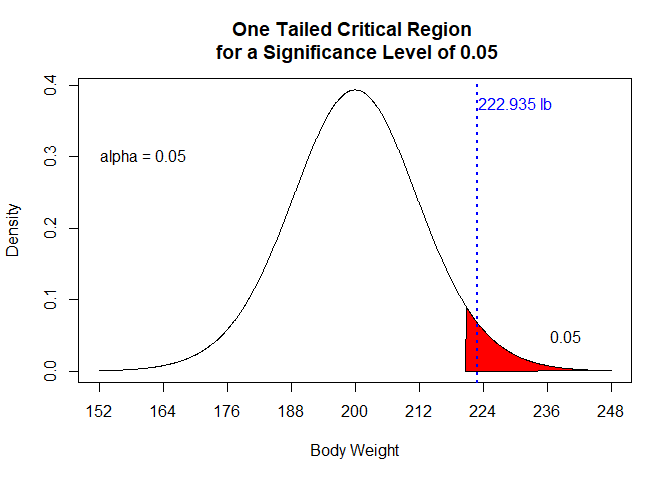
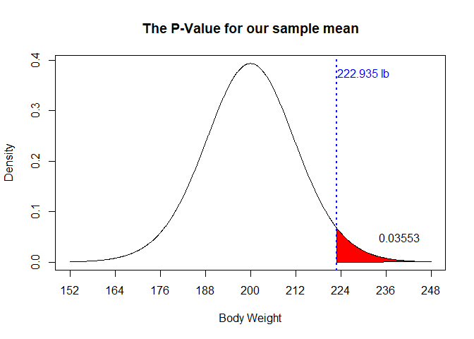
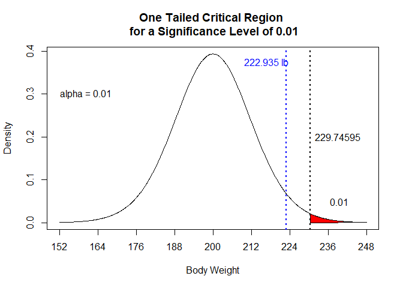

What is a P-Value
================
Pascal Schmidt
January 22, 2018

In all introductory statistics courses, p-values are easily calculated and reported. But was is a p-value really? A p-value is rarely understood properly, despite its common use in hypothesis testing. So, in this doument, I will try my best to remove common misunderstandings and will try to actually answer the question: "what is a p-value".

This blog post got greatly inspired by [this](http://blog.minitab.com/blog/adventures-in-statistics-2/understanding-hypothesis-tests-significance-levels-alpha-and-p-values-in-statistics) phenomenal post about p-values.

What we are going to cover:

-   Definition of a p-value
-   Explaining the p-value in terms of hypothesis testing
-   Show you visualizations to easily make you understand a p-value
-   Interpretation of a p-value
-   Common misconceptions
-   Concluding thoughts on a p-value


### Definition of a p-value

> A p-value is the probability of observing a test statistic as extreme or more extreme than the observed test statistic, given our null hypothesis is true (huh wait what….?).

Has this definition answered your question of "What is a p-value"? Probably not and I have to admit the definition is quite confusing. But well, at least we know now that it is a probability. So, let’s illustrate what it means with an example.

``` r
library(plotrix)
source(here::here("scripts/Setup_Pvalue.R"))

# calculating critical values
critical_region_two <- qt(c(.025, .975), df = 19)
critical_region_one <- qt(0.95, df = 19)
```

### Illustrating the P-Value With the Help of an Example

Suppose we are interested in the mean body weight of a football team after the Christmas break. Specifically, the coach is concerned that his players enjoyed the holiday meals too much and have gained weight.

Before the Christmas holidays, the football team is in great shape. Therefore, the coach hypothesized the mean body weight to be 200 pounds. He is sampling 20 players of the football team. Afterwards, he calculates a sample mean of 222.935 pounds and a standard error of 11.99436 pounds. Now the coach wants to know if the sample mean of 222.935 pounds indicates that his players have significantly gained weight over the Christmas holidays.

Next, we must choose a significance level and we usually choose a level α of 0.05 (5%). We can interpret alpha as the probability of rejecting our null hypothesis even though it is true. So, for our example that means that the coach concludes that his players have gained a lot of weight over the holidays, even though his players took care of their bodies and did not gain weight at all! The significance level α is the probability of this error.

### Two Tailed Critical Region for a Significance Level of 0.05

``` r
deg_free <- length(weight_distribution) - 1
x <- seq(from = -4, to = 4, length.out = 1000)
y <- dt(x, df = deg_free)

plot(x, y, 
     type = "l", 
     xaxt = "n", 
     xlab = "Body Weight", ylab = "Density", 
     main = "Two Tailed Critical Region \n for a Significance Level of 0.05")

axis(1, 
     at = -4:4, 
     labels = c(152, 164, 176, 188, 200, 212, 224, 236, 248))

polygon(c(x[x >= critical_region_two[[2]]], critical_region_two[[2]]), 
        c(y[x >= critical_region_two[[2]]], 0), 
        col = "red")

polygon(c(x[x <= critical_region_two[[1]]], critical_region_two[[1]]), 
        c(y[x <= critical_region_two[[1]]], 0), 
        col = "red")


text(-3.3, 0.3, "alpha = 0.05", cex = 1)
text(-3.3, 0.05, "0.025", cex = 1)
text(3.3, 0.05, "0.025", cex = 1)
text(2.5, 0.375, paste0(mean_weight, " lb"), col = "blue")


t_test <- t.test(weight_distribution, mu = 200, alternative = "greater")
abline(v = t_test$statistic[[1]], col = "blue", lwd = 2, lty = 3)
```



The above probability distribution plot shows the distribution we would obtain if the null hypothesis is true. We have also shaded the critical regions in red and each area has a probability of 0.025.

Notice however, that in our example, we are interested in a one sample t-test. Consequently, only large positive values of t are considered “extreme” and supportive of our alternative hypothesis. The alternative hypothesis says that players have gained a significant amount of weight. The graph below shows the critical region only in the right tail, which has now a probability of 0.05.

### One Tailed Critical Region for a Significance Level of 0.05

``` r
x <- seq(from = -4, to = 4, length.out = 1000)
y <- dt(x, df = deg_free)

plot(x, y, 
     type = "l", 
     xaxt = "n", xlab = "Body Weight", ylab = "Density", 
     main = "One Tailed Critical Region \n for a Significance Level of 0.05")

axis(1, 
     at = -4:4, 
     labels = c(152, 164, 176, 188, 200, 212, 224, 236, 248))

polygon(c(x[x >= critical_region_one], critical_region_one), 
        c(y[x >= critical_region_one], 0), 
        col = "red")

text(-3.3, 0.3, "alpha = 0.05", cex = 1)
text(3.3, 0.05, "0.05", cex = 1)
text(2.5, 0.375, paste0(mean_weight, " lb"), col = "blue")

abline(v = t_test$statistic[[1]], col = "blue", lwd = 2, lty = 3)
```



In our example, our sample mean weight falls in the critical rejection region. Therefore, the coach is rejecting the null hypothesis. He concludes that the sample body weight mean of 222.935 pounds is statistically significant at the 0.05 level. We have obtained a value that is considered extreme. It falls into the critical region that is shaded in red and is therefore supportive of our alternative hypothesis.

### The P-Value for our sample

``` r
x <- seq(from = -4, to = 4, length.out = 1000)
y <- dt(x, df = deg_free)

plot(x, y, 
     type = "l", 
     xaxt = "n", xlab = "Body Weight", ylab = "Density", 
     main = "The P-Value for our sample mean")

axis(1, 
     at = -4:4, 
     labels = c(152, 164, 176, 188, 200, 212, 224, 236, 248))

polygon(c(x[x >= t_test$statistic[[1]]], t_test$statistic[[1]]), 
        c(y[x >= t_test$statistic[[1]]], 0), 
        col = "red")

p_value <- round(t_test$p.value, 5)
text(3.3, 0.05, p_value, cex = 1)
text(2.5, 0.375, paste0(mean_weight, " lb"), col = "blue")

abline(v = t_test$statistic[[1]], col = "blue", lwd = 2, lty = 3)
```



With our interpretation in mind and with respect to our example, the p-value of 0.03553 (3.553%) is the probability of observing a sample mean that is at least as extreme as our sample bodyweight average of 222.935 pounds given that our population mean is 200 pounds (when our null hypothesis is true). Meaning, with a probability of 0.03553 (3.553%) we are observing sample means of 222.935 pounds or greater if the population mean is 200 pounds. **This is our p-value**.

### A Common Misinterpretation on the Coach's Side

The coach concludes that the p-value of 0.03553 is the probability that the null hypothesis is true. Therefore, he thinks that the probability of his team still having a mean body weight of 200 pounds is very small (3.553%). However, this is not true. He hypothesized a population mean weight of 200 pounds. The probability attached to the weight actually being 200 pounds (null hypothesis being true) can be interpreted as the coach's belief that the null hypothesis is true. To illustrate that thought further, the population mean weight of the football team could actually be 210 pounds or 195 pounds. The 200 pounds is only the coaches hypothesized value that he chose.He could have chosen any other weight he believed is the true mean body weight of his team.

### The Right Conclusion of the P-Value

The Coach can either conclude that he did not know his team very well and therefore, his hypothesized value of 200 pounds is wrong. On the other hand, the Coach can conclude that the sample he took was a “bad sample”. However, considering our small p-value there is a very low probability of obtaining such a “bad sample”. Therefore, the coach should conclude that his hypothesized value of 200 pounds was wrong.

Thank you for reading this blog post. I hope I have answered the question of "what is a p-value" so you'll feel more comfortable for your next statistics exam.

If you are still confused and want to find out more about p-values check out these posts or leave a comment below.

[P-values in statistical hypothesis tests](http://www.statisticshowto.com/p-value/)

[University of Alberta explains what a p-value is](http://www.stat.ualberta.ca/~hooper/teaching/misc/Pvalue.pdf)

### One Tailed Critical Region for a Significance Level of 0.01

``` r
critical_region <- qt(0.99, df = deg_free)

x <- seq(from = -4, to = 4, length.out = 1000)
y <- dt(x, df = deg_free)

plot(x, y, 
     type = "l", 
     xaxt = "n", 
     xlab = "Body Weight", ylab = "Density", 
     main = "One Tailed Critical Region \n for a Significance Level of 0.01")

axis(1, 
     at = -4:4, 
     labels = c(152, 164, 176, 188, 200, 212, 224, 236, 248))

polygon(c(x[x >= critical_region], critical_region), 
        c(y[x >= critical_region], 0), 
        col = "red")

p_value_critical <- round(critical_region * (std.err_weight/sqrt(length(weight_distribution))) + mean_weight, 5)
text(-3.3, 0.3, "alpha = 0.01", cex = 1)
text(3.3, 0.05, "0.01", cex = 1)
text(1.4, 0.375, paste0(mean_weight, " lb"), col = "blue")
text(3.25, 0.2, p_value_critical, col = "black")

abline(v = critical_region, col = "black", lwd = 2, lty = 3)
abline(v = t_test$statistic[[1]], col = "blue", lwd = 2, lty = 3)
```


