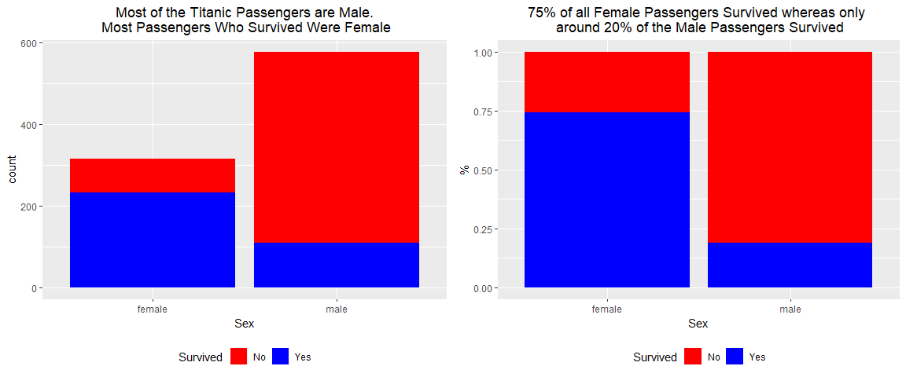
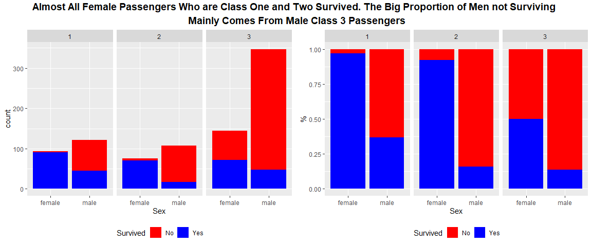
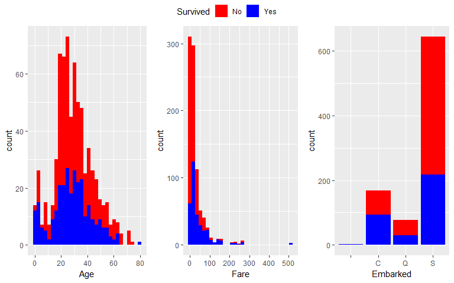
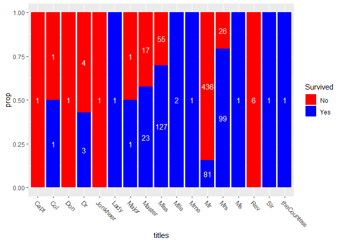
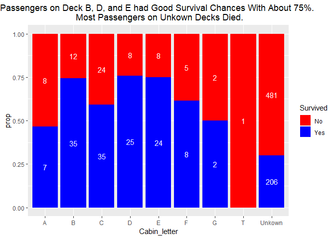
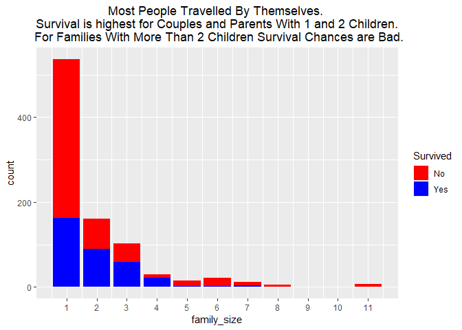
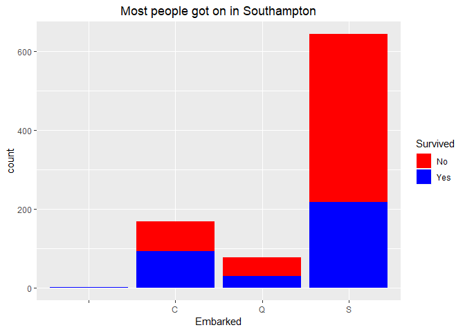
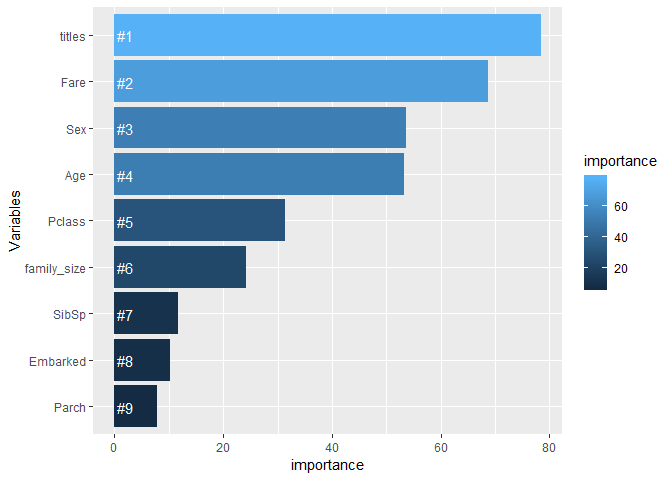
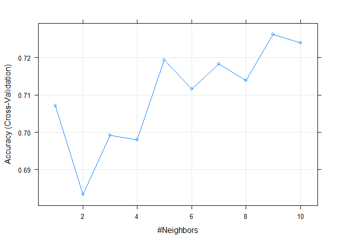

Titanic
================
Pascal Schmidt
August 26, 2018

The Titanic data set is said to be the starter for every aspiring data scientist. So it was that I sat down two years ago, after having taken an econometrics course in university which introduced me to R, thinking to give the competition a shot. My goal was to achieve an accuracy of 80% or higher. Boy was I wrong! My first try in this competition ended up with me producing some tables (with the table() function) and trying to solve the challenge with a linear regression model :) :) :). In short, I missinterpreted what the data science community meant by "a competition for beginners". Now, two years later, I again tried my luck. Knowing about terms like training and testing data sets, overfitting, cross-validation, bias-variance trade-off, regular expressions, and about different classification models makes me hopefully better prepared this time. After almost having completed a Statistics degree, countless hours on coursera, data camp and stackoverflow, and after having a data science internship under my belt I finally declare myself a "beginner" in the data science community and ready for the competition.

Long story short, don't be discouraged if you hear the words "beginner competition", but are not yet able to understand everything or produce the results other people showcase in their kernels.

This blog post is an attempt to make the competition more accessible to beginners. Throughout the post, I am explaining my code and why I do things the way I do. Let's junp right into it.

What I am going to cover in this blog:

-   An exploratory data analysis with ggplot and dplyr
-   Feature Engeneering for some variables
-   Dealing with missing values
-   Model Building
-   Model Evaluation

In the end, I am ending up with a score of 79.5%. Pretty dissappointing for me and I didn't achieve my initial goal of 80%. This is why in the second part of this tutorial, I evaluated the so called gender model with which I achieved a score of 81.82%.

First, we are loading the libraries we need.The tidyverse consists of various packages (dplyr, ggplot, etc.) and is perfect for data manipualtions. The ggbubr package is nice for visualizatons and gives us some extra flexibility. The arsenal package is for easily creating some nice loking tables. The other packages are for building predictive models.

After having loaded the packages, we are loading in the data sets. In order to rbind() them, the train and test data sets have to have equivalent columns. That is why I am creating the `Survived` column in the test data set. After that, I am transforming some variables with mutste() to characters and factors.

``` r
library(tidyverse)
library(ggpubr)
library(arsenal)
library(pander)
library(here)
library(caret)
library(class)
library(MASS)
library(randomForest)
library(knitr)

train <- read.csv(here::here("docs", "train.csv"))
test <- read.csv(here::here("docs", "test.csv"))
test$Survived <- NA
titanic <- rbind(train, test) # combining data sets

titanic %>%
  dplyr::mutate(
    Name = as.character(Name),
    Ticket = as.character(Ticket),
    Cabin = as.character(Cabin),
    Survived = as.factor(Survived),
    Pclass = as.factor(Pclass)
  ) -> titanic
```

Exploratory Data Analysis of Titanic Variables
==============================================

### Investigating Gender

For all my plots, I am using ggplot. If you are unfamiliar with the syntax, the R for data science book, data camp, and the ggplot cheat sheet are great resources which you can refer to.

``` r
plot_count <- ggplot(titanic[1:891, ], aes(x = Sex, fill = Survived)) +
  geom_bar() +
  scale_fill_manual(
    name = "Survived",
    values = c("red", "blue"),
    labels = c("No", "Yes"),
    breaks = c("0", "1")
  ) +
  ggtitle("Most of the Titanic Passengers are Male.\n Most Passengers Who Survived Were Female") +
  theme(
    plot.title = element_text(hjust = 0.5),
    legend.position = "bottom"
  )

plot_percent <- ggplot(titanic[1:891, ], aes(x = Sex, fill = Survived)) +
  geom_bar(position = "fill") +
  scale_fill_manual(
    name = "Survived",
    values = c("red", "blue"),
    labels = c("No", "Yes"),
    breaks = c("0", "1")
  ) +
  ggtitle("75% of all Female Passengers Survived whereas only \n around 20% of the Male Passengers Survived") +
  theme(
    plot.title = element_text(hjust = 0.5),
    legend.position = "bottom"
  ) +
  ylab("%")


ggarrange(plot_count, plot_percent)
```



It loks like most of the female titanic passengers survived and most of the male passengers survived. This becomes especially visible when looking at the percentages on the right plot. 75% of all female passengers survived whereas less than 25% of male passengers survived.

This is a very crucial finding and is also the key for the 81.82% success of the gender model I am discussing in part 2.

### Investigating Gender and Class

``` r
plot_count <- ggplot(titanic[1:891, ], aes(x = Sex, fill = Survived)) +
  geom_bar() +
  facet_wrap(~Pclass) +
  scale_fill_manual(
    name = "Survived",
    values = c("red", "blue"),
    labels = c("No", "Yes"),
    breaks = c("0", "1")
  ) +
  theme(legend.position = "bottom")

plot_percent <- ggplot(titanic[1:891, ], aes(x = Sex, fill = Survived)) +
  geom_bar(position = "fill") +
  facet_wrap(~Pclass) +
  scale_fill_manual(
    name = "Survived",
    values = c("red", "blue"),
    labels = c("No", "Yes"),
    breaks = c("0", "1")
  ) +
  theme(legend.position = "bottom") +
  ylab("%")

combined_figure <- ggpubr::ggarrange(plot_count, plot_percent)
ggpubr::annotate_figure(combined_figure,
  top = text_grob("Almost All Female Passengers Who are Class One and Two Survived. The Big Proportion of Men not Surviving \n Mainly Comes From Male Class 3 Passengers",
    color = "black",
    face = "bold",
    size = 14
  )
)
```



Next, we'll have a look at the passenger class. Almost all female passengers in classes 1 and 2 survived whereas for male, the passenger class is not a great predictor for survival. This is because regardless of class, male passengers do not really seem to benefit much from being in higher classes.

``` r
plot_age <- ggplot(titanic[1:891, ], aes(x = Age, fill = Survived)) +
  geom_histogram() +
  scale_fill_manual(
    name = "Survived",
    values = c("red", "blue"),
    labels = c("No", "Yes"),
    breaks = c("0", "1")
  ) +
  theme(legend.position = "bottom")

plot_fare <- ggplot(titanic[1:891, ], aes(x = Fare, fill = Survived)) +
  geom_histogram() +
  scale_fill_manual(
    name = "Survived",
    values = c("red", "blue"),
    labels = c("No", "Yes"),
    breaks = c("0", "1")
  ) +
  theme(legend.position = "bottom")

plot_embarked <- ggplot(titanic[1:891, ], aes(x = Embarked, fill = Survived)) +
  geom_bar() +
  scale_fill_manual(
    name = "Survived",
    values = c("red", "blue"),
    labels = c("No", "Yes"),
    breaks = c("0", "1")
  ) +
  theme(legend.position = "bottom")

ggpubr::ggarrange(plot_age, plot_fare, plot_embarked, common.legend = TRUE, ncol = 3)
```



-   For the age variable, we can see that younger children are more likely to survive. From around 0 - 10, the survival chances are pretty good.

-   There are a lot of fares that cost around $10. People who paid this amount had really bad survival chances. It seems like the more expensive the fare, the better the survival chances are.

-   The second plot shows where people embarked. This plot does not say a lot about survival. We can see however, that we have some missing values there and most people came on board in S which stands for Southampton.

### Investigating The Titles of Passengers

Next, wed do some feature engeneering. This means, we are deriving new variables which have more explanatory power in predicting who survied and died from already existing variables in the data set. Such a variable is `Names` for example. In order to that, it is advantageous to have some basic understanding of regular expressions. When I first looked at other people's kernels, I had no idea how they got the titles out of the name variable. The code looks pretty complicated and it takes some time to get used to regular expressions.

``` r
head(titanic$Name) %>%
  pander::pandoc.table()
```

<table>
<caption>Table continues below</caption>
<colgroup>
<col width="32%" />
<col width="36%" />
<col width="30%" />
</colgroup>
<tbody>
<tr class="odd">
<td align="center">Braund, Mr. Owen Harris</td>
<td align="center">Cumings, Mrs. John Bradley (Florence Briggs Thayer)</td>
<td align="center">Heikkinen, Miss. Laina</td>
</tr>
</tbody>
</table>

<table style="width:100%;">
<colgroup>
<col width="40%" />
<col width="35%" />
<col width="23%" />
</colgroup>
<tbody>
<tr class="odd">
<td align="center">Futrelle, Mrs. Jacques Heath (Lily May Peel)</td>
<td align="center">Allen, Mr. William Henry</td>
<td align="center">Moran, Mr. James</td>
</tr>
</tbody>
</table>

When we look at the output of the head function, then we see that for every passenegr name starts with their last name, followed by a comma, followed by their title with a dot, and then their first names. We are going to extract the title with the gsub() function.

Here is a little working example.In order to extract the title of my name from the string below we are saying that everything before and including the comma should be removed and then everything after and including the dot should be removed as well.

``` r
x <- "Schmidt, Mr. Pascal David Fabian"
```

We do that with the code below. The .\*, means we remove everything before the comma. The comma (,) is a special character and therefore, we need these two backward slashes (\\) in front of the comma. Then we have the "or" (|) bar. After that we need the two backward slashes again because the literal dot after the titles is also a special character. Then we say remove everything after the dot again. So what we are doing is replacing "Schmidt, " with nothing and then " Pascal David Fabian" with nothing as well. And voila, we are left with the title only.

``` r
gsub("(.*\\,|\\..*)", "", x) %>%
  gsub("[[:space:]]", "", .)
```

    ## [1] "Mr"

We do that for the entire Name vector, saving the titles in the `titles` object and then displaying how many titles there are with the table() function.

``` r
titanic$titles <- gsub("(.*\\,|\\..*)", "", titanic$Name) %>%
  gsub("[[:space:]]", "", .)
table(titanic$titles) %>%
  pander::pandoc.table(split.table = Inf)
```

<table>
<colgroup>
<col width="5%" />
<col width="4%" />
<col width="4%" />
<col width="5%" />
<col width="3%" />
<col width="8%" />
<col width="5%" />
<col width="6%" />
<col width="7%" />
<col width="5%" />
<col width="5%" />
<col width="4%" />
<col width="4%" />
<col width="4%" />
<col width="3%" />
<col width="4%" />
<col width="4%" />
<col width="10%" />
</colgroup>
<thead>
<tr class="header">
<th align="center">Capt</th>
<th align="center">Col</th>
<th align="center">Don</th>
<th align="center">Dona</th>
<th align="center">Dr</th>
<th align="center">Jonkheer</th>
<th align="center">Lady</th>
<th align="center">Major</th>
<th align="center">Master</th>
<th align="center">Miss</th>
<th align="center">Mlle</th>
<th align="center">Mme</th>
<th align="center">Mr</th>
<th align="center">Mrs</th>
<th align="center">Ms</th>
<th align="center">Rev</th>
<th align="center">Sir</th>
<th align="center">theCountess</th>
</tr>
</thead>
<tbody>
<tr class="odd">
<td align="center">1</td>
<td align="center">4</td>
<td align="center">1</td>
<td align="center">1</td>
<td align="center">8</td>
<td align="center">1</td>
<td align="center">1</td>
<td align="center">2</td>
<td align="center">61</td>
<td align="center">260</td>
<td align="center">2</td>
<td align="center">1</td>
<td align="center">757</td>
<td align="center">197</td>
<td align="center">2</td>
<td align="center">8</td>
<td align="center">1</td>
<td align="center">1</td>
</tr>
</tbody>
</table>

After that, we are going to do some visualizations. Of course in ggplot again!

``` r
title_sum <- titanic[1:891, ] %>%
  dplyr::group_by(titles, Survived) %>%
  dplyr::summarise(freq = n()) %>%
  ungroup() %>%
  dplyr::mutate(
    total = sum(freq),
    prop = freq / total
  )

titles <- ggplot(title_sum, aes(x = titles, y = prop, group = Survived)) +
  geom_col(aes(fill = Survived), position = "fill") +
  geom_text(aes(label = freq), position = position_fill(vjust = .5), col = "white") +
  scale_fill_manual(
    name = "Survived",
    values = c("red", "blue"),
    labels = c("No", "Yes"),
    breaks = c("0", "1")
  ) +
  theme(
    plot.title = element_text(hjust = 0.5),
    axis.text.x = element_text(angle = -45, hjust = 0)
  )

titles
```



We do some data manipulation with dplyr in order to see the percentage of survived versus died passengers for each unique title. Then we are plotting. Aouch, a lot of misters died! Wow that's actually quite interesting. Mrs, and Miss does pretty well. So let's group some of the titles together. We do that with the code below.

``` r
titanic$titles[titanic$titles %in% c("Lady", "theCountess", "Dona", "Jonkheer", "Don", "Sir", "Dr")] <- "Rare Titles"
titanic$titles[titanic$titles %in% c("Ms", "Mme", "Mlle")] <- "Mrs"
titanic$titles[titanic$titles %in% c("Capt", "Col", "Major", "Rev")] <- "Officers"
titanic$titles <- as.factor(titanic$titles)
summary(arsenal::tableby(Survived ~ titles,
                         data = titanic,
                         test = FALSE,
                         total = FALSE
))
```

|                |  0 (N=549)  |  1 (N=342)  |
|:---------------|:-----------:|:-----------:|
| **titles**     |             |             |
|    Master      |  17 (3.1%)  |  23 (6.7%)  |
|    Miss        |  55 (10.0%) | 127 (37.1%) |
|    Mr          | 436 (79.4%) |  81 (23.7%) |
|    Mrs         |  26 (4.7%)  | 103 (30.1%) |
|    Officers    |   9 (1.6%)  |   2 (0.6%)  |
|    Rare Titles |   6 (1.1%)  |   6 (1.8%)  |

### Investigating the Cabin Numbers

A lot of cabin numbers are missing. This is really unforunate because I think based on the viualization, our final model could have improved from the correct cabin numbers of every single passenger.

``` r
titanic$Cabin_letter <- substr(titanic$Cabin, 1, 1)
titanic$Cabin_letter[titanic$Cabin_letter == ""] <- "Unkown"

title_sum <- titanic[1:891, ] %>%
  group_by(Cabin_letter, Survived) %>%
  summarise(freq = n()) %>%
  ungroup() %>%
  mutate(
    total = sum(freq),
    prop = freq / total
  )

ggplot(title_sum, aes(x = Cabin_letter, y = prop, group = Survived)) +
  geom_col(aes(fill = Survived), position = "fill") +
  geom_text(aes(label = freq), position = position_fill(vjust = .5), col = "white") +
  scale_fill_manual(
    name = "Survived",
    values = c("red", "blue"),
    labels = c("No", "Yes"),
    breaks = c("0", "1")
  ) +
  theme(plot.title = element_text(hjust = 0.5)) +
  ggtitle("Passengers on Deck B, D, and E had Good Survival Chances With About 75%. \n Most Passengers on Unkown Decks Died.")
```



``` r
titanic$Cabin_letter <- as.factor(titanic$Cabin_letter)
```

The cabin numbers are representing on which deck each passeneger was. Survival is pretty good for decks B, D, and E. A lot of passengers from unkown cabin numbers died. Unfortunately, there are too many missing values in the `Cabin` variable.

At this point, we are not doing anything with the cabin numbers. However, they'll be very important in part 2 when it comes to our gender model.

Next, we are investigating the family sizes of passengers.Sibsp is the number of siblings or spouses on board of the titanic. Parch is the number of parents or children on board of the titanic. So we are feature engeneering a variable called `family_size` which will consists of Parch, Sibsp and the passenger themself.

### Investigating Families

``` r
titanic$family_size <- titanic$SibSp + titanic$Parch + 1

ggplot(titanic[1:891, ], aes(x = family_size, fill = Survived)) +
  geom_bar() +
  scale_fill_manual(
    name = "Survived",
    values = c("red", "blue"),
    labels = c("No", "Yes"),
    breaks = c("0", "1")
  ) +
  theme(plot.title = element_text(hjust = 0.5)) +
  scale_x_continuous(breaks = seq(1, 11, 1)) +
  ggtitle("Most People Travelled By Themselves. \n Survival is highest for Couples and Parents With 1 and 2 Children. \n For Families With More Than 2 Children Survival Chances are Bad.")
```



``` r
titanic$family_size[titanic$family_size %in% c("5", "6", "7", "8", "9", "10", "11")] <- "Big Family"
titanic$family_size <- as.factor(titanic$family_size)
```

It seems like the survival is highest for couples and parents with 1-3 children. For larger sized families and people travelling alone, survival chances do not seem to be great. Because it seems like larger family sizes do not do well, we are grouping them.

Missing Values
==============

### Age

``` r
missing_row_age <- which(is.na(titanic$Age))

for (i in unique(titanic$titles)) {
  titanic[missing_row_age, "Age"][titanic[missing_row_age, "titles"] == i] <- median(subset(titanic, titles == i)$Age, na.rm = TRUE)
}
```

### Embarked

``` r
ggplot(titanic[1:891, ], aes(x = Embarked, fill = Survived)) +
  geom_bar() +
  scale_fill_manual(
    name = "Survived",
    values = c("red", "blue"),
    labels = c("No", "Yes"),
    breaks = c("0", "1")
  ) +
  theme(plot.title = element_text(hjust = 0.5)) +
  ggtitle("Most people got on in Southampton")
```



``` r
titanic$Embarked[titanic$Embarked == ""] <- "S"
```

### Fare

``` r
titanic[is.na(titanic$Fare), ] %>%
  dplyr::select(., Age, Fare, Name, Pclass, titles, Embarked) %>%
  pander::pandoc.table(., split.table = Inf)
```

<table>
<colgroup>
<col width="14%" />
<col width="9%" />
<col width="9%" />
<col width="28%" />
<col width="12%" />
<col width="12%" />
<col width="13%" />
</colgroup>
<thead>
<tr class="header">
<th align="center"> </th>
<th align="center">Age</th>
<th align="center">Fare</th>
<th align="center">Name</th>
<th align="center">Pclass</th>
<th align="center">titles</th>
<th align="center">Embarked</th>
</tr>
</thead>
<tbody>
<tr class="odd">
<td align="center"><strong>1044</strong></td>
<td align="center">60.5</td>
<td align="center">NA</td>
<td align="center">Storey, Mr. Thomas</td>
<td align="center">3</td>
<td align="center">Mr</td>
<td align="center">S</td>
</tr>
</tbody>
</table>

``` r
titanic$Fare[is.na(titanic$Fare)] <- median(subset(titanic, Pclass == "3")$Fare, na.rm = TRUE)
```

Model Building
==============

### Logistic Regression

``` r
model <- glm(Survived ~ Pclass + titles + Fare + Parch + SibSp + Embarked + Age + Sex + family_size, family = "binomial", data = titanic[1:891, ])
summary(model)
```

    ## 
    ## Call:
    ## glm(formula = Survived ~ Pclass + titles + Fare + Parch + SibSp + 
    ##     Embarked + Age + Sex + family_size, family = "binomial", 
    ##     data = titanic[1:891, ])
    ## 
    ## Deviance Residuals: 
    ##     Min       1Q   Median       3Q      Max  
    ## -2.7414  -0.5232  -0.3937   0.5439   2.4226  
    ## 
    ## Coefficients:
    ##                         Estimate Std. Error z value Pr(>|z|)    
    ## (Intercept)            19.293975 505.551205   0.038 0.969557    
    ## Pclass2                -1.117691   0.327881  -3.409 0.000652 ***
    ## Pclass3                -2.068292   0.323743  -6.389 1.67e-10 ***
    ## titlesMiss            -15.855578 505.551052  -0.031 0.974980    
    ## titlesMr               -3.557551   0.607915  -5.852 4.86e-09 ***
    ## titlesMrs             -15.133361 505.551118  -0.030 0.976119    
    ## titlesOfficers         -3.672651   1.039915  -3.532 0.000413 ***
    ## titlesRare Titles      -3.508479   0.956992  -3.666 0.000246 ***
    ## Fare                    0.003935   0.002667   1.475 0.140132    
    ## Parch                  -0.026030   0.356470  -0.073 0.941789    
    ## SibSp                  -0.155702   0.305080  -0.510 0.609796    
    ## EmbarkedQ               0.017643   0.401863   0.044 0.964982    
    ## EmbarkedS              -0.304258   0.257984  -1.179 0.238251    
    ## Age                    -0.024152   0.009699  -2.490 0.012773 *  
    ## Sexmale               -15.188611 505.550749  -0.030 0.976032    
    ## family_size2           -0.271993   0.413730  -0.657 0.510914    
    ## family_size3           -0.123881   0.712942  -0.174 0.862054    
    ## family_size4            0.092982   1.104497   0.084 0.932909    
    ## family_sizeBig Family  -2.539844   1.685012  -1.507 0.131730    
    ## ---
    ## Signif. codes:  0 '***' 0.001 '**' 0.01 '*' 0.05 '.' 0.1 ' ' 1
    ## 
    ## (Dispersion parameter for binomial family taken to be 1)
    ## 
    ##     Null deviance: 1186.66  on 890  degrees of freedom
    ## Residual deviance:  711.52  on 872  degrees of freedom
    ## AIC: 749.52
    ## 
    ## Number of Fisher Scoring iterations: 13

``` r
car::vif(model)
```

    ##                     GVIF Df GVIF^(1/(2*Df))
    ## Pclass      2.315854e+00  2        1.233610
    ## titles      1.709214e+07  5        5.287856
    ## Fare        1.711375e+00  1        1.308195
    ## Parch       8.342044e+00  1        2.888260
    ## SibSp       9.137712e+00  1        3.022865
    ## Embarked    1.356503e+00  2        1.079208
    ## Age         1.874363e+00  1        1.369074
    ## Sex         6.716106e+06  1     2591.545059
    ## family_size 3.044354e+01  4        1.532628

``` r
predictTest <- predict(model, type = "response", newdata = titanic[892:1309, ])
titanic[892:1309, ]$Survived <- as.numeric(predictTest >= 0.5)

Predictions <- data.frame(titanic[892:1309, ][c("PassengerId", "Survived")])
write.csv(Predictions, file = here::here("docs", "Logit_multicollinearity.csv"), row.names = FALSE)
```


``` r
model_NoSex <- glm(Survived ~ Pclass + titles + Fare + Parch + SibSp + Embarked + Age, family = "binomial", data = titanic[1:891, ])
car::vif(model_NoSex)
```

    ##              GVIF Df GVIF^(1/(2*Df))
    ## Pclass   2.256789  2        1.225668
    ## titles   3.047385  5        1.117874
    ## Fare     1.623189  1        1.274044
    ## Parch    1.463319  1        1.209677
    ## SibSp    1.597912  1        1.264085
    ## Embarked 1.285848  2        1.064872
    ## Age      1.959045  1        1.399659

``` r
summary(model_NoSex)
```

    ## 
    ## Call:
    ## glm(formula = Survived ~ Pclass + titles + Fare + Parch + SibSp + 
    ##     Embarked + Age, family = "binomial", data = titanic[1:891, 
    ##     ])
    ## 
    ## Deviance Residuals: 
    ##     Min       1Q   Median       3Q      Max  
    ## -2.3862  -0.5491  -0.3832   0.5511   2.5761  
    ## 
    ## Coefficients:
    ##                    Estimate Std. Error z value Pr(>|z|)    
    ## (Intercept)        4.294896   0.631517   6.801 1.04e-11 ***
    ## Pclass2           -1.088434   0.322700  -3.373 0.000744 ***
    ## Pclass3           -2.158943   0.318472  -6.779 1.21e-11 ***
    ## titlesMiss        -0.522737   0.504034  -1.037 0.299686    
    ## titlesMr          -3.451705   0.547544  -6.304 2.90e-10 ***
    ## titlesMrs          0.318030   0.570859   0.557 0.577454    
    ## titlesOfficers    -3.548728   1.005306  -3.530 0.000416 ***
    ## titlesRare Titles -2.630036   0.827722  -3.177 0.001486 ** 
    ## Fare               0.003511   0.002642   1.329 0.183827    
    ## Parch             -0.354448   0.134171  -2.642 0.008248 ** 
    ## SibSp             -0.556195   0.125424  -4.435 9.23e-06 ***
    ## EmbarkedQ         -0.131422   0.393675  -0.334 0.738506    
    ## EmbarkedS         -0.400157   0.249909  -1.601 0.109330    
    ## Age               -0.027704   0.009509  -2.914 0.003574 ** 
    ## ---
    ## Signif. codes:  0 '***' 0.001 '**' 0.01 '*' 0.05 '.' 0.1 ' ' 1
    ## 
    ## (Dispersion parameter for binomial family taken to be 1)
    ## 
    ##     Null deviance: 1186.66  on 890  degrees of freedom
    ## Residual deviance:  729.09  on 877  degrees of freedom
    ## AIC: 757.09
    ## 
    ## Number of Fisher Scoring iterations: 5

``` r
predictTest <- predict(model_NoSex, type = "response", newdata = titanic[892:1309, ])
titanic[892:1309, ]$Survived <- as.numeric(predictTest >= 0.5)

Predictions <- data.frame(titanic[892:1309, ][c("PassengerId", "Survived")])
write.csv(Predictions, file = here::here("docs", "Logit_nocollinearity_submission"), row.names = FALSE)
```


Random Forest
=============

``` r
randomForest_model <- randomForest(Survived ~ Pclass + Age + SibSp + Parch +
  Fare + Embarked + titles +
  family_size + Sex,
ntree = 1000,
data = titanic[1:891, ]
)
```

``` r
importance <- importance(randomForest_model)
var_importance <- data.frame(
  variables = row.names(importance),
  importance = round(importance[, "MeanDecreaseGini"], 2)
)

rank_importance <- var_importance %>%
  mutate(rank = paste0("#", dense_rank(desc(importance))))

ggplot(rank_importance, aes(
  x = reorder(variables, importance),
  y = importance, fill = importance
)) +
  geom_bar(stat = "identity") +
  geom_text(aes(x = variables, y = 0.5, label = rank),
    hjust = 0, vjust = 0.55, size = 4, colour = "white"
  ) +
  labs(x = "Variables") +
  coord_flip()
```



``` r
prediction <- predict(randomForest_model, titanic[892:1309, ])

# Save the solution to a dataframe with two columns: PassengerId and Survived (prediction)
solution <- data.frame(PassengerID = titanic[892:1309, ]$PassengerId, Survived = prediction)

# Write the solution to file
write.csv(solution, file = here::here("docs", "random_forest_submission.csv"), row.names = F)
```


Linear Discriminant Analysis
============================

``` r
model <- MASS::lda(Survived ~ Pclass + titles + Fare + family_size + Parch + SibSp + Embarked + Age + Sex, data = titanic[1:891, ])
```

``` r
predictTest <- predict(model, type = "response", newdata = titanic[892:1309, ])
Predictions <- data.frame(titanic[892:1309, ]$PassengerId, Survived = predictTest$class)
write.csv(Predictions, file = here::here("docs", "lda_submission.csv"), row.names = FALSE)
```


### KNN

``` r
for (i in names(titanic)) {
  if (is.factor(titanic[, i])) {
    titanic[, i] <- as.double(titanic[, i])
  } else if (is.character(titanic[, i])) {
    titanic <- dplyr::select(titanic, -i)
  }
}

titanic$Survived <- as.factor(titanic$Survived)
titanic <- titanic[, -1]
titanic_scaled <- scale(titanic[, -1])

trControl <- trainControl(
  method = "cv",
  number = 5
)
fit <- train(Survived ~ .,
  method = "knn",
  tuneGrid = expand.grid(k = 1:10),
  trControl = trControl,
  metric = "Accuracy",
  data = titanic[1:891, ]
)
plot(fit)
```



``` r
knn_predictions <- class::knn(titanic_scaled[1:891, -1], titanic_scaled[892:1309, -1], titanic[1:891, ]$Survived, k = 7)
knn_predictions <- ifelse(knn_predictions == 1, 0, 1)

Predictions <- data.frame(PassengerId = 892:1309, Survived = knn_predictions)
write.csv(Predictions, file = here::here("docs", "knn.csv"), row.names = FALSE)
```

``` r
knn_submission <- here::here("reports/titanic_files/figure-markdown_github/knn_submission.png")
knitr::include_graphics("C:/Users/Pascal%20Schmidt/Desktop/blog_posts/22-23_Titanic-And-gender-Model/reports/titanic_files/figure-markdown_github/knn_submission.png")
```


