What's the Difference Between a Data Scientist, a Data Analyst and a Data Engineer
================
Pascal Schmidt
November 29, 2018

Often times, there is some confusion about the different job titles in the data industry. After all, Data Scentist, Data Analyst, and Data Engineer sound pretty similar. Nevertheless, there is a big difference in the work and skill these three job titles do and need. So what is actually the difference between a Data Scientist, a Data Analyst and a Data Engineer?

To answer this question, we went on Indeed's job website and scraped data from Vancouver, Toronto, and Montreal for the terms Data Scientist, Data Analyst, and Data Engineer.

We wanted to know if there is a difference in:

-   the level of education someone has to aquire to enter different data professions
-   the major one should pick in college and which qualifies best for certain positions
-   what technologies you should learn to become a Data Scientist, Data Analyst, or Data Engineer
-   what hard skills different data professions prefer (programming, machine learning)
-   what soft skills different data prefessions prefer (creativity, teamwork)
-   how many years of experience one need to enter certain fields

At the end we looked at who is hiring for a Data Scientist, a Data Analyst, or a Data Engineer position. We also looked at the job titles. So, what kind of job title would a Data Scientist have in comparison to a Data Analyst or in comparison to a Data Scientist. This is very interesting because it highlights the different job titles which makes the distinctions between these positions very apparent. Also after reading this post you know exactly what kind of job titles refer to the different professions and then in turn know what their requirements are (techologies, skills etc.).

Let's jump into the analysis!

``` r
library(tidyverse)
analyst_tor <- read.csv(here::here("data_analyst_toronto.csv"))
engineer_tor <- read.csv(here::here("data_engineer_toronto.csv"))
analyst_van <- read.csv(here::here("data_analyst_van.csv"))
engineer_van <- read.csv(here::here("data_engineer_van.csv"))
data_scientist <- read.csv(here::here("df_Canada.csv"))

data_analyst <- rbind(analyst_tor, analyst_van)
data_engineer <- rbind(engineer_tor, engineer_van)

data_analyst$job_description <- gsub("[\r\n]", "", data_analyst$job_description)
data_engineer$job_description <- gsub("[\r\n]", "", data_engineer$job_description)

data_analyst %>%  
  dplyr::select(., -X) %>%
  dplyr::distinct(.) -> data_analyst
data_engineer %>%
  dplyr::select(., -X) %>%
  dplyr::distinct(.) -> data_engineer
```

### What Level of Education is Required for Different Data Professions?

First, we wanted to know what the differences are for the level of education someone needs to pursue to get a job. Naturally, we would think that becoming a Data Scientist requires the highest level of education because the technical analysis can be sometimes very complex adn has to be precise. Let's see what Indeed says.

``` r
all_df <- list(data_analyst, data_engineer, data_scientist)
names(all_df) <- c("data_analyst", "data_engineer", "data_scientist")
all_df <- Map(cbind, all_df, df = names(all_df))

all_df %>%
  purrr::map(~dplyr::mutate(., Bachelor = stringr::str_detect(job_description, "Bachelor's|Bachelors|BSc|undergraduate"))) %>%
  purrr::map(~dplyr::mutate(., Master = stringr::str_detect(job_description, "Master's|Masters|MSc|graduate"))) %>%
  purrr::map(~dplyr::mutate(., PhD = stringr::str_detect(job_description, "PhD"))) %>%
  purrr::map(~dplyr::mutate(., master_PhD = stringr::str_detect(job_description, "Master's.*PhD|Masters.*PhD|MSc.*PhD|graduate.*PhD"))) %>%
  purrr::map(~dplyr::select(., Bachelor, Master, PhD, df)) %>%
  purrr::map(~tidyr::gather(., education, key, Bachelor:PhD)) %>%
  purrr::map(~dplyr::group_by(., education, df)) %>%
  purrr::map(~dplyr::summarise(., count = sum(key, na.rm = TRUE))) %>%
  purrr::map(~dplyr::mutate(., total = sum(.$count), 
                            prop = count / total)) %>%
  do.call(rbind, .) -> degree

ggplot(degree, aes(x = df, y = prop, fill = education)) +
  geom_bar(position = "stack", stat = "identity") +
  geom_text(position = position_stack(vjust = 0.5), aes(label = paste0(round(prop*100, 0), "%"))) +
  xlab("") +
  ylab("Count") +
  ggtitle("What Proportion of Degrees \ndo Different Professions Require?") +
  theme_minimal() +
  theme(plot.title = element_text(hjust = 0.5),
        axis.title.y = element_blank(),
        axis.ticks.y = element_blank(),
        axis.text.y = element_blank()) +
  scale_x_discrete(labels = c("Data Analyst", "Data Engineer", "Data Scientist")) +
  scale_fill_manual(
    labels = c(
      "Bachelor",
      "Master",
      "PhD"
    ), values = c(
      "#727272",
      "#f1595f",
      "#79c36a"
    ),
    name = "Degree"
  )
```

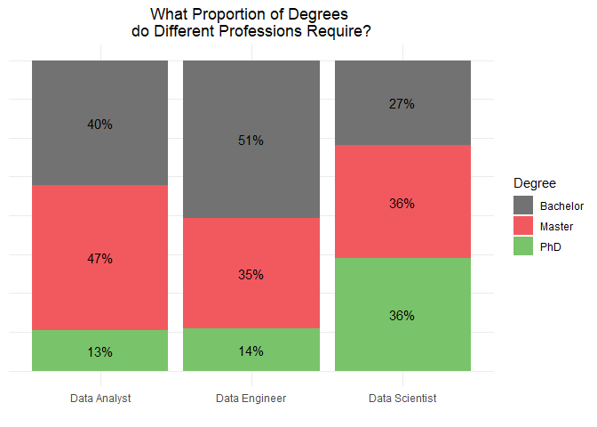

As we suspected, the highest degree, a PhD, is required for the Data Science position. The graph above shows that more than double the amount of PhDs are required for becoming a Data Scientist in comparison to a Data Analyst or Data Engeneering position.

The percentage of bachelor degrees is highest in the Data Engineering profession. I guess this is because a lot of these jobs require computer science degrees. It is often sufficient to get a bachelor's in Computer Science whereas for Statistics, Masters are preferred or even PhDs. But enough of the talk. Let's just find out what these majors are.

### What Major Should you Pick to Become a Data Scientist, Data Analyst, or Data Engineer?

We looked for Statistics, Mathematics, Computer Science, any type of Engineering, Finance, Economics, Operations Reasearch and Physics degree. At the end we kept degrees in the graph that were mentioned at 5% of the time or more.

``` r
all_df %>%
  purrr::map(~dplyr::mutate(., Statistics = grepl("Statistics", job_description, ignore.case = TRUE))) %>%
  purrr::map(~dplyr::mutate(., Biostatistics = grepl("Biostatistics", job_description, ignore.case = TRUE))) %>%
  purrr::map(~dplyr::mutate(., Mathematics = grepl("Mathematics", job_description, ignore.case = TRUE))) %>%
  purrr::map(~dplyr::mutate(., `Computer Science` = grepl("Computer Science", job_description, ignore.case = TRUE))) %>%
  purrr::map(~dplyr::mutate(., Engineering = grepl("Engineering", job_description, ignore.case = TRUE))) %>%
  purrr::map(~dplyr::mutate(., Finance = grepl("Finance", job_description, ignore.case = TRUE))) %>%
  purrr::map(~dplyr::mutate(., Economics = grepl("Economics", job_description, ignore.case = TRUE))) %>%
  purrr::map(~dplyr::mutate(., `Operations Research` = grepl("Operations research", job_description, ignore.case = TRUE))) %>%
  purrr::map(~dplyr::mutate(., `Operations Research` = grepl("Operational research", job_description, ignore.case = TRUE))) %>%
  purrr::map(~dplyr::mutate(., Physics = grepl("Physics", job_description, ignore.case = TRUE))) %>%
  purrr::map(~dplyr::select(., df:Physics)) %>%
  purrr::map(~tidyr::gather(., major, key, Statistics:Physics)) %>%
  purrr::map(~dplyr::group_by(., major, df)) %>%
  purrr::map(~dplyr::summarise(., count = sum(key, na.rm = TRUE))) %>%
  purrr::map(~dplyr::mutate(., total = sum(.$count), 
                            prop = count / total)) %>%
  purrr::map(~dplyr::filter(., prop > 0.05)) %>%
  purrr::map(~dplyr::mutate(., total = sum(.$count), 
                            prop = count / total)) %>%
  do.call(rbind, .) -> major

ggplot(major, aes(x = df, y = prop, fill = major)) +
  geom_bar(position = "stack", stat = "identity") +
  geom_text(position = position_stack(vjust = 0.5), aes(label = paste0(round(prop*100, 0), "%"))) +
  xlab("") +
  ylab("Count") +
  ggtitle("What Major Should You Pick for Different Data Positions?") +
  theme_minimal() +
  theme(plot.title = element_text(hjust = 0.5),
        axis.title.y = element_blank(),
        axis.ticks.y = element_blank(),
        axis.text.y = element_blank()) +
  scale_x_discrete(labels = c("Data Analyst", "Data Engineer", "Data Scientist")) +
  scale_fill_manual(
    values = c(
      "#727272",
      "#f1595f",
      "#79c36a",
      "#599ad3",
      "#f9a65a",
      "#9e66ab",
      "#cd7058"
    ),
    name = "Major"
  )
```

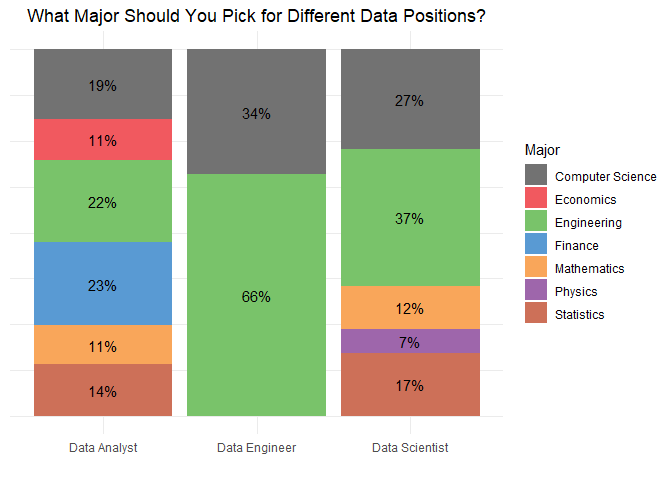

The graph above is pretty interesting. First, we see that the Data Engineering prefession only requires Computer Science and Engeneering degrees (with most of them being sofwear engineering). This makes a lot of sense considering that a Data Engineer is responsible for the construction, maintenance, and testing of databases and other large scale systems. Data Engineers are usually dealing with huge amount of data. All of which has to be properly stored and made easily accesssible for Data Scientists or Data Analysts to analyse. Such skills are not acquired by a Statistics, Economics, or Finance degree.

Another interesting observation is that Economics and Finance is only prefered for Data Analysts. This is because a lot of Data Analysts are Business Analysts or Financial Analysts who are working in the finance sectors e.g. banks.

The proportion of Statistics is highest in the Data Scientist bar with around 17%.

### What Technology Skills are Required for Data Analysts, Data Engineers, or Data Scientists?

``` r
all_df %>%
  purrr::map(~dplyr::mutate(., R = grepl("\\bR\\b", job_description))) %>%
  purrr::map(~dplyr::mutate(., Python = grepl("Python", job_description, ignore.case=TRUE))) %>%
  purrr::map(~dplyr::mutate(., SQL = grepl("SQL", job_description, ignore.case=TRUE))) %>%
  purrr::map(~dplyr::mutate(., SAS = grepl("SAS", job_description, ignore.case=TRUE))) %>%
  purrr::map(~dplyr::mutate(., Hadoop = grepl("hadoop|hive|\\bmapreduce\\b|\\bhbase\\b", job_description, ignore.case=TRUE))) %>%
  purrr::map(~dplyr::mutate(., Perl = grepl("perl", job_description, ignore.case=TRUE))) %>%
  purrr::map(~dplyr::mutate(., `C++` = grepl("C++", job_description, fixed=TRUE))) %>%
  purrr::map(~dplyr::mutate(., `C#` = grepl("C#", job_description, fixed=TRUE))) %>%
  purrr::map(~dplyr::mutate(., Java = grepl("\\bjava\\b", job_description, ignore.case=TRUE))) %>%
  purrr::map(~dplyr::mutate(., Scala = grepl("scala", job_description, ignore.case=TRUE))) %>%
  purrr::map(~dplyr::mutate(., Tensorflow = grepl("tensorflow", job_description, ignore.case=TRUE))) %>%
  purrr::map(~dplyr::mutate(., Javascript = grepl("javascript", job_description, ignore.case=TRUE))) %>%
  purrr::map(~dplyr::mutate(., Spark = grepl("spark", job_description, ignore.case=TRUE))) %>%
  purrr::map(~dplyr::mutate(., VC = grepl("Git.*|Version Control|Bitbucket", job_description, ignore.case=TRUE))) %>%
  purrr::map(~dplyr::mutate(., Terminal = grepl("command line|bash|terminal|shell|command-line", job_description, ignore.case=TRUE))) %>%
  purrr::map(~dplyr::mutate(., Excel = grepl("\\<Excel\\>", job_description))) %>%
  purrr::map(~dplyr::mutate(., Tableau = grepl("Tableau", job_description, ignore.case = TRUE))) %>%
  purrr::map(~dplyr::mutate(., Julia = grepl("Julia", job_description, ignore.case = TRUE))) %>%
  purrr::map(~dplyr::select(., df:Julia)) %>%
  purrr::map(~tidyr::gather(., skill, key, R:Julia)) %>%
  purrr::map(~dplyr::group_by(., skill, df)) %>%
  purrr::map(~dplyr::summarise(., count = sum(key, na.rm = TRUE))) %>%
  purrr::map(~dplyr::mutate(., total = sum(.$count), 
                            prop = count / total)) %>%
  purrr::map(~dplyr::filter(., prop > 0.08)) %>%
  purrr::map(~dplyr::mutate(., total = sum(.$count), 
                            prop = count / total)) %>%
  do.call(rbind, .) -> hard_skill

ggplot(hard_skill, aes(x = df, y = prop, fill = skill)) +
  geom_bar(position = "stack", stat = "identity") +
  geom_text(position = position_stack(vjust = 0.5), aes(label = paste0(round(prop*100, 0), "%"))) +
  xlab("") +
  ylab("Count") +
  ggtitle("What Technologies Should You Pick \n for Different Data Positions?") +
  theme_minimal() +
  theme(plot.title = element_text(hjust = 0.5),
        axis.title.y = element_blank(),
        axis.ticks.y = element_blank(),
        axis.text.y = element_blank()) +
  scale_x_discrete(labels = c("Data Analyst", "Data Engineer", "Data Scientist")) +
  scale_fill_manual(
    values = c(
      "#727272",
      "#f1595f",
      "#79c36a",
      "#599ad3",
      "#f9a65a",
      "#9e66ab",
      "#cd7058",
      "#d77fb3"
    ),
    name = "Technology"
  )
```

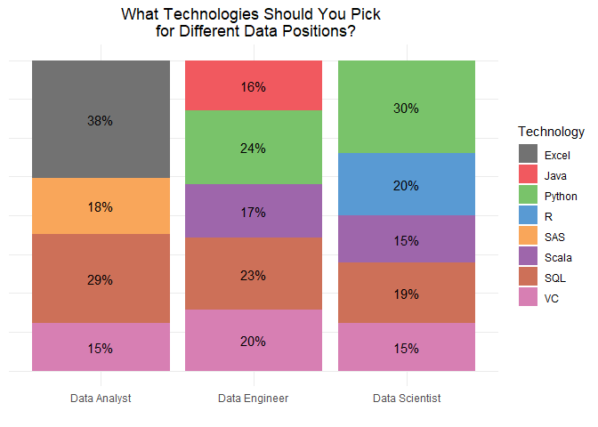

SQL skills are required for every position and a must have skill. Version control (VC) like git or bitbucket are also necessary for all three professions.

What is interesting is that Data Analysts are the only ones who are using Excel extensively and SAS to a certain extent. R is mostly used by Data Scientists and Data Engineers are the only ones who use java extensively.

Scala is a necessary skill for Data Engineers and apperas 17% of the time. Scala is used in combination with Spark to deal with huge amounts of data. I am suprised that a Data Scientist also has to know Scala. Usually I would say R, Python, SQL, and Version Control are the most important technologies to know for a Data Scientist.

### What Hard Skills do Data People Need?

``` r
all_df %>%
  purrr::map(~dplyr::mutate(., `Machine Learning` = grepl("Machine Learning", job_description))) %>%
  purrr::map(~dplyr::mutate(., Probability = grepl("Probability", job_description, ignore.case=TRUE))) %>%
  purrr::map(~dplyr::mutate(., Programming = grepl("Programming", job_description, ignore.case=TRUE))) %>%
  purrr::map(~dplyr::mutate(., `Algorithmic Thinking` = grepl("Algorithmic Thinking", job_description, ignore.case=TRUE))) %>%
  purrr::map(~dplyr::mutate(., `Statistical Learning` = grepl("Statistical Learning", job_description, ignore.case=TRUE))) %>%
  purrr::map(~dplyr::mutate(., `Data Structures and Algorithm` = grepl("Algorithm|\\bdata structures\\b", job_description, ignore.case=TRUE))) %>%
  purrr::map(~dplyr::mutate(., Quantitative = grepl("Quantitative", job_description, fixed=TRUE))) %>%
  purrr::map(~dplyr::mutate(., Modeling = grepl("Modeling", job_description, ignore.case=TRUE))) %>%
  purrr::map(~dplyr::mutate(., `Deep Learning` = grepl("Deep Learning", job_description, ignore.case=TRUE))) %>%
  purrr::map(~dplyr::mutate(., `Neural Networks` = grepl("Neural Networks", job_description, ignore.case=TRUE))) %>%
  purrr::map(~dplyr::mutate(., `Experimental Design` = grepl("Experimental Design", job_description, ignore.case=TRUE))) %>%
  purrr::map(~dplyr::mutate(., `Hypothesis Test` = grepl("hypothesis test", job_description, ignore.case=TRUE))) %>%
  purrr::map(~dplyr::mutate(., `Data Pipeline` = grepl("pipeline", job_description, ignore.case=TRUE))) %>%
  purrr::map(~dplyr::mutate(., `Data Pipeline` = grepl("\\bETL\\b|warehouse architecture", job_description, ignore.case=TRUE))) %>%
  purrr::map(~dplyr::select(., df:`Hypothesis Test`)) %>%
  purrr::map(~tidyr::gather(., skill, key, `Machine Learning`:`Hypothesis Test`)) %>%
  purrr::map(~dplyr::group_by(., skill, df)) %>%
  purrr::map(~dplyr::summarise(., count = sum(key, na.rm = TRUE))) %>%
  purrr::map(~dplyr::mutate(., total = sum(.$count), 
                            prop = count / total)) %>%
  purrr::map(~dplyr::filter(., prop > 0.03)) %>%
  purrr::map(~dplyr::mutate(., total = sum(.$count), 
                            prop = count / total)) %>%
  do.call(rbind, .) -> hard_skill

ggplot(hard_skill, aes(x = df, y = prop, fill = skill)) +
  geom_bar(position = "stack", stat = "identity") +
  geom_text(position = position_stack(vjust = 0.5), aes(label = paste0(round(prop*100, 0), "%"))) +
  xlab("") +
  ylab("Count") +
  ggtitle("What Skills do you Need for \n Different Data Professions?") +
  theme_minimal() +
  theme(plot.title = element_text(hjust = 0.5),
        axis.title.y = element_blank(),
        axis.ticks.y = element_blank(),
        axis.text.y = element_blank()) +
  scale_x_discrete(labels = c("Data Analyst", "Data Engineer", "Data Scientist")) +
  scale_fill_manual(
    values = c(
      "#727272",
      "#f1595f",
      "#79c36a",
      "#599ad3",
      "#f9a65a",
      "#9e66ab",
      "#cd7058",
      "#d77fb3"
    ),
    name = "Hard Skills"
  )
```

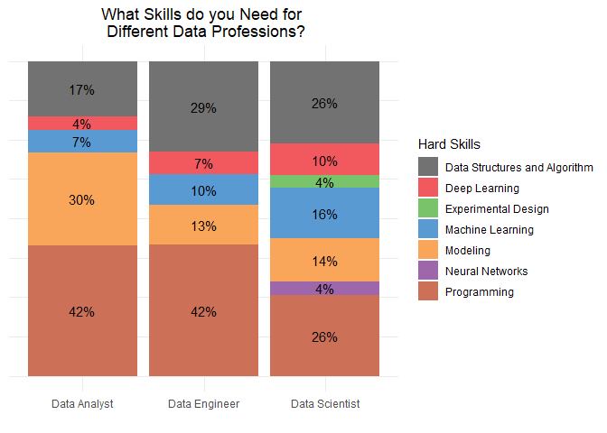

The most important hard skills across all three job titles are good programming skills and a good knowledge of data structures and algorithms. In this case it is a mix of data structures and algorithms and algorithms like random forest or support vector machines which you would need for machine learning.

Modelling is mostly required for Data Analysts and experimental design only appears in the Data Scientist profession. This is because of the statistics skills a Data Scientist must have. Whereas the other professions are relying less on statistics.

### What Soft Skills are Important?

``` r
all_df %>%
  purrr::map(~dplyr::mutate(., Communication = grepl("Communicat", job_description))) %>%
  purrr::map(~dplyr::mutate(., Teamwork = grepl("teamwork", job_description, ignore.case=TRUE))) %>%
  purrr::map(~dplyr::mutate(., `Problem Solving` = grepl("problem solving", job_description, ignore.case=TRUE))) %>%
  purrr::map(~dplyr::mutate(., Creative = grepl("Creative", job_description, ignore.case=TRUE))) %>%
  purrr::map(~dplyr::mutate(., `Hard Working` = grepl("Hard Working", job_description, ignore.case=TRUE))) %>%
  purrr::map(~dplyr::mutate(., `Detail Oriented` = grepl("Detail Oriented|looking for detail", job_description, ignore.case=TRUE))) %>%
  purrr::map(~dplyr::mutate(., Articulative = grepl("Articulate", job_description, ignore.case=TRUE))) %>%
  purrr::map(~dplyr::select(., df:Articulative)) %>%
  purrr::map(~tidyr::gather(., skill, key, Communication:Articulative)) %>%
  purrr::map(~dplyr::group_by(., skill, df)) %>%
  purrr::map(~dplyr::summarise(., count = sum(key, na.rm = TRUE))) %>%
  purrr::map(~dplyr::mutate(., total = sum(.$count), 
                            prop = count / total)) %>%
  purrr::map(~dplyr::filter(., prop > 0.03)) %>%
  purrr::map(~dplyr::mutate(., total = sum(.$count), 
                            prop = count / total)) %>%
  do.call(rbind, .) -> soft_skill

ggplot(soft_skill, aes(x = df, y = prop, fill = skill)) +
  geom_bar(position = "stack", stat = "identity") +
  geom_text(position = position_stack(vjust = 0.5), aes(label = paste0(round(prop*100, 0), "%"))) +
  xlab("") +
  ylab("Count") +
  ggtitle("What Soft Skills do you Need for \n Different Data Professions?") +
  theme_minimal() +
  theme(plot.title = element_text(hjust = 0.5),
        axis.title.y = element_blank(),
        axis.ticks.y = element_blank(),
        axis.text.y = element_blank()) +
  scale_x_discrete(labels = c("Data Analyst", "Data Engineer", "Data Scientist")) +
  scale_fill_manual(
    values = c(
      "#727272",
      "#f1595f",
      "#79c36a",
      "#599ad3",
      "#f9a65a",
      "#9e66ab",
      "#cd7058",
      "#d77fb3"
    ),
    name = "Soft Skills"
  )
```

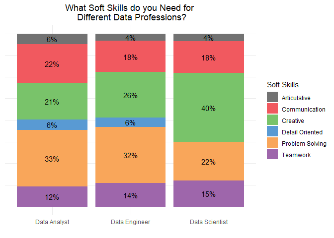

This graph shows basically the same for all three professions. Problem solving skills, creativity, and communication skills are the most important soft skills for Data Analysts, Data Engineers, and Data Scientists. But really, this graph would probably be the same for every office job.

### How Many Years of Experience are Required for Data Analysts, Data Scientists, and Data Engineers?

``` r
all_df %>%
  purrr::map(~stringr::str_extract(.$job_description, "[0-9]+\\+ years")) %>%
  purrr::map(., as.factor) %>%
  purrr::map(., table) %>%
  purrr::map(~dplyr::tibble(., experience = as.factor(names(.)), count = as.integer(.))) %>%
  purrr::map(~dplyr::arrange(., desc(count))) %>%
  purrr::map(~dplyr::mutate(., total = sum(count), 
                            prop = count / total)) %>%
  purrr::map(~dplyr::filter(., prop > 0.06)) %>%
  purrr::map(~dplyr::mutate(., total = sum(count), 
                            prop = count / total)) %>%
  Map(cbind, ., df = c("Data Analyst", "Data Engineer", "Data Scientist")) %>%
  do.call(rbind, .) -> experience

ggplot(experience, aes(x = df, y = prop, fill = experience)) +
  geom_bar(position = "stack", stat = "identity") +
  geom_text(position = position_stack(vjust = 0.5), aes(label = paste0(round(prop*100, 0), "%"))) +
  xlab("") +
  ylab("Count") +
  ggtitle("How Many Years of Experience do you Need for \n Different Data Professions?") +
  theme_minimal() +
  theme(plot.title = element_text(hjust = 0.5),
        axis.title.y = element_blank(),
        axis.ticks.y = element_blank(),
        axis.text.y = element_blank()) +
  scale_x_discrete(labels = c("Data Analyst", "Data Engineer", "Data Scientist")) +
  scale_fill_manual(
    values = c(
      "#727272",
      "#f1595f",
      "#79c36a",
      "#599ad3",
      "#f9a65a",
      "#9e66ab",
      "#cd7058",
      "#d77fb3"
    ),
    name = "Experience"
  )
```

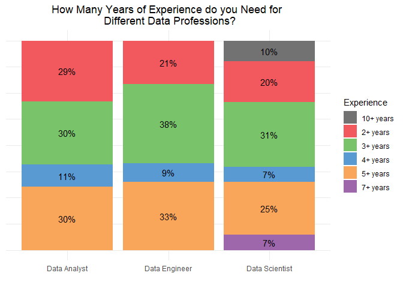

It looks like Data Science people really need time to build their skill set because it requires the most experience. This matches our first graph where Data Scientists mostly need PhDs.

### Employment Options

``` r
all_df %>%
  purrr::map(~dplyr::group_by(., company_name)) %>%
  purrr::map(~dplyr::summarise(., n = n())) %>%
  purrr::map(~dplyr::arrange(., desc(n))) %>%
  purrr::map(~dplyr::filter(., n > 5)) %>%
  Map(cbind, ., df = c("Data Analyst", "Data Engineer", "Data Scientist")) -> companies

lapply(companies, function(x) {
  ggplot(x, aes(x = reorder(company_name, n), y = n)) + 
    geom_bar(stat = 'identity', fill = "#004C4C") + 
    geom_text(stat = "identity", aes(label = n), hjust = 1.5, col = "white") +
    coord_flip() + 
    theme_minimal() +
    theme(plot.title = element_text(hjust = 0.5)) +
    xlab('Company Name') +
    ylab('Count') +
    labs(title = paste0(unique(x$df), ' Employers'))
})
```

$data\_analyst 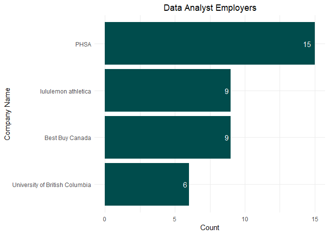 $data\_engineer 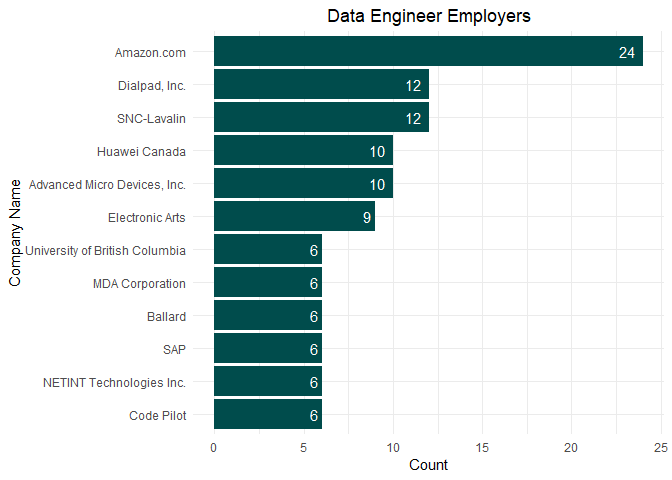 $data\_scientist 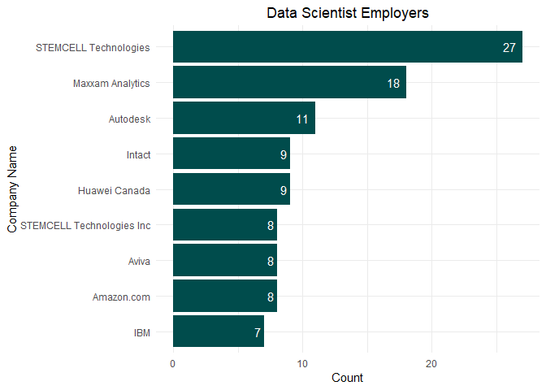

Amazon is hiring a lot of Data Engineers!

### What Kind of Job Titles can you Expect for different Data Professions

This one is really important and interesting. Data Engineers are not always called "Data Engineers" and Data Analysts are also not always called "Data Analyst". Whenever you hear a job titles that fits the one of a Data Analyst but is not specifically called "Data Analyst", then you can easily identify the job's required skill set by knowing if the job belongs to the Data Analyst, Data Engineering, or Data Scientist profession.

``` r
all_df %>%
  purrr::map(~dplyr::group_by(., job_title)) %>%
  purrr::map(~dplyr::summarise(., n = n())) %>%
  purrr::map(~dplyr::arrange(.,desc(n))) %>%
  purrr::map(~dplyr::filter(., n > 3)) %>%
  Map(cbind, ., df = c("Data Analyst", "Data Engineer", "Data Scientist")) -> titles


lapply(titles, function(x) {
  ggplot(x, aes(x = reorder(job_title, n), y = n)) + 
    geom_bar(stat = 'identity', fill = "#D29083") + 
    geom_text(stat = "identity", aes(label = n), hjust = 1.5, col = "white") +
    coord_flip() + 
    theme_minimal() +
    theme(plot.title = element_text(hjust = 0.5)) +
    xlab('Job Title') +
    ylab('Frequency') +
    labs(title = paste0("Most Frequent ", unique(x$df), ' Job Titles'))
})
```

$data\_analyst 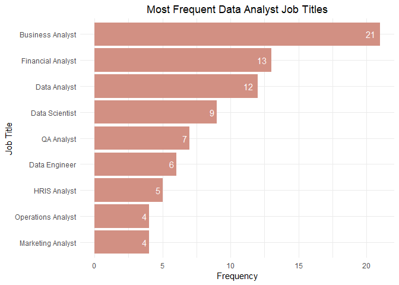 $data\_engineer 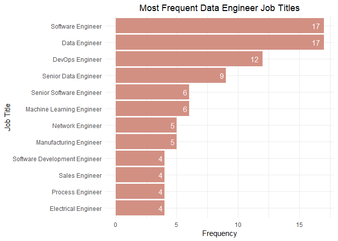 $data\_scientist 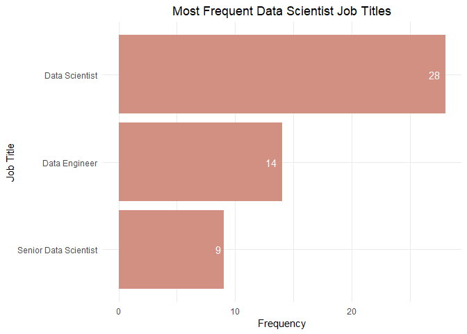

Data Analysts are most often called Business Analysts and Financial Analysts. That's why this job title likes to employ people who majored in Economics or Finance. Data Analyst comes in third place which is pretty funny to me.

Data Engineering workers are all called engineers. Either Softwar Engineers, Data Engineers, DevOps Engineers, or even Sales Engineers.

The graph for the Data Scientist looks pretty boring.

### What are the Differences Between a Data Scientist, a Data Analyst, and a Data Engineer?

In short, a **Data Scientist** is mostly involved in the statistical analysis of data. They have to know the underlying assumptions of models and have to assess whether a method can be applied to a particular data set. This job need a ton of experience because every single data set out there looks different.

Because every data set is different, a Data Scientist can't just apply the previous statistical method to the current data. A ton of experience is required with data to know what can be done and what is just bad practice. No one acquires these skills in school. A lot of work in the industry is required to become a good Data Scientist.

A **Data Engineer** is responsible to set up a system for storing and distributing data. Data Engineering people are very well payed because the skill set is very hard to aquire.

A **Data Analyst** works a lot with Excel and it is more of a reporting type of position. Heavy statistics and mathematics is not done by Data Analysts. They usually do a lot of exploratory analysis and then present their data findings to the company.

I hope you found this post helpful. Let me know in the comments below which typeof position you would like to pursue the most!
