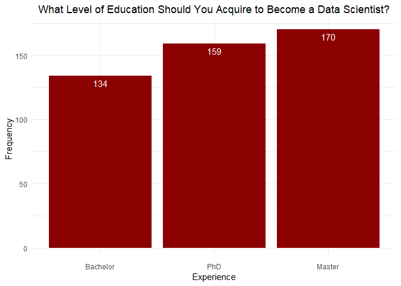
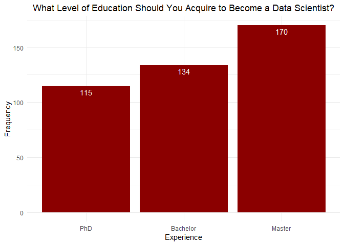
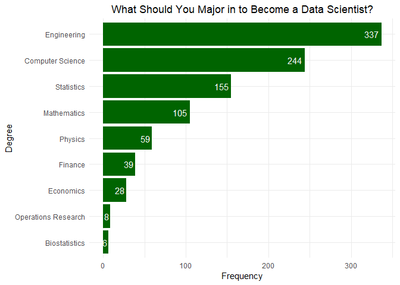
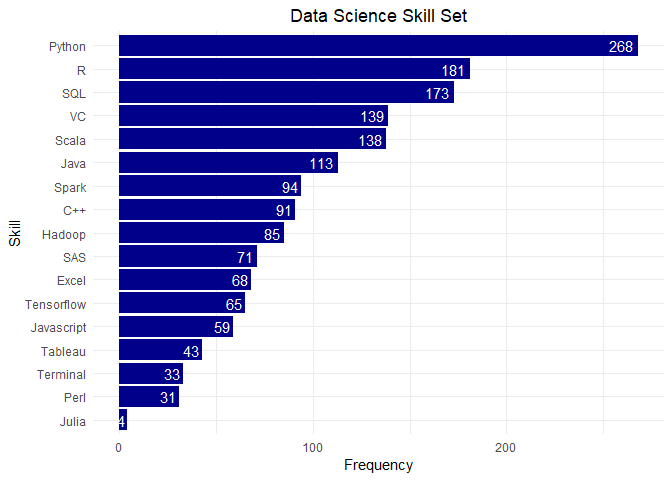
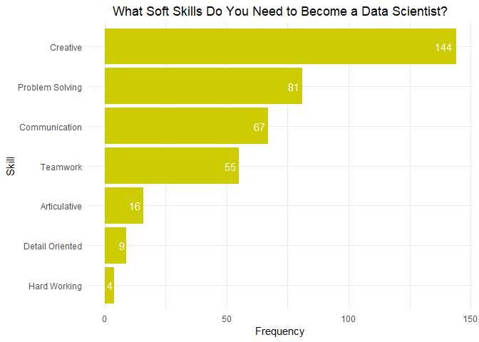
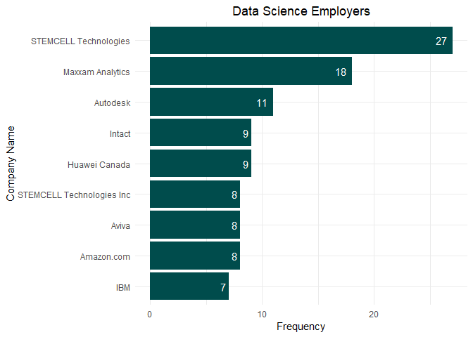
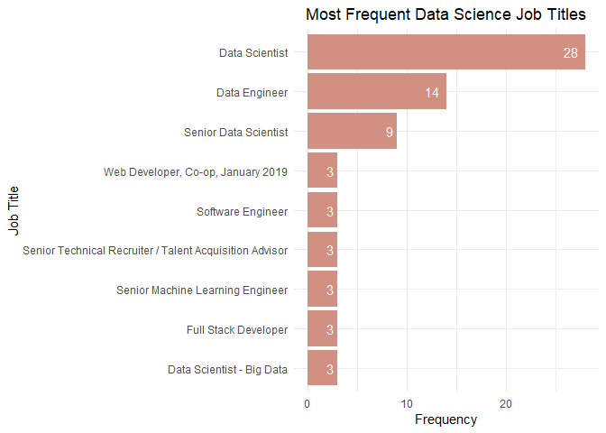

Indeed Job Data Evaluation
================
Pascal Schmidt
October 27, 2018

``` r
knitr::opts_chunk$set(message = FALSE, warning = FALSE, echo = TRUE)
```

``` r
library(tidyverse)
df_Canada <- read.csv(here::here("data/df_Canada.csv"))
```

Data Science is a hot field and a Data Scientist has been titled as the sexiest job in the 21st century. A lot of people are transisisoning into the field and want to work with data. But what does it take to become a Data Scienitist?

I this blog post we want to answer that question. In order to to that we scraped job data from Indeed's website with a scraper we developed in our last post. We looked for the job title `Data Scientist` in Canada. The cities we scraped data from were Vancouver, Toronto, and Montreal.

Despite having only looked in Canada, the skill set transfers to other countries as well and is not limited to Canada. In our first analysis we did a supervised analysis where we looked for words that we thought were related to Data Science. In the second part of our analysis we did a unsupervised analysis with the `tidytext` package.

In order to answer the question in as much detail as possible, we posed the following questions:

-   What level of education is required for a Data Scientist? (Bechelor's, Master's, or PhD?)
-   What majors are best suited to become a Data Scientist? (Computer Science, Statistics, Physics etc.?)
-   What technical skills does a Data Scientist need Part 1? (Python vs. R vs. SQL etc.?)
-   What technical skills does a Data Scientist need Part 2? (Machine learning, AI, statistics etc.?)
-   What soft skills do Data Scientists need? (communication, teamwork etc.?)
-   How many years of experience is needed to enter the fied of Data Science?

The last two questions we posed are not directly related to "How to become a data scientist" but are still interesting.

-   What companies are hiring Data Scientists?
-   What job titles were the most common ones?

All analysis was done in R. If anyone wants to reproduce the results then the code is on my gihub account. Every section starts with my personal experience, that I have gained as a Data Scientist and working with a lot of Data Science people. Afterwards, we'll have a more objective look and see what Indeed has to say. Let's jump into our analysis.

### What Level of Education is Required to Become a Data Scientist?

Usually, people think that Data Scientists have to have a Phd in order to get the job done. In my experience, that is not the case.

It also depends on you area of study. As a computer science majors, a bachelor's degree is in most of the cases enough. For other majors like statistics people often want to see people with a Master's degree.

One of my co-workers has a Phd in statistics and once said that having a Phd did actually hurt them. After their Master's, they felt very comfortable with all the skills required in data science. Their skill set was very broad and my co-worker felt well equipped. However, during their Phd my co-worker went really really deep into one specific area.

So, they could answer all questions of their particular research subject but all other topics in statistics and computer science were left behind. That also meant that there was no time to explore new methods or technologies while doing their Phd. Therefore, I think that doing a Phd should be well thought out. You won't necessarily become a better Data Scientist, you'll only become the expert in one specific area.

Obviously, if you want to work in academia, a Phd is a must. However, almost all jobs outside of academia do not necessarily require or need a Phd.

Of course, this is only one data point but I also experienced the same opinion with my TA in university who was a Phd student. He is developing statistical methods for high dimensional spatiotemporal data in order to better understand problems related to basketball and other sports. He told me that he wished to do more machine learning in order to stay on top of the game. However, he is sp involved in his area of research that all other areas of statistics are not being practiced.

Let's see what Indeed has to say.

What Level of Education is Required to Become a Data Scientist?

``` r
df_Canada %>%
  dplyr::mutate(Bachelor = grepl("Bachelor's|Bachelors|BSc|undergraduate", job_description, ignore.case = TRUE)) %>%
  dplyr::mutate(Master = grepl("Master's|Masters|MSc|graduate", job_description, ignore.case = TRUE)) %>%
  dplyr::mutate(PhD = grepl("PhD", job_description, ignore.case = TRUE)) %>%
  dplyr::mutate(master_PhD = grepl("Master's.*PhD|Masters.*PhD|MSc.*PhD|graduate.*PhD", job_description, ignore.case = TRUE)) -> degree

degree %>%
  dplyr::select(Bachelor, Master, PhD) %>%
  purrr::map_dbl(sum) %>%
  dplyr::tibble(degree = as.factor(names(.)), count = .) %>%
  dplyr::arrange(desc(count)) -> deg

ggplot(deg, aes(x = reorder(degree, count), y = count)) + 
  geom_bar(stat = 'identity', fill = "darkred") + 
  geom_text(stat = "identity", aes(label = count), vjust = 1.5, col = "white") +
  theme_minimal() +
  theme(plot.title = element_text(hjust = 0.5)) +
  xlab('Experience') + 
  ylab('Frequency') + 
  labs(title = 'What Level of Education Should You Acquire to Become a Data Scientist?')
```



``` r
ggsave(here::here("level-educ.png"))
```

It looks like the most desired degree level is a Master's degree. Right after employers want you to have a Phd and and a Bachelor's degree is in last place.

Often, in job description it asks for Master's degrees or higher. Therefore, we substracted Phd's when in the job description also mentioned a Master's degree. Let's see how it changed.

``` r
degree %>%
  dplyr::select(Bachelor, Master, PhD, master_PhD) %>%
  purrr::map_dbl(sum) %>%
  dplyr::tibble(degree = as.factor(names(.)), count = .) %>%
  dplyr::arrange(desc(count)) -> deg
deg[2, 2] <- deg[2, 2] - deg[4, 2]
deg <- deg[c(1:3), ]

ggplot(deg, aes(x = reorder(degree, count), y = count)) + 
  geom_bar(stat = 'identity', fill = "darkred") + 
  geom_text(stat = "identity", aes(label = count), vjust = 1.5, col = "white") +
  theme_minimal() +
  theme(plot.title = element_text(hjust = 0.5)) +
  xlab('Experience') + 
  ylab('Frequency') + 
  labs(title = 'What Level of Education Should You Acquire to Become a Data Scientist?')
```



``` r
ggsave(here::here("level-educ-phd.png"))
```

Wow, a lot of job descriptions mention that having a Master's degree is enough. Now we have Phd degrees in last place.

It looks like Bachelor's and Master's degrees are sufficent to become a Data Scientist.

### What Should You Study/Major in to Become a Data Scientist?

I don't know what the best major is to become a Data Scientist. I only know that all the people I know in the field have a quantitative background (e.g Statistics, Computer Science, Mathematics).

In my opinion, having a quantitative degree, a good work ethic and a learners mindset suffice for a career in Data Science. There are s many different methods that it is impossible for any degree to cover the depth of Data Science. Therefore, it is more important to be adaptable and to be a quick learner.

Let's see what kind of degrees Data Science positions demand.

``` r
df_Canada %>%
  dplyr::mutate(Statistics = grepl("Statistics", job_description, ignore.case = TRUE)) %>%
  dplyr::mutate(Biostatistics = grepl("Biostatistics", job_description, ignore.case = TRUE)) %>%
  dplyr::mutate(Mathematics = grepl("Mathematics", job_description, ignore.case = TRUE)) %>%
  dplyr::mutate(`Computer Science` = grepl("Computer Science", job_description, ignore.case = TRUE)) %>%
  dplyr::mutate(Engineering = grepl("Engineering", job_description, ignore.case = TRUE)) %>%
  dplyr::mutate(Finance = grepl("Finance", job_description, ignore.case = TRUE)) %>%
  dplyr::mutate(Economics = grepl("Economics", job_description, ignore.case = TRUE)) %>%
  dplyr::mutate(`Operations Research` = grepl("Operations research", job_description, ignore.case = TRUE)) %>%
  dplyr::mutate(`Operations Research` = grepl("Operational research", job_description, ignore.case = TRUE)) %>%
  dplyr::mutate(Physics = grepl("Physics", job_description, ignore.case = TRUE)) -> stem_degree

stem_degree[, -c(1:6)] %>%
  purrr::map_dbl(sum) %>%
  dplyr::tibble(skill = as.factor(names(.)), count = .) %>%
  dplyr::arrange(desc(count)) -> stem_count

ggplot(stem_count, aes(x = reorder(skill, count), y = count)) + 
  geom_bar(stat = 'identity', fill = "darkgreen") + 
  geom_text(stat = "identity", aes(label = count), hjust = 1.2, col = "white") +
  coord_flip() + 
  theme_minimal() +
  theme(plot.title = element_text(hjust = 0.5)) +
  xlab('Degree') + 
  ylab('Frequency') + 
  labs(title = 'What Should You Major in to Become a Data Scientist?')
```



``` r
ggsave(here::here("major-data-science.png"))
```

I would't have expected to see engineering up there. What I can say is that it is definitely over represented because we did not account for words like feature engineering or reverse engineering. However, going through around 20 job descriptions myself I can say that a lot of jobs are mentioning that a degree in any kind of an engineering field is desired. So after all, it is definitely a degree most job descriptions mentioned.

Computer science is mentioned the second most, followed by statistics and mathematics. What is interesting is to see that finance was mentioned 39 times and economics 28 times out of around 600 job postings. That shows that really any degree that has some quantititative material in its degree can be used to become a Data Scientist. I almost majored in Economics and the degree was far from quantitative in comparison to Statistics, the degree I majored in in university.

What Technical Skill Set Do You Need to Become a Data Scientist? Part 1
-----------------------------------------------------------------------

This is a really hard question to answer since there are so many different job requirements in Data Science. Hence, every job requires different technical skills. When you are applying for jobs as a Data Engineer, you probably want to be familiar with SQL, Hadoop, Java, and Spark. As a Data Scientist, it is important to know R or Python (best to know both), SQL, and maybe Java or C++.

At my workplace, we soley use R, Terminal, and Version Control for our projects.

Let's see what Indeed says:

``` r
skill_set <- df_Canada %>%
  dplyr::mutate(R = grepl("\\bR\\b", job_description)) %>%
  dplyr::mutate(Python = grepl("Python", job_description, ignore.case=TRUE)) %>%
  dplyr::mutate(SQL = grepl("SQL", job_description, ignore.case=TRUE)) %>%
  dplyr::mutate(SAS = grepl("SAS", job_description, ignore.case=TRUE)) %>%
  dplyr::mutate(Hadoop = grepl("hadoop", job_description, ignore.case=TRUE)) %>%
  dplyr::mutate(Perl = grepl("perl", job_description, ignore.case=TRUE)) %>%
  dplyr::mutate(`C++` = grepl("C++", job_description, fixed=TRUE)) %>%
  dplyr::mutate(Java = grepl("java\\b", job_description, ignore.case=TRUE)) %>%
  dplyr::mutate(Scala = grepl("scala", job_description, ignore.case=TRUE)) %>%
  dplyr::mutate(Tensorflow = grepl("tensorflow", job_description, ignore.case=TRUE)) %>%
  dplyr::mutate(Javascript = grepl("javascript", job_description, ignore.case=TRUE)) %>%
  dplyr::mutate(Spark = grepl("spark", job_description, ignore.case=TRUE)) %>%
  dplyr::mutate(VC = grepl("Git.*|Version Control|Bitbucket", job_description, ignore.case=TRUE)) %>%
  dplyr::mutate(Terminal = grepl("command line|bash|terminal|shell|command-line", job_description, ignore.case=TRUE)) %>%
  dplyr::mutate(Excel = grepl("\\<Excel\\>", job_description)) %>%
  dplyr::mutate(Tableau = grepl("Tableau", job_description, ignore.case = TRUE)) %>%
  dplyr::mutate(Julia = grepl("Julia", job_description, ignore.case = TRUE))

skill_set[, -c(1:6)] %>%
  purrr::map_dbl(sum) %>%
  dplyr::tibble(skill = as.factor(names(.)), count = .) %>%
  dplyr::arrange(desc(count)) -> skill_count

ggplot(skill_count, aes(x = reorder(skill, count), y = count)) + 
  geom_bar(stat = 'identity', fill = "darkblue") + 
  geom_text(stat = "identity", aes(label = count), hjust = 1.2, col = "white") +
  coord_flip() + 
  theme_minimal() +
  theme(plot.title = element_text(hjust = 0.5)) +
  xlab('Skill') + 
  ylab('Frequency') + 
  labs(title = 'Data Science Skill Set')
```



``` r
ggsave(here::here("tech-skills.png"))
```

Programming in Python is by far the most desired skill to have. I think this is because it is a multi purpose language and a lot of softwear engineers who are transissioning into Data Science feel more comfortable using Python instead of R. R is mostly used by academics and people with a statistics background. Both languages have great functionality when it comes to working with data.

SQL is in third place and Version Control (Git, Bitbucket) in forth place. When you are just starting out I would recommend, you picking either R or Python, then learn Git, and then a bit of SQL. The most difficult thing will be to become a good programmer and use R or Python well. Git and SQL can be picked up easily within a few weeks.

If we had looked for Data Analyst positions, then I believe that Excel would have been in first place. If we had looked for Data Engineer positions, then Hadoop, Scala or Java would be way up there. In fact, I looked at the differences between a Data Analyst, a Data Scientist, and a Data Engineer in this blog post.

What Technical Skill Set Do You Need to Become a Data Scientist? Part 2
-----------------------------------------------------------------------

The top skill every Data Scientist needs is to be able to program well. In place 2 there is algorithms. This skill can be attributed to machine learning alorithms and in general problem solving skills. It is followed by machine learning, modeling, deep learning, and neural networks.

Not only does a Data Scientist need to be good at using certain technologies, they also have to be excellent programmers and have to know the theory behind machine learning algorithms. This makes this job so hard. Excellent programming and statistics knowledge are hard to acquire and have to b build up over time.

What Soft Skills Set Do You Need as a Data Scientist?
-----------------------------------------------------

In my experience, communication is the most important soft skill of a Data Scientist. Presenting data and explaining what conclusions follow from it is very important. When talking to a more technical audience, the interpretaion of models and other statistical output is also crucial. Furthermore, explaining why a statistical method is used over another one and whi it works better is also important. In short, without good communiactions skills a Data Scientist won't ever reach their full potential (money and position wise).

Let's have a look at Indeed's posts.

``` r
skill_set <- df_Canada %>%
  dplyr::mutate(Communication = grepl("Communicat", job_description)) %>%
  dplyr::mutate(Teamwork = grepl("teamwork", job_description, ignore.case=TRUE)) %>%
  dplyr::mutate(`Problem Solving` = grepl("problem solving", job_description, ignore.case=TRUE)) %>%
  dplyr::mutate(Creative = grepl("Creative", job_description, ignore.case=TRUE)) %>%
  dplyr::mutate(`Hard Working` = grepl("Hard Working", job_description, ignore.case=TRUE)) %>%
  dplyr::mutate(`Detail Oriented` = grepl("Detail Oriented|looking for detail", job_description, ignore.case=TRUE)) %>%
  dplyr::mutate(Articulative = grepl("Articulate", job_description, ignore.case=TRUE))

skill_set[, -c(1:6)] %>%
  purrr::map_dbl(sum) %>%
  dplyr::tibble(skill = as.factor(names(.)), count = .) %>%
  dplyr::arrange(desc(count)) -> skill_count

ggplot(skill_count, aes(x = reorder(skill, count), y = count)) + 
  geom_bar(stat = 'identity', fill = "#CCCC00") + 
  geom_text(stat = "identity", aes(label = count), hjust = 1.25, col = "white") +
  coord_flip() + 
  theme_minimal() +
  theme(plot.title = element_text(hjust = 0.5)) +
  xlab('Skill') + 
  ylab('Frequency') + 
  labs(title = 'What Soft Skills Do You Need to Become a Data Scientist?')
```



``` r
ggsave(here::here("soft-skills.png"))
```

Being creative and being able to solve problems were the two most desired skills. They probably mean the same thing and can be grouped together as problem solving.

The skill that we were ranking number 1 only made third place. It seems employers seem to care more about solving problems in a creative way than communicating them.

How many Years of Experience is Necessary Before Getting a Job in Data Science?
-------------------------------------------------------------------------------

We only asked this questions out of interest. Many job descriptions include a sentence which states how many years of experience is desired. Rarely, it has any significance for applicants. So remember, as long as you get the job done you are qualified.

``` r
stringr::str_extract(df_Canada$job_description, "[0-9]+\\+ years") %>%
  as.factor() %>%
  table() %>%
  dplyr::tibble(experience = as.factor(names(.)), count = as.integer(.)) %>%
  dplyr::arrange(desc(count)) -> experience

ggplot(experience, aes(x = reorder(experience, count), y = count)) + 
  geom_bar(stat = 'identity', fill = "#8B008B") + 
  geom_text(stat = "identity", aes(label = count), hjust = 1.5, col = "white") +
  coord_flip() + 
  theme_minimal() +
  theme(plot.title = element_text(hjust = 0.5)) +
  xlab('Years of Experience') +
  ylab('Frequency') +
  labs(title = 'How many Years of Experience is Necessary \n Before Getting a Job in Data Science?')
```


``` r
ggsave(here::here("years-experience.png"))
```

Indeed says that 3+ years of experience are most common in job descriptions. Followed by 5+ years, 2+ years, and 10+ years of experience. The 100+ years of experience were probably a typo in the description.

In conclusion, to be become a successful data Scientintist, one needs a lot of experience. However, even people with only little experience can contribute greatly to projects. So don't be discouraged if you haven't had a lot of exposure with data yet. Keep learning!

What kind of Companies are Hiring Data Scientists?
--------------------------------------------------

``` r
company_names <- df_Canada %>%
  dplyr::group_by(company_name) %>%
  dplyr::summarise(n = n()) %>%
  dplyr::arrange(desc(n)) %>%
  dplyr::filter(n > 5)


ggplot(company_names, aes(x = reorder(company_name, n), y = n)) + 
  geom_bar(stat = 'identity', fill = "#004C4C") + 
  geom_text(stat = "identity", aes(label = n), hjust = 1.5, col = "white") +
  coord_flip() + 
  theme_minimal() +
  theme(plot.title = element_text(hjust = 0.5)) +
  xlab('Company Name') +
  ylab('Frequency') +
  labs(title = 'Data Science Employers')
```



``` r
ggsave(here::here("companies.png"))
```

Because we are in Canada, this graph does not include Facebook, Apple, Microsoft, or Google. Especially in Vancouver there are a lot of health related Data Science jobs so it makes sense to see STEMCELL TEchnologies as number 1. Amazon and IBM came 8th and 9th place.

Most Mentioned Job Titles
-------------------------

``` r
job_titles <- df_Canada %>%
  dplyr::group_by(job_title) %>%
  dplyr::summarise(n = n()) %>%
  dplyr::arrange(desc(n)) %>%
  dplyr::filter(n > 2)


ggplot(job_titles, aes(x = reorder(job_title, n), y = n)) + 
  geom_bar(stat = 'identity', fill = "#D29083") + 
  geom_text(stat = "identity", aes(label = n), hjust = 1.5, col = "white") +
  coord_flip() + 
  theme_minimal() +
  theme(plot.title = element_text(hjust = 0.5)) +
  xlab('Job Title') +
  ylab('Frequency') +
  labs(title = 'Most Frequent Data Science Job Titles')
```



``` r
ggsave(here::here("job-title.png"))
```

Most mentioned jobs were unsuprisingly Data Scientist, followed by Data Engineer and Senior Data Scientist.

At the end, we also created a wordcloud.

``` r
library(wordcloud)
library(tm)
```

``` r
datacloud <- Corpus(VectorSource(df_Canada$job_description))

datacloud <- tm_map(datacloud, removePunctuation)

datacloud <- tm_map(datacloud, tolower)

datacloud <- tm_map(datacloud, removeWords, c("services", "andor", "ability", "using", "new", "one", "help", "you", "must", "will", "including", "can", stopwords('english')))


# jpeg('wordcloud.jpg')
wordcloud(datacloud, 
          max.words = 52, 
          random.order = FALSE, 
          scale=c(4,.6),
          random.color = FALSE,
          colors=palette())
```


``` r
# dev.off()
```
