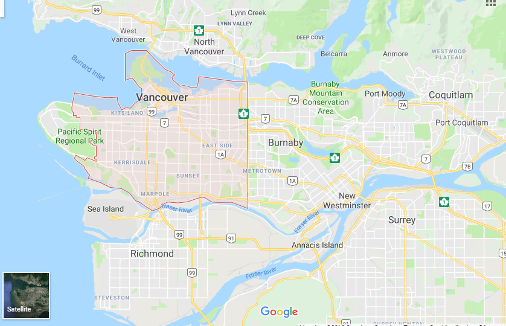
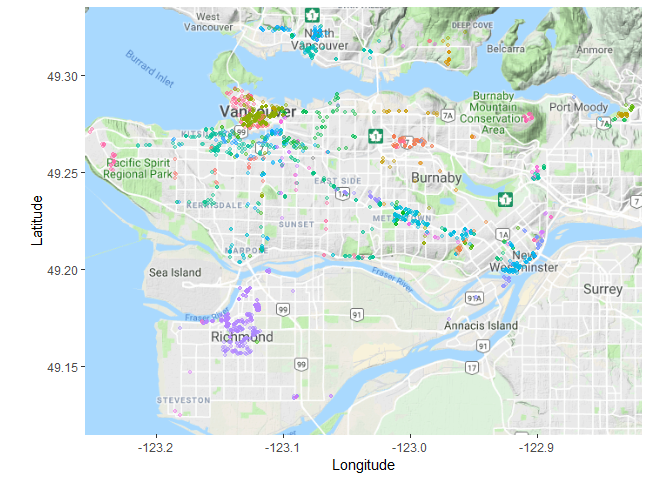

A Data Driven Approach to Evaluating the Vancouver Housing Market
================
Pascal Schmidt
November 18, 2018

``` r
knitr::opts_chunk$set(warning = FALSE, results = "asis", message = FALSE)
```

``` r
library(tidyverse)
```

Data Cleaning and Data Wrangling
--------------------------------

``` r
###################################
### Reading in the streets data ###
###################################

path <- list.files(path = here::here("data"), pattern = ".xlsx")
df <- tibble::data_frame(path = path) %>%
  dplyr::mutate(., path = paste0(here::here("data"), "/", path)) %>%
  dplyr::mutate(., sheet_name = purrr::map(path, readxl::excel_sheets)) %>%
  tidyr::unnest(.) %>%
  dplyr::mutate(., data = purrr::map2(
    path, sheet_name,
    ~readxl::read_excel(.x, .y)
  ))

data_streets <- df$data
```

``` r
##############################################
### Rading in renting data from craigslist ###
##############################################

craigslist <- read.csv(here::here("data", "craigslist.csv"))

# data wrangling and data manipulation
# the code below groups the apartments into square feet
craigslist %>%
  dplyr::mutate(
    SqFt_mod = cut(.$SqFt,
      breaks = seq(from = 0, to = 1199, by = 100),
      labels = paste0(seq(from = 1, to = 1099, by = 100), "-", seq(from = 101, to = 1100, by = 100))
    ),
    SqFt_mod_2 = cut(.$SqFt,
      breaks = seq(from = 1100, to = 3099, by = 250),
      labels = paste0(seq(from = 1101, to = 2849, by = 250), "-", seq(from = 1351, to = 3100, by = 250))
    ),
    SqFt_mod_3 = cut(.$SqFt,
      breaks = seq(from = 3100, to = 13099, by = 500),
      labels = paste0(seq(from = 3101, to = 12599, by = 500), "-", seq(from = 3601, to = 13100, by = 500))
    )
  ) %>%
  tidyr::unite(., SqFt_mod, c("SqFt_mod", "SqFt_mod_2", "SqFt_mod_3"), sep = "", remove = TRUE) %>%
  dplyr::mutate(., SqFt_mod = gsub("NA", "", SqFt_mod)) -> craigslist

# remove all variables with missing locations and
# remove all variables that have missing values for square feet and bedrooms
craigslist %>%
  dplyr::filter(., !(is.na(SqFt) & is.na(Bedrooms))) %>%
  dplyr::filter(., !is.na(Location)) %>%
  tidyr::separate(.,
    col = Location,
    into = c("street", "city"),
    sep = ", ",
    remove = TRUE
  ) %>%
  dplyr::mutate(., neighborhood = NA) -> craigslist
```

``` r
for (i in 1:length(data_streets)) {
  craigslist$neighborhood[craigslist$street %in% (data_streets[[i]] %>%
    dplyr::pull(.))] <- colnames(data_streets[[i]])
}

for (i in 1:nrow(craigslist)) {
  craigslist[i, "neighborhood"]["Maple Ridge" %in% craigslist[i, "city"]] <- "Maple Ridge"
  craigslist[i, "neighborhood"]["Marpole Avenue" %in% craigslist[i, "street_name"] & "Port Coquitlam" %in% craigslist[i, "city"]] <- "Port Coquitlam"
  craigslist[i, "neighborhood"]["Marpole Avenue" %in% craigslist[i, "street_name"] & "Vancouver West" %in% craigslist[i, "city"]] <- "Fairview"
  craigslist[i, "neighborhood"]["Hamilton Street" %in% craigslist[i, "street_name"] & "Vancouver West" %in% craigslist[i, "city"]] <- "Yaletown"
  craigslist[i, "neighborhood"]["Hamilton Street" %in% craigslist[i, "street_name"] & "New Westminster" %in% craigslist[i, "city"]] <- "Kelvin"
  craigslist[i, "neighborhood"]["Tsawwassen" %in% craigslist[i, "city"]] <- "Tsawwassen"
}

for (i in 1:nrow(craigslist)) {
  craigslist[i, "neighborhood"]["Marpole Avenue" %in% craigslist[i, "street"] & "Port Coquitlam" %in% craigslist[i, "city"]] <- "Port Coquitlam"
  craigslist[i, "neighborhood"]["Marpole Avenue" %in% craigslist[i, "street"] & "Vancouver West" %in% craigslist[i, "city"]] <- "Fairview"
  craigslist[i, "neighborhood"]["Hamilton Street" %in% craigslist[i, "street"] & "Vancouver West" %in% craigslist[i, "city"]] <- "Yaletown"
  craigslist[i, "neighborhood"]["Hamilton Street" %in% craigslist[i, "street"] & "New Westminster" %in% craigslist[i, "city"]] <- "Kelvin"
  craigslist[i, "neighborhood"]["Yaletown" %in% craigslist[i, "city"]] <- "Yaletown"
  craigslist[i, "neighborhood"]["Coal Harbour" %in% craigslist[i, "city"]] <- "Coal Harbour"
  craigslist[i, "neighborhood"]["Kerrisdale" %in% craigslist[i, "city"]] <- "Kerrisdale"
  craigslist[i, "neighborhood"]["Kitsilano" %in% craigslist[i, "city"]] <- "Kitsilano"
  craigslist[i, "neighborhood"]["Metrotown" %in% craigslist[i, "city"]] <- "Metrotown"
  craigslist[i, "neighborhood"]["Burnaby North" %in% craigslist[i, "street"]] <- "Burnaby North"
  craigslist[i, "neighborhood"]["Burnaby" %in% craigslist[i, "street"]] <- "Burnaby"
  craigslist[i, "neighborhood"]["Burquitlam" %in% craigslist[i, "street"] | "North Road" %in% craigslist[i, "street"]] <- "Burquitlam"
  craigslist[i, "neighborhood"]["Central Coquitlam" %in% craigslist[i, "street"]] <- "Coquitlam Centre"
  craigslist[i, "neighborhood"]["Coquitlam Center" %in% craigslist[i, "street"]] <- "Coquitlam Centre"
  craigslist[i, "neighborhood"]["Coquitlam Centre" %in% craigslist[i, "street"]] <- "Coquitlam Centre"
  craigslist[i, "neighborhood"]["Central Coquitlam" %in% craigslist[i, "street"]] <- "Central Coquitlam"
  craigslist[i, "neighborhood"]["Broadway" %in% craigslist[i, "street"] | "Coquitlam" %in% craigslist[i, "street"]] <- "Coquitlam"
  craigslist[i, "neighborhood"]["East Vancouver" %in% craigslist[i, "street"]] <- "East Vancouver"

  craigslist[i, "neighborhood"]["West Vancouver" %in% craigslist[i, "street"]] <- "West Vancouver"
  craigslist[i, "neighborhood"]["West Coquitlam" %in% craigslist[i, "street"]] <- "West Coquitlam"
  craigslist[i, "neighborhood"]["Vancouver" %in% craigslist[i, "street"]] <- "Vancouver"


  craigslist[i, "neighborhood"]["Surrey" %in% craigslist[i, "street"]] <- "Surrey"
  craigslist[i, "neighborhood"]["South Granville" %in% craigslist[i, "street"]] <- "South Granville"

  craigslist[i, "neighborhood"]["South Vancouver" %in% craigslist[i, "street"]] <- "South Vancouver"
  craigslist[i, "neighborhood"]["Richmond Centre" %in% craigslist[i, "street"]] <- "Richmond Central"
  craigslist[i, "neighborhood"]["Richmond" %in% craigslist[i, "street"]] <- "Richmond"
  craigslist[i, "neighborhood"]["Port Moody" %in% craigslist[i, "street"]] <- "Port Moody"

  craigslist[i, "neighborhood"]["Pitt Meadows" %in% craigslist[i, "street"]] <- "Pitt Meadows"
  craigslist[i, "neighborhood"]["North Vancouver" %in% craigslist[i, "street"]] <- "North Vancouver"
  craigslist[i, "neighborhood"]["North Coquitlam" %in% craigslist[i, "street"]] <- "North Coquitlam"
  craigslist[i, "neighborhood"]["North Burnaby" %in% craigslist[i, "street"]] <- "North Burnaby"

  craigslist[i, "neighborhood"]["New Westminster" %in% craigslist[i, "street"]] <- "New Westminster"
  craigslist[i, "neighborhood"]["Maple Ridge" %in% craigslist[i, "street"]] <- "Maple Ridge"
  craigslist[i, "neighborhood"]["East Burnaby" %in% craigslist[i, "street"]] <- "East Burnaby"
  craigslist[i, "neighborhood"]["Pitt Meadows" %in% craigslist[i, "city"]] <- "Pitt Meadows"
  craigslist[i, "neighborhood"]["Port Coquitlam" %in% craigslist[i, "city"]] <- "Port Coquitlam"
  craigslist[i, "neighborhood"]["Port Moody" %in% craigslist[i, "city"]] <- "Port Moody"

  craigslist[i, "neighborhood"]["Coquitlam West" %in% craigslist[i, "street"]] <- "Laurentian Belaire"
}

craigslist %>%
  tidyr::drop_na(., neighborhood) -> craigslist
```

``` r
###################################
### Reading in real estate data ###
###################################

housing <- read.csv(here::here("data", "housing_data.csv"))
housing[] <- lapply(housing, as.character)
housing$neighborhood <- NA
```

``` r
path <- list.files(path = here::here("data"), pattern = ".xlsx")
df <- tibble::data_frame(path = path) %>%
  dplyr::mutate(., path = paste0(here::here("data"), "/", path)) %>%
  dplyr::mutate(., sheet_name = purrr::map(path, readxl::excel_sheets)) %>%
  tidyr::unnest(.) %>%
  dplyr::mutate(., data = purrr::map2(
    path, sheet_name,
    ~readxl::read_excel(.x, .y)
  ))

data_streets <- df$data

for (i in 1:length(data_streets)) {
  housing$neighborhood[housing$street_name %in% (data_streets[[i]] %>%
    dplyr::pull(.))] <- colnames(data_streets[[i]])
}

for (i in 1:nrow(housing)) {
  housing[i, "neighborhood"]["Maple Ridge" %in% housing[i, "city"]] <- "Maple Ridge"
  housing[i, "neighborhood"]["Marpole Avenue" %in% housing[i, "street_name"] & "Port Coquitlam" %in% housing[i, "city"]] <- "Port Coquitlam"
  housing[i, "neighborhood"]["Marpole Avenue" %in% housing[i, "street_name"] & "Vancouver West" %in% housing[i, "city"]] <- "Fairview"
  housing[i, "neighborhood"]["Hamilton Street" %in% housing[i, "street_name"] & "Vancouver West" %in% housing[i, "city"]] <- "Yaletown"
  housing[i, "neighborhood"]["Hamilton Street" %in% housing[i, "street_name"] & "New Westminster" %in% housing[i, "city"]] <- "Kelvin"
  housing[i, "neighborhood"]["Tsawwassen" %in% housing[i, "city"]] <- "Tsawwassen"
}
```

``` r
housing %>%
  dplyr::mutate(
    price = stringr::str_sub(.[, "price"], start = 2, end = 8) %>%
      stringr::str_remove_all(., ","),
    squares = stringr::str_remove_all(.[, "squares"], "sq.ft.") %>%
      stringr::str_remove_all(., ",")
  ) %>%
  dplyr::mutate_at(., .vars = c("price", "squares", "age", "bed", "bath"), funs(as.integer(.))) %>%
  dplyr::mutate_if(., is.character, as.factor) -> housing

housing %>%
  dplyr::mutate(
    SqFt_mod = cut(.$squares,
      breaks = seq(from = 0, to = 1199, by = 100),
      labels = paste0(seq(from = 1, to = 1099, by = 100), "-", seq(from = 101, to = 1100, by = 100))
    ),
    SqFt_mod_2 = cut(.$squares,
      breaks = seq(from = 1100, to = 3099, by = 250),
      labels = paste0(seq(from = 1101, to = 2849, by = 250), "-", seq(from = 1351, to = 3100, by = 250))
    ),
    SqFt_mod_3 = cut(.$squares,
      breaks = seq(from = 3100, to = 13099, by = 500),
      labels = paste0(seq(from = 3101, to = 12599, by = 500), "-", seq(from = 3601, to = 13100, by = 500))
    )
  ) %>%
  tidyr::unite(., SqFt_mod, c("SqFt_mod", "SqFt_mod_2", "SqFt_mod_3"), sep = "", remove = TRUE) %>%
  dplyr::mutate(., SqFt_mod = gsub("NA", "", SqFt_mod)) -> housing
```

Today, we will be looking at the Vancouver housing market in Canada. We collected rent data from craigslist and also home prices from various websites. A home is on average the most expensive "investment" almost everyone makes and therefore, it is important to know the market. In this blog post, we will be answering questions such as:

-   What are the market rates for rents and homes in the Vancouver housing market?
-   At what prices are homes undervalued or overvalued?

The Vancouver housing market is one of the most expensive ones in the world. Consequently, one must spend a lot of money when purchasing a home. However, is the money spend on a home worth the cost? In order to answer this question, we also looked at price to rent ratios. In more detail, we wanted to know:

-   What locations have the best price to rent ratios?
-   In what locations should you buy and in what locations should you rent?


Data Collection
---------------

The data for this project was obtained from various websites that listed home prices. The rent data on the other hand was collected with the `craigr` package which is available on [github](https://github.com/adletaw/craigr). After we collected the data, we spend a lot of time inserting the neighborhoods by looking at the street names.

We did that in order to decrease the variance for our home prices and rents but on the other hand introduced bias in our analysis. We thought that we would compare and evaluate neighborhoods rather than particular street names due to the fact we only had one house for some street names. Therefore, this would increase the variance for our homes. Consequently, we analysed the prices and rents by neighborhood. If you are interested in finding out more about the bias-varaince trade-off, then check out [this blog post](http://thatdatatho.com/2018/08/08/explaining-bias-variance-trade-off-machine-learning/).

We collected rent data and housing prices from Vancouver, Richmond, New Westminster, and Coquitlam. We restriced our search to apartments that cost less than a million dollars. This is because we did not want to collect any outlier luxury apartments worth millions of dollars.



What Are the Market Rates for Rent and Home Prices in Vancouver?
----------------------------------------------------------------

### Multiple Linear Regression for Housing Prices

In order to answer this question, we fit a muliple linear regression model. One for rents and one for home prices. For home prices, we regressed `price` on `age`, number of bathrooms `bath`, number of bedrooms `bed`, square feet `squares`, and `neighborhood`.

#### Regression Equation for Housing Prices in the Greater Vancouver Area

*p**r**i**c**e* = *β*<sub>0</sub> + *β*<sub>1</sub>*a**g**e* + *β*<sub>2</sub>*b**a**t**h* + *β*<sub>3</sub>*b**e**d* + *β*<sub>4</sub>*s**q**u**a**r**e**s* + *β*<sub>5</sub>*n**e**i**g**h**b**o**r**h**o**o**d* + *ϵ*

Below, you can find a summary table of the regression output. We only displayed the neighborhoods with the lowest estimates and the neighborhood with the highest estimates. We also displayed `age`, `squares`, `bath`, and `bed` as well as the intercept.

``` r
housing %>%
  stats::lm(price ~ age + bed + bath + squares + neighborhood, data = .) %>%
  base::summary(.) %>%
  broom::tidy(.) %>%
  dplyr::mutate_at(., .vars = c("estimate", "std.error", "statistic", "p.value"), funs(round(., 2))) %>%
  dplyr::arrange(estimate) %>%
  pander::pandoc.table(.)
```

<table>
<colgroup>
<col width="43%" />
<col width="14%" />
<col width="15%" />
<col width="15%" />
<col width="11%" />
</colgroup>
<thead>
<tr class="header">
<th align="center">term</th>
<th align="center">estimate</th>
<th align="center">std.error</th>
<th align="center">statistic</th>
<th align="center">p.value</th>
</tr>
</thead>
<tbody>
<tr class="odd">
<td align="center">neighborhoodMaple Ridge</td>
<td align="center">-463157</td>
<td align="center">33081</td>
<td align="center">-14</td>
<td align="center">0</td>
</tr>
<tr class="even">
<td align="center">neighborhoodBirchland Manor</td>
<td align="center">-434378</td>
<td align="center">61917</td>
<td align="center">-7.02</td>
<td align="center">0</td>
</tr>
<tr class="odd">
<td align="center">neighborhoodPort Moody North</td>
<td align="center">-400267</td>
<td align="center">83779</td>
<td align="center">-4.78</td>
<td align="center">0</td>
</tr>
<tr class="even">
<td align="center">neighborhoodPort Coquitlam</td>
<td align="center">-338276</td>
<td align="center">27089</td>
<td align="center">-12.49</td>
<td align="center">0</td>
</tr>
<tr class="odd">
<td align="center">neighborhoodMary Hill</td>
<td align="center">-317866</td>
<td align="center">33957</td>
<td align="center">-9.36</td>
<td align="center">0</td>
</tr>
<tr class="even">
<td align="center">neighborhoodSapperton</td>
<td align="center">-300319</td>
<td align="center">33824</td>
<td align="center">-8.88</td>
<td align="center">0</td>
</tr>
<tr class="odd">
<td align="center">neighborhoodBurquitlam</td>
<td align="center">-289733</td>
<td align="center">83405</td>
<td align="center">-3.47</td>
<td align="center">0</td>
</tr>
<tr class="even">
<td align="center">neighborhoodHarbour Chines</td>
<td align="center">-269512</td>
<td align="center">33847</td>
<td align="center">-7.96</td>
<td align="center">0</td>
</tr>
<tr class="odd">
<td align="center">neighborhoodQueens Park</td>
<td align="center">-257265</td>
<td align="center">23902</td>
<td align="center">-10.76</td>
<td align="center">0</td>
</tr>
<tr class="even">
<td align="center">neighborhoodUnivercity</td>
<td align="center">-254310</td>
<td align="center">25961</td>
<td align="center">-9.8</td>
<td align="center">0</td>
</tr>
<tr class="odd">
<td align="center">neighborhoodQueensborough</td>
<td align="center">-250906</td>
<td align="center">26057</td>
<td align="center">-9.63</td>
<td align="center">0</td>
</tr>
<tr class="even">
<td align="center">neighborhoodSunset</td>
<td align="center">-245710</td>
<td align="center">37613</td>
<td align="center">-6.53</td>
<td align="center">0</td>
</tr>
<tr class="odd">
<td align="center">neighborhoodLougheed</td>
<td align="center">-235268</td>
<td align="center">29448</td>
<td align="center">-7.99</td>
<td align="center">0</td>
</tr>
<tr class="even">
<td align="center">neighborhoodNew Westminster Downtown</td>
<td align="center">-234424</td>
<td align="center">19742</td>
<td align="center">-11.87</td>
<td align="center">0</td>
</tr>
<tr class="odd">
<td align="center">neighborhoodRichmond South</td>
<td align="center">-224068</td>
<td align="center">60423</td>
<td align="center">-3.71</td>
<td align="center">0</td>
</tr>
<tr class="even">
<td align="center">neighborhoodDeer Lake Park</td>
<td align="center">-223399</td>
<td align="center">33774</td>
<td align="center">-6.61</td>
<td align="center">0</td>
</tr>
<tr class="odd">
<td align="center">neighborhoodEagle Ridge</td>
<td align="center">-223138</td>
<td align="center">31326</td>
<td align="center">-7.12</td>
<td align="center">0</td>
</tr>
<tr class="even">
<td align="center">neighborhoodSun Valley</td>
<td align="center">-222396</td>
<td align="center">83390</td>
<td align="center">-2.67</td>
<td align="center">0.01</td>
</tr>
<tr class="odd">
<td align="center">neighborhoodKelvin</td>
<td align="center">-221726</td>
<td align="center">28039</td>
<td align="center">-7.91</td>
<td align="center">0</td>
</tr>
<tr class="even">
<td align="center">neighborhoodSullivan Heights</td>
<td align="center">-216351</td>
<td align="center">37698</td>
<td align="center">-5.74</td>
<td align="center">0</td>
</tr>
<tr class="odd">
<td align="center">neighborhoodCascade Heights</td>
<td align="center">-210652</td>
<td align="center">35459</td>
<td align="center">-5.94</td>
<td align="center">0</td>
</tr>
<tr class="even">
<td align="center">neighborhoodMiddlegate</td>
<td align="center">-200505</td>
<td align="center">21525</td>
<td align="center">-9.32</td>
<td align="center">0</td>
</tr>
<tr class="odd">
<td align="center">neighborhoodBurrard Inlet 3</td>
<td align="center">-199910</td>
<td align="center">25825</td>
<td align="center">-7.74</td>
<td align="center">0</td>
</tr>
<tr class="even">
<td align="center">neighborhoodEastburn</td>
<td align="center">-199678</td>
<td align="center">37719</td>
<td align="center">-5.29</td>
<td align="center">0</td>
</tr>
<tr class="odd">
<td align="center">neighborhoodCassin</td>
<td align="center">-199212</td>
<td align="center">22698</td>
<td align="center">-8.78</td>
<td align="center">0</td>
</tr>
<tr class="even">
<td align="center">neighborhoodRichmond Central</td>
<td align="center">-194340</td>
<td align="center">19063</td>
<td align="center">-10.19</td>
<td align="center">0</td>
</tr>
<tr class="odd">
<td align="center">neighborhoodSteveston</td>
<td align="center">-193270</td>
<td align="center">24303</td>
<td align="center">-7.95</td>
<td align="center">0</td>
</tr>
<tr class="even">
<td align="center">neighborhoodSeymour Heights</td>
<td align="center">-191516</td>
<td align="center">60507</td>
<td align="center">-3.17</td>
<td align="center">0</td>
</tr>
<tr class="odd">
<td align="center">neighborhoodRenfrew-Collingwood</td>
<td align="center">-177266</td>
<td align="center">23523</td>
<td align="center">-7.54</td>
<td align="center">0</td>
</tr>
<tr class="even">
<td align="center">neighborhoodRichmond North</td>
<td align="center">-166283</td>
<td align="center">18541</td>
<td align="center">-8.97</td>
<td align="center">0</td>
</tr>
<tr class="odd">
<td align="center">neighborhoodLynn Valley</td>
<td align="center">-160075</td>
<td align="center">32399</td>
<td align="center">-4.94</td>
<td align="center">0</td>
</tr>
<tr class="even">
<td align="center">neighborhoodKillarney</td>
<td align="center">-159118</td>
<td align="center">22276</td>
<td align="center">-7.14</td>
<td align="center">0</td>
</tr>
<tr class="odd">
<td align="center">neighborhoodBuckingham Heights</td>
<td align="center">-153998</td>
<td align="center">30354</td>
<td align="center">-5.07</td>
<td align="center">0</td>
</tr>
<tr class="even">
<td align="center">neighborhoodKensington-Cedar Cottage</td>
<td align="center">-152621</td>
<td align="center">22415</td>
<td align="center">-6.81</td>
<td align="center">0</td>
</tr>
<tr class="odd">
<td align="center">neighborhoodBryne Creek Ravine Park</td>
<td align="center">-151665</td>
<td align="center">27538</td>
<td align="center">-5.51</td>
<td align="center">0</td>
</tr>
<tr class="even">
<td align="center">neighborhoodCapitol Hill</td>
<td align="center">-150342</td>
<td align="center">35518</td>
<td align="center">-4.23</td>
<td align="center">0</td>
</tr>
<tr class="odd">
<td align="center">neighborhoodThompson</td>
<td align="center">-150045</td>
<td align="center">60315</td>
<td align="center">-2.49</td>
<td align="center">0.01</td>
</tr>
<tr class="even">
<td align="center">neighborhoodGarden Village</td>
<td align="center">-143267</td>
<td align="center">29364</td>
<td align="center">-4.88</td>
<td align="center">0</td>
</tr>
<tr class="odd">
<td align="center">neighborhoodVictoria-Fraserview</td>
<td align="center">-141997</td>
<td align="center">32393</td>
<td align="center">-4.38</td>
<td align="center">0</td>
</tr>
<tr class="even">
<td align="center">neighborhoodBrentwood</td>
<td align="center">-139089</td>
<td align="center">20506</td>
<td align="center">-6.78</td>
<td align="center">0</td>
</tr>
<tr class="odd">
<td align="center">neighborhoodSouth Slope</td>
<td align="center">-136520</td>
<td align="center">30239</td>
<td align="center">-4.51</td>
<td align="center">0</td>
</tr>
<tr class="even">
<td align="center">neighborhoodTsawwassen</td>
<td align="center">-126631</td>
<td align="center">83646</td>
<td align="center">-1.51</td>
<td align="center">0.13</td>
</tr>
<tr class="odd">
<td align="center">neighborhoodNorth Lonsdale</td>
<td align="center">-120820</td>
<td align="center">35544</td>
<td align="center">-3.4</td>
<td align="center">0</td>
</tr>
<tr class="even">
<td align="center">neighborhoodBurnaby Mountain</td>
<td align="center">-116247</td>
<td align="center">50616</td>
<td align="center">-2.3</td>
<td align="center">0.02</td>
</tr>
<tr class="odd">
<td align="center">neighborhoodHastings-Sunrise</td>
<td align="center">-110496</td>
<td align="center">23061</td>
<td align="center">-4.79</td>
<td align="center">0</td>
</tr>
<tr class="even">
<td align="center">neighborhoodCove Cliff</td>
<td align="center">-109287</td>
<td align="center">83688</td>
<td align="center">-1.31</td>
<td align="center">0.19</td>
</tr>
<tr class="odd">
<td align="center">neighborhoodBurnaby Lake</td>
<td align="center">-107346</td>
<td align="center">60870</td>
<td align="center">-1.76</td>
<td align="center">0.08</td>
</tr>
<tr class="even">
<td align="center">neighborhoodPemberson Heights</td>
<td align="center">-105410</td>
<td align="center">25205</td>
<td align="center">-4.18</td>
<td align="center">0</td>
</tr>
<tr class="odd">
<td align="center">neighborhoodMetrotown</td>
<td align="center">-104171</td>
<td align="center">18957</td>
<td align="center">-5.5</td>
<td align="center">0</td>
</tr>
<tr class="even">
<td align="center">neighborhoodSentinel Hill</td>
<td align="center">-91845</td>
<td align="center">60440</td>
<td align="center">-1.52</td>
<td align="center">0.13</td>
</tr>
<tr class="odd">
<td align="center">neighborhoodLynnmour</td>
<td align="center">-91146</td>
<td align="center">35558</td>
<td align="center">-2.56</td>
<td align="center">0.01</td>
</tr>
<tr class="even">
<td align="center">neighborhoodGrandview-Woodland</td>
<td align="center">-89206</td>
<td align="center">23899</td>
<td align="center">-3.73</td>
<td align="center">0</td>
</tr>
<tr class="odd">
<td align="center">neighborhoodBurnaby Central</td>
<td align="center">-79311</td>
<td align="center">84172</td>
<td align="center">-0.94</td>
<td align="center">0.35</td>
</tr>
<tr class="even">
<td align="center">neighborhoodWindsor Park</td>
<td align="center">-79251</td>
<td align="center">50624</td>
<td align="center">-1.57</td>
<td align="center">0.12</td>
</tr>
<tr class="odd">
<td align="center">neighborhoodMarpole</td>
<td align="center">-77902</td>
<td align="center">23596</td>
<td align="center">-3.3</td>
<td align="center">0</td>
</tr>
<tr class="even">
<td align="center">neighborhoodNorth Vancouver Central</td>
<td align="center">-70411</td>
<td align="center">21534</td>
<td align="center">-3.27</td>
<td align="center">0</td>
</tr>
<tr class="odd">
<td align="center">neighborhoodFairview</td>
<td align="center">-62078</td>
<td align="center">27350</td>
<td align="center">-2.27</td>
<td align="center">0.02</td>
</tr>
<tr class="even">
<td align="center">neighborhoodWillingdon Heights</td>
<td align="center">-59387</td>
<td align="center">25420</td>
<td align="center">-2.34</td>
<td align="center">0.02</td>
</tr>
<tr class="odd">
<td align="center">neighborhoodLower Lonsdale</td>
<td align="center">-59046</td>
<td align="center">20853</td>
<td align="center">-2.83</td>
<td align="center">0</td>
</tr>
<tr class="even">
<td align="center">neighborhoodOakridge</td>
<td align="center">-51146</td>
<td align="center">26808</td>
<td align="center">-1.91</td>
<td align="center">0.06</td>
</tr>
<tr class="odd">
<td align="center">neighborhoodCapilano Highlands</td>
<td align="center">-50900</td>
<td align="center">60274</td>
<td align="center">-0.84</td>
<td align="center">0.4</td>
</tr>
<tr class="even">
<td align="center">neighborhoodDeep Cove</td>
<td align="center">-47605</td>
<td align="center">60288</td>
<td align="center">-0.79</td>
<td align="center">0.43</td>
</tr>
<tr class="odd">
<td align="center">neighborhoodRiley Park</td>
<td align="center">-44719</td>
<td align="center">26889</td>
<td align="center">-1.66</td>
<td align="center">0.1</td>
</tr>
<tr class="even">
<td align="center">neighborhoodDowntown Eastside</td>
<td align="center">-32024</td>
<td align="center">28635</td>
<td align="center">-1.12</td>
<td align="center">0.26</td>
</tr>
<tr class="odd">
<td align="center">neighborhoodMount Pleasant</td>
<td align="center">-29173</td>
<td align="center">23274</td>
<td align="center">-1.25</td>
<td align="center">0.21</td>
</tr>
<tr class="even">
<td align="center">neighborhoodStrathcona</td>
<td align="center">-26594</td>
<td align="center">33673</td>
<td align="center">-0.79</td>
<td align="center">0.43</td>
</tr>
<tr class="odd">
<td align="center">neighborhoodUniversity Hill (UBC)</td>
<td align="center">-14637</td>
<td align="center">23431</td>
<td align="center">-0.62</td>
<td align="center">0.53</td>
</tr>
<tr class="even">
<td align="center">neighborhoodCoal Harbour</td>
<td align="center">-8180</td>
<td align="center">26852</td>
<td align="center">-0.3</td>
<td align="center">0.76</td>
</tr>
<tr class="odd">
<td align="center">age</td>
<td align="center">-4862</td>
<td align="center">192.2</td>
<td align="center">-25.3</td>
<td align="center">0</td>
</tr>
<tr class="even">
<td align="center">squares</td>
<td align="center">353</td>
<td align="center">15.48</td>
<td align="center">22.81</td>
<td align="center">0</td>
</tr>
<tr class="odd">
<td align="center">neighborhoodPoint Grey</td>
<td align="center">8896</td>
<td align="center">21953</td>
<td align="center">0.41</td>
<td align="center">0.69</td>
</tr>
<tr class="even">
<td align="center">neighborhoodKitsilano</td>
<td align="center">14209</td>
<td align="center">19363</td>
<td align="center">0.73</td>
<td align="center">0.46</td>
</tr>
<tr class="odd">
<td align="center">bath</td>
<td align="center">27453</td>
<td align="center">6747</td>
<td align="center">4.07</td>
<td align="center">0</td>
</tr>
<tr class="even">
<td align="center">neighborhoodKerrisdale</td>
<td align="center">27685</td>
<td align="center">23652</td>
<td align="center">1.17</td>
<td align="center">0.24</td>
</tr>
<tr class="odd">
<td align="center">bed</td>
<td align="center">34660</td>
<td align="center">5977</td>
<td align="center">5.8</td>
<td align="center">0</td>
</tr>
<tr class="even">
<td align="center">neighborhoodDowntown</td>
<td align="center">42785</td>
<td align="center">18277</td>
<td align="center">2.34</td>
<td align="center">0.02</td>
</tr>
<tr class="odd">
<td align="center">neighborhoodHollyburn</td>
<td align="center">66133</td>
<td align="center">27950</td>
<td align="center">2.37</td>
<td align="center">0.02</td>
</tr>
<tr class="even">
<td align="center">neighborhoodEagle Harbour</td>
<td align="center">74902</td>
<td align="center">50326</td>
<td align="center">1.49</td>
<td align="center">0.14</td>
</tr>
<tr class="odd">
<td align="center">neighborhoodDundarave</td>
<td align="center">90116</td>
<td align="center">44587</td>
<td align="center">2.02</td>
<td align="center">0.04</td>
</tr>
<tr class="even">
<td align="center">neighborhoodWest End</td>
<td align="center">95721</td>
<td align="center">21230</td>
<td align="center">4.51</td>
<td align="center">0</td>
</tr>
<tr class="odd">
<td align="center">neighborhoodYaletown</td>
<td align="center">122073</td>
<td align="center">22317</td>
<td align="center">5.47</td>
<td align="center">0</td>
</tr>
<tr class="even">
<td align="center">(Intercept)</td>
<td align="center">476095</td>
<td align="center">19136</td>
<td align="center">24.88</td>
<td align="center">0</td>
</tr>
</tbody>
</table>

From the output above, we can see that `age`, `bed`, `bath`, and `squares` are statistically significant. Some neighborhoods are also significant. As expected, the sign of `age` is negative. This means that on average, holding everything else constant, an one year increase in age decreases the value of the property by around $4861 dollars.

It is interesting to see that home prices in Maple Ridge drop the most when comparing to other neighborhoods. On the other hand, holding everything else constant, a home buyer has to pay 122,073 dollars extra when purchasing a house in Yaletown.

`age`, `squares`, `bed`, `bath`, and `neighborhood` explain around 61% of the variation in home prices. So, 39% ar still unexplained and are due to other factors. The F-statistic is &lt; 0.01 and so we can conclude that our model is better than the intercept-only model.

### What Are the Market Rates for Home Prices in the Greater Vancouver Area?

``` r
lm_house_price <- stats::lm(price ~ age + bed + bath + squares + neighborhood, data = housing)
predicted_values <- data.frame(age = 10, bed = 1, bath = 1, squares = 800, neighborhood = "Yaletown")
predict(lm_house_price, newdata = predicted_values)
```

       1 

894047.9

When one wants to buy a home in Yaletown, the market price for a one bedroom, one bathroom apartment with 800 square feet and 10 years old is:

476094.5 − 4861.85 \* 10 + 27452.53 \* 1 + 34660.06 \* 1 + 352.98 \* 800 + 122073.08 \* 1 = 894045.7

So, whenever you are intereted in finding out the market rate of a particular house, then you can plug in age, number of bathrooms and bedrooms, and square feet into this equation.

If the price of a home is lower than the result of the regression equation, then this house might sell below market value. Likewise, if the price of a home is above the price of the regression equation's output, then this house might be above market value.

The next regression model we fit was for rents.

### Multiple Linear Regression for Rent Prices in the Greater Vancouver Area

We regressed rent prices on bedrooms, square feet, and neigborhoods. For the craigslist data, we unfortunately did not collect covariates for age and number of bathrooms. Consequently, this will lower the variation explained in rent prices.

#### Regression Equation for Rent Prices in the Greater Vancouver Area

*p**r**i**c**e* = *β*<sub>0</sub> + *β*<sub>1</sub>*b**e**d* + *β*<sub>2</sub>*s**q**u**a**r**e**s* + *β*<sub>3</sub>*n**e**i**g**h**b**o**r**h**o**o**d* + *ϵ*

``` r
craigslist %>%
  stats::lm(Price ~ Bedrooms + SqFt + neighborhood, data = .) %>%
  base::summary(.) %>%
  broom::tidy(.) %>%
  dplyr::mutate_at(., .vars = c("estimate", "std.error", "statistic", "p.value"), funs(round(., 2))) %>%
  dplyr::arrange(estimate) %>%
  pander::pandoc.table(.)
```

<table>
<colgroup>
<col width="43%" />
<col width="14%" />
<col width="15%" />
<col width="15%" />
<col width="11%" />
</colgroup>
<thead>
<tr class="header">
<th align="center">term</th>
<th align="center">estimate</th>
<th align="center">std.error</th>
<th align="center">statistic</th>
<th align="center">p.value</th>
</tr>
</thead>
<tbody>
<tr class="odd">
<td align="center">neighborhoodCassin</td>
<td align="center">-1119</td>
<td align="center">706.5</td>
<td align="center">-1.58</td>
<td align="center">0.11</td>
</tr>
<tr class="even">
<td align="center">neighborhoodBroadmoor</td>
<td align="center">-937.6</td>
<td align="center">463.3</td>
<td align="center">-2.02</td>
<td align="center">0.04</td>
</tr>
<tr class="odd">
<td align="center">neighborhoodRichmond South</td>
<td align="center">-902.9</td>
<td align="center">544.2</td>
<td align="center">-1.66</td>
<td align="center">0.1</td>
</tr>
<tr class="even">
<td align="center">neighborhoodSeafair</td>
<td align="center">-708.1</td>
<td align="center">487.9</td>
<td align="center">-1.45</td>
<td align="center">0.15</td>
</tr>
<tr class="odd">
<td align="center">neighborhoodConnaught Heights</td>
<td align="center">-687.5</td>
<td align="center">930.7</td>
<td align="center">-0.74</td>
<td align="center">0.46</td>
</tr>
<tr class="even">
<td align="center">neighborhoodWestwood Plateau</td>
<td align="center">-669.4</td>
<td align="center">411.2</td>
<td align="center">-1.63</td>
<td align="center">0.1</td>
</tr>
<tr class="odd">
<td align="center">neighborhoodDartmoore</td>
<td align="center">-666.7</td>
<td align="center">788.6</td>
<td align="center">-0.85</td>
<td align="center">0.4</td>
</tr>
<tr class="even">
<td align="center">neighborhoodBurke Mountain</td>
<td align="center">-633.7</td>
<td align="center">431.3</td>
<td align="center">-1.47</td>
<td align="center">0.14</td>
</tr>
<tr class="odd">
<td align="center">neighborhoodEssondale</td>
<td align="center">-618.3</td>
<td align="center">529.5</td>
<td align="center">-1.17</td>
<td align="center">0.24</td>
</tr>
<tr class="even">
<td align="center">neighborhoodMaple Ridge</td>
<td align="center">-575.5</td>
<td align="center">379.7</td>
<td align="center">-1.52</td>
<td align="center">0.13</td>
</tr>
<tr class="odd">
<td align="center">neighborhoodCentral Coquitlam</td>
<td align="center">-572.9</td>
<td align="center">615.2</td>
<td align="center">-0.93</td>
<td align="center">0.35</td>
</tr>
<tr class="even">
<td align="center">neighborhoodPitt Meadows</td>
<td align="center">-505.4</td>
<td align="center">455.2</td>
<td align="center">-1.11</td>
<td align="center">0.27</td>
</tr>
<tr class="odd">
<td align="center">neighborhoodThompson</td>
<td align="center">-487.4</td>
<td align="center">506.1</td>
<td align="center">-0.96</td>
<td align="center">0.34</td>
</tr>
<tr class="even">
<td align="center">neighborhoodEagle Ridge</td>
<td align="center">-416.7</td>
<td align="center">1264</td>
<td align="center">-0.33</td>
<td align="center">0.74</td>
</tr>
<tr class="odd">
<td align="center">neighborhoodBurnaby Mountain</td>
<td align="center">-386</td>
<td align="center">1264</td>
<td align="center">-0.31</td>
<td align="center">0.76</td>
</tr>
<tr class="even">
<td align="center">neighborhoodNorth Coquitlam</td>
<td align="center">-381.7</td>
<td align="center">931</td>
<td align="center">-0.41</td>
<td align="center">0.68</td>
</tr>
<tr class="odd">
<td align="center">neighborhoodCoquitlam</td>
<td align="center">-351.8</td>
<td align="center">381.3</td>
<td align="center">-0.92</td>
<td align="center">0.36</td>
</tr>
<tr class="even">
<td align="center">neighborhoodBurnaby Central</td>
<td align="center">-318.1</td>
<td align="center">497.1</td>
<td align="center">-0.64</td>
<td align="center">0.52</td>
</tr>
<tr class="odd">
<td align="center">neighborhoodQueensborough</td>
<td align="center">-314.3</td>
<td align="center">516.9</td>
<td align="center">-0.61</td>
<td align="center">0.54</td>
</tr>
<tr class="even">
<td align="center">neighborhoodEastburn</td>
<td align="center">-290.6</td>
<td align="center">489.1</td>
<td align="center">-0.59</td>
<td align="center">0.55</td>
</tr>
<tr class="odd">
<td align="center">neighborhoodAustin Heights</td>
<td align="center">-256.9</td>
<td align="center">506.9</td>
<td align="center">-0.51</td>
<td align="center">0.61</td>
</tr>
<tr class="even">
<td align="center">neighborhoodWestridge</td>
<td align="center">-254.2</td>
<td align="center">585.6</td>
<td align="center">-0.43</td>
<td align="center">0.66</td>
</tr>
<tr class="odd">
<td align="center">neighborhoodSoutharm</td>
<td align="center">-228</td>
<td align="center">544.8</td>
<td align="center">-0.42</td>
<td align="center">0.68</td>
</tr>
<tr class="even">
<td align="center">neighborhoodPort Moody</td>
<td align="center">-208.4</td>
<td align="center">396.1</td>
<td align="center">-0.53</td>
<td align="center">0.6</td>
</tr>
<tr class="odd">
<td align="center">neighborhoodDeep Cove</td>
<td align="center">-208.1</td>
<td align="center">931.1</td>
<td align="center">-0.22</td>
<td align="center">0.82</td>
</tr>
<tr class="even">
<td align="center">neighborhoodPort Coquitlam</td>
<td align="center">-197.3</td>
<td align="center">386.8</td>
<td align="center">-0.51</td>
<td align="center">0.61</td>
</tr>
<tr class="odd">
<td align="center">neighborhoodHarbour Chines</td>
<td align="center">-189.4</td>
<td align="center">930.6</td>
<td align="center">-0.2</td>
<td align="center">0.84</td>
</tr>
<tr class="even">
<td align="center">neighborhoodNorth Burnaby</td>
<td align="center">-185.7</td>
<td align="center">401</td>
<td align="center">-0.46</td>
<td align="center">0.64</td>
</tr>
<tr class="odd">
<td align="center">neighborhoodSteveston</td>
<td align="center">-161.4</td>
<td align="center">420.9</td>
<td align="center">-0.38</td>
<td align="center">0.7</td>
</tr>
<tr class="even">
<td align="center">neighborhoodEagle Harbour</td>
<td align="center">-115.3</td>
<td align="center">1263</td>
<td align="center">-0.09</td>
<td align="center">0.93</td>
</tr>
<tr class="odd">
<td align="center">neighborhoodSouth Slope</td>
<td align="center">-115</td>
<td align="center">469.9</td>
<td align="center">-0.24</td>
<td align="center">0.81</td>
</tr>
<tr class="even">
<td align="center">neighborhoodSouth Vancouver</td>
<td align="center">-82.7</td>
<td align="center">789.7</td>
<td align="center">-0.1</td>
<td align="center">0.92</td>
</tr>
<tr class="odd">
<td align="center">neighborhoodMeadowbrook</td>
<td align="center">-81.24</td>
<td align="center">1264</td>
<td align="center">-0.06</td>
<td align="center">0.95</td>
</tr>
<tr class="even">
<td align="center">neighborhoodCariboo</td>
<td align="center">-74</td>
<td align="center">475.7</td>
<td align="center">-0.16</td>
<td align="center">0.88</td>
</tr>
<tr class="odd">
<td align="center">neighborhoodBuckingham Heights</td>
<td align="center">-73.86</td>
<td align="center">496.7</td>
<td align="center">-0.15</td>
<td align="center">0.88</td>
</tr>
<tr class="even">
<td align="center">neighborhoodRiver Springs</td>
<td align="center">-62.72</td>
<td align="center">931</td>
<td align="center">-0.07</td>
<td align="center">0.95</td>
</tr>
<tr class="odd">
<td align="center">neighborhoodRichmond Central</td>
<td align="center">-47.47</td>
<td align="center">381.7</td>
<td align="center">-0.12</td>
<td align="center">0.9</td>
</tr>
<tr class="even">
<td align="center">neighborhoodBurnaby South</td>
<td align="center">-42.63</td>
<td align="center">497.3</td>
<td align="center">-0.09</td>
<td align="center">0.93</td>
</tr>
<tr class="odd">
<td align="center">neighborhoodChineside</td>
<td align="center">-27.57</td>
<td align="center">1264</td>
<td align="center">-0.02</td>
<td align="center">0.98</td>
</tr>
<tr class="even">
<td align="center">neighborhoodBurquitlam</td>
<td align="center">-16.6</td>
<td align="center">425.2</td>
<td align="center">-0.04</td>
<td align="center">0.97</td>
</tr>
<tr class="odd">
<td align="center">neighborhoodCascade Heights</td>
<td align="center">-2.37</td>
<td align="center">615.5</td>
<td align="center">0</td>
<td align="center">1</td>
</tr>
<tr class="even">
<td align="center">SqFt</td>
<td align="center">1.2</td>
<td align="center">0.04</td>
<td align="center">26.73</td>
<td align="center">0</td>
</tr>
<tr class="odd">
<td align="center">neighborhoodCoquitlam Centre</td>
<td align="center">9.7</td>
<td align="center">425.1</td>
<td align="center">0.02</td>
<td align="center">0.98</td>
</tr>
<tr class="even">
<td align="center">neighborhoodHarbour Village</td>
<td align="center">33.18</td>
<td align="center">707.6</td>
<td align="center">0.05</td>
<td align="center">0.96</td>
</tr>
<tr class="odd">
<td align="center">neighborhoodSouth Westminster</td>
<td align="center">33.32</td>
<td align="center">1265</td>
<td align="center">0.03</td>
<td align="center">0.98</td>
</tr>
<tr class="even">
<td align="center">neighborhoodHastings-Sunrise</td>
<td align="center">43.78</td>
<td align="center">420.2</td>
<td align="center">0.1</td>
<td align="center">0.92</td>
</tr>
<tr class="odd">
<td align="center">neighborhoodMarpole</td>
<td align="center">47.59</td>
<td align="center">505.7</td>
<td align="center">0.09</td>
<td align="center">0.93</td>
</tr>
<tr class="even">
<td align="center">Bedrooms</td>
<td align="center">51.94</td>
<td align="center">33.43</td>
<td align="center">1.55</td>
<td align="center">0.12</td>
</tr>
<tr class="odd">
<td align="center">neighborhoodBurnaby Lake</td>
<td align="center">54.02</td>
<td align="center">563.2</td>
<td align="center">0.1</td>
<td align="center">0.92</td>
</tr>
<tr class="even">
<td align="center">neighborhoodMary Hill</td>
<td align="center">62.57</td>
<td align="center">653.8</td>
<td align="center">0.1</td>
<td align="center">0.92</td>
</tr>
<tr class="odd">
<td align="center">neighborhoodSullivan Heights</td>
<td align="center">67.68</td>
<td align="center">517.7</td>
<td align="center">0.13</td>
<td align="center">0.9</td>
</tr>
<tr class="even">
<td align="center">neighborhoodKelvin</td>
<td align="center">70.56</td>
<td align="center">517.5</td>
<td align="center">0.14</td>
<td align="center">0.89</td>
</tr>
<tr class="odd">
<td align="center">neighborhoodLaurentian Belaire</td>
<td align="center">71.82</td>
<td align="center">654.2</td>
<td align="center">0.11</td>
<td align="center">0.91</td>
</tr>
<tr class="even">
<td align="center">neighborhoodBurnaby Heights</td>
<td align="center">72.37</td>
<td align="center">930.8</td>
<td align="center">0.08</td>
<td align="center">0.94</td>
</tr>
<tr class="odd">
<td align="center">neighborhoodWest Coquitlam</td>
<td align="center">78.76</td>
<td align="center">654</td>
<td align="center">0.12</td>
<td align="center">0.9</td>
</tr>
<tr class="even">
<td align="center">neighborhoodBurnaby North</td>
<td align="center">80.08</td>
<td align="center">529.4</td>
<td align="center">0.15</td>
<td align="center">0.88</td>
</tr>
<tr class="odd">
<td align="center">neighborhoodBryne Creek Ravine Park</td>
<td align="center">80.18</td>
<td align="center">789.7</td>
<td align="center">0.1</td>
<td align="center">0.92</td>
</tr>
<tr class="even">
<td align="center">neighborhoodRichmond</td>
<td align="center">87.81</td>
<td align="center">381.4</td>
<td align="center">0.23</td>
<td align="center">0.82</td>
</tr>
<tr class="odd">
<td align="center">neighborhoodPort Moody North</td>
<td align="center">94.18</td>
<td align="center">1264</td>
<td align="center">0.07</td>
<td align="center">0.94</td>
</tr>
<tr class="even">
<td align="center">neighborhoodEast Burnaby</td>
<td align="center">113.9</td>
<td align="center">652.9</td>
<td align="center">0.17</td>
<td align="center">0.86</td>
</tr>
<tr class="odd">
<td align="center">neighborhoodBurnaby</td>
<td align="center">124.6</td>
<td align="center">405.5</td>
<td align="center">0.31</td>
<td align="center">0.76</td>
</tr>
<tr class="even">
<td align="center">neighborhoodSurrey</td>
<td align="center">129.8</td>
<td align="center">587.1</td>
<td align="center">0.22</td>
<td align="center">0.82</td>
</tr>
<tr class="odd">
<td align="center">neighborhoodPitt Meadow</td>
<td align="center">131.8</td>
<td align="center">1264</td>
<td align="center">0.1</td>
<td align="center">0.92</td>
</tr>
<tr class="even">
<td align="center">neighborhoodNew Westminster Downtown</td>
<td align="center">132.4</td>
<td align="center">470.5</td>
<td align="center">0.28</td>
<td align="center">0.78</td>
</tr>
<tr class="odd">
<td align="center">neighborhoodLougheed</td>
<td align="center">138.5</td>
<td align="center">415.6</td>
<td align="center">0.33</td>
<td align="center">0.74</td>
</tr>
<tr class="even">
<td align="center">neighborhoodNew Westminster</td>
<td align="center">146</td>
<td align="center">384.5</td>
<td align="center">0.38</td>
<td align="center">0.7</td>
</tr>
<tr class="odd">
<td align="center">neighborhoodGarden Village</td>
<td align="center">178.9</td>
<td align="center">563.8</td>
<td align="center">0.32</td>
<td align="center">0.75</td>
</tr>
<tr class="even">
<td align="center">neighborhoodSapperton</td>
<td align="center">186.6</td>
<td align="center">482.7</td>
<td align="center">0.39</td>
<td align="center">0.7</td>
</tr>
<tr class="odd">
<td align="center">neighborhoodQueens Park</td>
<td align="center">187.7</td>
<td align="center">470.7</td>
<td align="center">0.4</td>
<td align="center">0.69</td>
</tr>
<tr class="even">
<td align="center">neighborhoodEast Vancouver</td>
<td align="center">195.5</td>
<td align="center">429.2</td>
<td align="center">0.46</td>
<td align="center">0.65</td>
</tr>
<tr class="odd">
<td align="center">neighborhoodMiddlegate</td>
<td align="center">218.8</td>
<td align="center">506.5</td>
<td align="center">0.43</td>
<td align="center">0.67</td>
</tr>
<tr class="even">
<td align="center">neighborhoodVancouver</td>
<td align="center">226.1</td>
<td align="center">517.4</td>
<td align="center">0.44</td>
<td align="center">0.66</td>
</tr>
<tr class="odd">
<td align="center">neighborhoodDeer Lake Park</td>
<td align="center">230</td>
<td align="center">531</td>
<td align="center">0.43</td>
<td align="center">0.66</td>
</tr>
<tr class="even">
<td align="center">neighborhoodDundarave</td>
<td align="center">237.9</td>
<td align="center">789.6</td>
<td align="center">0.3</td>
<td align="center">0.76</td>
</tr>
<tr class="odd">
<td align="center">neighborhoodOxford Heights</td>
<td align="center">239.4</td>
<td align="center">789.2</td>
<td align="center">0.3</td>
<td align="center">0.76</td>
</tr>
<tr class="even">
<td align="center">neighborhoodCoquitlam Center</td>
<td align="center">260.5</td>
<td align="center">465.4</td>
<td align="center">0.56</td>
<td align="center">0.58</td>
</tr>
<tr class="odd">
<td align="center">neighborhoodBrighouse</td>
<td align="center">274.8</td>
<td align="center">517.7</td>
<td align="center">0.53</td>
<td align="center">0.6</td>
</tr>
<tr class="even">
<td align="center">neighborhoodDunbar Southlands</td>
<td align="center">298</td>
<td align="center">436.1</td>
<td align="center">0.68</td>
<td align="center">0.49</td>
</tr>
<tr class="odd">
<td align="center">neighborhoodRenfrew-Collingwood</td>
<td align="center">329.2</td>
<td align="center">470.7</td>
<td align="center">0.7</td>
<td align="center">0.48</td>
</tr>
<tr class="even">
<td align="center">neighborhoodUnivercity</td>
<td align="center">334.4</td>
<td align="center">456.7</td>
<td align="center">0.73</td>
<td align="center">0.46</td>
</tr>
<tr class="odd">
<td align="center">neighborhoodBrentwood</td>
<td align="center">336.6</td>
<td align="center">406.9</td>
<td align="center">0.83</td>
<td align="center">0.41</td>
</tr>
<tr class="even">
<td align="center">neighborhoodKillarney</td>
<td align="center">356.8</td>
<td align="center">435.2</td>
<td align="center">0.82</td>
<td align="center">0.41</td>
</tr>
<tr class="odd">
<td align="center">neighborhoodRichmond North</td>
<td align="center">377.7</td>
<td align="center">381.5</td>
<td align="center">0.99</td>
<td align="center">0.32</td>
</tr>
<tr class="even">
<td align="center">neighborhoodVictoria-Fraserview</td>
<td align="center">381.6</td>
<td align="center">564.5</td>
<td align="center">0.68</td>
<td align="center">0.5</td>
</tr>
<tr class="odd">
<td align="center">neighborhoodGrandview-Woodland</td>
<td align="center">401.3</td>
<td align="center">460.2</td>
<td align="center">0.87</td>
<td align="center">0.38</td>
</tr>
<tr class="even">
<td align="center">neighborhoodKensington-Cedar Cottage</td>
<td align="center">456.4</td>
<td align="center">414.6</td>
<td align="center">1.1</td>
<td align="center">0.27</td>
</tr>
<tr class="odd">
<td align="center">neighborhoodOakridge</td>
<td align="center">467.2</td>
<td align="center">415.6</td>
<td align="center">1.12</td>
<td align="center">0.26</td>
</tr>
<tr class="even">
<td align="center">neighborhoodBurkeville</td>
<td align="center">484.8</td>
<td align="center">1265</td>
<td align="center">0.38</td>
<td align="center">0.7</td>
</tr>
<tr class="odd">
<td align="center">neighborhoodFairview</td>
<td align="center">495.5</td>
<td align="center">505.3</td>
<td align="center">0.98</td>
<td align="center">0.33</td>
</tr>
<tr class="even">
<td align="center">neighborhoodMetrotown</td>
<td align="center">512.9</td>
<td align="center">378.9</td>
<td align="center">1.35</td>
<td align="center">0.18</td>
</tr>
<tr class="odd">
<td align="center">neighborhoodHollyburn</td>
<td align="center">532</td>
<td align="center">564.4</td>
<td align="center">0.94</td>
<td align="center">0.35</td>
</tr>
<tr class="even">
<td align="center">neighborhoodCapitol Hill</td>
<td align="center">558.9</td>
<td align="center">585.7</td>
<td align="center">0.95</td>
<td align="center">0.34</td>
</tr>
<tr class="odd">
<td align="center">(Intercept)</td>
<td align="center">584</td>
<td align="center">371.8</td>
<td align="center">1.57</td>
<td align="center">0.12</td>
</tr>
<tr class="even">
<td align="center">neighborhoodRiley Park</td>
<td align="center">590.9</td>
<td align="center">423.1</td>
<td align="center">1.4</td>
<td align="center">0.16</td>
</tr>
<tr class="odd">
<td align="center">neighborhoodSouth Granville</td>
<td align="center">637.8</td>
<td align="center">517.2</td>
<td align="center">1.23</td>
<td align="center">0.22</td>
</tr>
<tr class="even">
<td align="center">neighborhoodUniversity Hill (UBC)</td>
<td align="center">681.2</td>
<td align="center">430.6</td>
<td align="center">1.58</td>
<td align="center">0.11</td>
</tr>
<tr class="odd">
<td align="center">neighborhoodSunset</td>
<td align="center">747.6</td>
<td align="center">446.4</td>
<td align="center">1.67</td>
<td align="center">0.09</td>
</tr>
<tr class="even">
<td align="center">neighborhoodNorth Vancouver</td>
<td align="center">766.8</td>
<td align="center">707.3</td>
<td align="center">1.08</td>
<td align="center">0.28</td>
</tr>
<tr class="odd">
<td align="center">neighborhoodStrathcona</td>
<td align="center">790.9</td>
<td align="center">446</td>
<td align="center">1.77</td>
<td align="center">0.08</td>
</tr>
<tr class="even">
<td align="center">neighborhoodKerrisdale</td>
<td align="center">793.1</td>
<td align="center">396.3</td>
<td align="center">2</td>
<td align="center">0.05</td>
</tr>
<tr class="odd">
<td align="center">neighborhoodSun Valley</td>
<td align="center">952.1</td>
<td align="center">1265</td>
<td align="center">0.75</td>
<td align="center">0.45</td>
</tr>
<tr class="even">
<td align="center">neighborhoodWest End</td>
<td align="center">1002</td>
<td align="center">383.1</td>
<td align="center">2.61</td>
<td align="center">0.01</td>
</tr>
<tr class="odd">
<td align="center">neighborhoodLynn Valley</td>
<td align="center">1036</td>
<td align="center">931.4</td>
<td align="center">1.11</td>
<td align="center">0.27</td>
</tr>
<tr class="even">
<td align="center">neighborhoodMount Pleasant</td>
<td align="center">1067</td>
<td align="center">410.3</td>
<td align="center">2.6</td>
<td align="center">0.01</td>
</tr>
<tr class="odd">
<td align="center">neighborhoodWest Vancouver</td>
<td align="center">1124</td>
<td align="center">428.4</td>
<td align="center">2.62</td>
<td align="center">0.01</td>
</tr>
<tr class="even">
<td align="center">neighborhoodWillingdon Heights</td>
<td align="center">1139</td>
<td align="center">545.8</td>
<td align="center">2.09</td>
<td align="center">0.04</td>
</tr>
<tr class="odd">
<td align="center">neighborhoodDowntown</td>
<td align="center">1258</td>
<td align="center">376.3</td>
<td align="center">3.34</td>
<td align="center">0</td>
</tr>
<tr class="even">
<td align="center">neighborhoodPoint Grey</td>
<td align="center">1277</td>
<td align="center">422.6</td>
<td align="center">3.02</td>
<td align="center">0</td>
</tr>
<tr class="odd">
<td align="center">neighborhoodDowntown Eastside</td>
<td align="center">1433</td>
<td align="center">615.7</td>
<td align="center">2.33</td>
<td align="center">0.02</td>
</tr>
<tr class="even">
<td align="center">neighborhoodKitsilano</td>
<td align="center">1636</td>
<td align="center">377.7</td>
<td align="center">4.33</td>
<td align="center">0</td>
</tr>
<tr class="odd">
<td align="center">neighborhoodYaletown</td>
<td align="center">1689</td>
<td align="center">377</td>
<td align="center">4.48</td>
<td align="center">0</td>
</tr>
<tr class="even">
<td align="center">neighborhoodCoal Harbour</td>
<td align="center">1941</td>
<td align="center">389.6</td>
<td align="center">4.98</td>
<td align="center">0</td>
</tr>
<tr class="odd">
<td align="center">neighborhoodShaugnessey</td>
<td align="center">2370</td>
<td align="center">518</td>
<td align="center">4.57</td>
<td align="center">0</td>
</tr>
</tbody>
</table>

Bedrooms and square feet have positive coefficients. This means that on average, holding everything else constant, the more bedrooms and the more square feet an apartment has, the more expensive it will be. The most expensive neighborhoods are Shaugnessey, Coal Harbour, and Yaletwon. The p-values for these neighborhoods are statistically significant.

`SqFt`,`bedrooms`, and `neighborhood` explain around 50% of the variation in rents. This means that the other 50% is due to other factors and remains unexplained in our model. The F-statistic is again statistically significant, which means that the fitted model with the covariates is better than the intercept-only model.

### What Are the Market Rates for Rent Prices in the Greater Vancouver Area?

The market rate for renting the same 1 bedroom apartment with 800 squre feet in Yaletown would cost $3284 dollars.

The equation would look like this:

584.04 + 51.94 \* 1 + 1.2 \* 800 + 1689.49 \* 1 = 3284

``` r
lm_rent <- stats::lm(Price ~ Bedrooms + SqFt + neighborhood, data = craigslist)
predicted_values <- data.frame(Bedrooms = 1, SqFt = 800, neighborhood = "Yaletown")
predict(lm_rent, newdata = predicted_values)
```

      1 

3283.94

So, whenever there is an apartment with a renting price below the one you'll get when plugging in the information into the equation above, then this apartment's rent is likely below market value.

Likewise, is the renting price is above the price you'll get from the equation, then the rent is likely above market value.

Here, I use the word likely because our regression equation explains only 50% of the variation in rent prices. Therefore, there might be other factors that contribute to rent prices that are not accounted for in the equation above.

Price to Rent Ratios for Different Neighborhoods in Vancouver
-------------------------------------------------------------

If you are familiar with the successful real estate investor [Grant Cardone](https://www.youtube.com/watch?v=bSRA9VcrGeI), then you have probably the sentence:

> Rent where you live and own what you can rent.


This is what we are trying to figure out now.

The price to rent ratio is calcutated by the price of the house devided by the yearly rent. So, $latex ratio = $. Consequently, you want to rent when the price to rent ratio is high. This happens when the denominator of the equation (rent) is low and house prices, the nominator, is high. On the other hand, you want to buy a property, when the the price to rent ratio is low. Meaning, a low nominator (house prices) and a high denominator (rents).

### In What Locations in the Vancouver Housing Market Should You Buy and in What Locations Should You Rent?

We first calculated the average price of houses and rents in certain neighborhoods with certain square feet. Then we kept the neighborhoods that had at least three home prices listed and three rent listings. The reason why we did it is because we wanted to decrease the variance by averaging the neighborhood prices/rents and also by throwing out houses/apartments that had less than 3 listings.

Afterwards, we calculated the price to rent ratios by by matching apartment prices and apartment rents with the same neighborhood and the same square feet.

The price to rent ratios would have been more accurate if we had also the age of certain apartments. This would ensure an even more accurate matching of house prices and rent prices. Consequently, this would have resulted in more accurate price to rent ratios.

The results are displayed in the table below.

``` r
# here, we are splitting the craigslist data frame into a list of data frames for each neighborhood
# then we are grouping by square feet and then calculating the average rent and number of apartments
# then we are creating a new variable square_neighborhood to do an
# inner join later with the housing data
craigslist %>%
  tidyr::drop_na(., SqFt) %>%
  base::split(., .$neighborhood) %>%
  purrr::map(~dplyr::group_by(., SqFt_mod)) %>%
  purrr::map(~dplyr::mutate(.,
    avg_price_rent = mean(Price, na.rm = TRUE),
    n_rent = n()
  )) %>%
  purrr::map(~dplyr::distinct(., avg_price, .keep_all = TRUE)) %>%
  base::do.call(rbind, .) %>%
  dplyr::select(., SqFt_mod, neighborhood, avg_price_rent, n_rent) %>%
  tidyr::unite(., square_neighborhood, SqFt_mod, neighborhood, sep = "_") -> rent_avg

# here, we are doing the same thing as above witht the housing data frame
housing %>%
  tidyr::drop_na(., squares) %>%
  base::split(., .$neighborhood) %>%
  purrr::map(~dplyr::group_by(., SqFt_mod)) %>%
  purrr::map(~dplyr::mutate(.,
    avg_price_house = mean(price, na.rm = TRUE),
    n_housing = n()
  )) %>%
  purrr::map(~dplyr::distinct(., avg_price, .keep_all = TRUE)) %>%
  base::do.call(rbind, .) %>%
  dplyr::select(., neighborhood, SqFt_mod, avg_price_house, n_housing) %>%
  tidyr::unite(., square_neighborhood, SqFt_mod, neighborhood, sep = "_") -> housing_avg

# now we are doing an inner join on the variable square_neigborhood
# then we are calculating the price to rent ratios for neigborhoods with corresponding square feet
rent_avg %>%
  dplyr::inner_join(., housing_avg, by = "square_neighborhood") %>%
  dplyr::mutate(.,
    avg_price_rent = avg_price_rent * 12,
    price_rent_ratio = avg_price_house / avg_price_rent
  ) %>%
  dplyr::arrange(desc(price_rent_ratio)) %>%
  dplyr::select(., -avg_price_rent, -avg_price_house) %>%
  dplyr::filter(., n_rent > 2 & n_housing > 2) %>%
  tidyr::separate(., square_neighborhood, into = c("square_feet", "neighborhood"), sep = "_") %>%
  pander::pandoc.table(.) # %>%
```

<table>
<colgroup>
<col width="17%" />
<col width="33%" />
<col width="11%" />
<col width="15%" />
<col width="22%" />
</colgroup>
<thead>
<tr class="header">
<th align="center">square_feet</th>
<th align="center">neighborhood</th>
<th align="center">n_rent</th>
<th align="center">n_housing</th>
<th align="center">price_rent_ratio</th>
</tr>
</thead>
<tbody>
<tr class="odd">
<td align="center">801-901</td>
<td align="center">Riley Park</td>
<td align="center">5</td>
<td align="center">6</td>
<td align="center">41.3</td>
</tr>
<tr class="even">
<td align="center">701-801</td>
<td align="center">Oakridge</td>
<td align="center">5</td>
<td align="center">5</td>
<td align="center">37.54</td>
</tr>
<tr class="odd">
<td align="center">801-901</td>
<td align="center">Maple Ridge</td>
<td align="center">10</td>
<td align="center">3</td>
<td align="center">34.5</td>
</tr>
<tr class="even">
<td align="center">801-901</td>
<td align="center">Hastings-Sunrise</td>
<td align="center">4</td>
<td align="center">5</td>
<td align="center">34.45</td>
</tr>
<tr class="odd">
<td align="center">1101-1351</td>
<td align="center">Brentwood</td>
<td align="center">6</td>
<td align="center">7</td>
<td align="center">33.88</td>
</tr>
<tr class="even">
<td align="center">701-801</td>
<td align="center">Metrotown</td>
<td align="center">15</td>
<td align="center">25</td>
<td align="center">32.7</td>
</tr>
<tr class="odd">
<td align="center">601-701</td>
<td align="center">Richmond Central</td>
<td align="center">15</td>
<td align="center">17</td>
<td align="center">31.33</td>
</tr>
<tr class="even">
<td align="center">601-701</td>
<td align="center">Mount Pleasant</td>
<td align="center">8</td>
<td align="center">8</td>
<td align="center">31.17</td>
</tr>
<tr class="odd">
<td align="center">701-801</td>
<td align="center">Hastings-Sunrise</td>
<td align="center">3</td>
<td align="center">14</td>
<td align="center">31.02</td>
</tr>
<tr class="even">
<td align="center">601-701</td>
<td align="center">Grandview-Woodland</td>
<td align="center">3</td>
<td align="center">3</td>
<td align="center">31.02</td>
</tr>
<tr class="odd">
<td align="center">601-701</td>
<td align="center">Metrotown</td>
<td align="center">38</td>
<td align="center">10</td>
<td align="center">30.61</td>
</tr>
<tr class="even">
<td align="center">1001-101</td>
<td align="center">Richmond Central</td>
<td align="center">8</td>
<td align="center">16</td>
<td align="center">30.47</td>
</tr>
<tr class="odd">
<td align="center">501-601</td>
<td align="center">Mount Pleasant</td>
<td align="center">5</td>
<td align="center">9</td>
<td align="center">30.43</td>
</tr>
<tr class="even">
<td align="center">801-901</td>
<td align="center">Richmond Central</td>
<td align="center">22</td>
<td align="center">35</td>
<td align="center">30.06</td>
</tr>
<tr class="odd">
<td align="center">501-601</td>
<td align="center">West End</td>
<td align="center">32</td>
<td align="center">9</td>
<td align="center">30.01</td>
</tr>
<tr class="even">
<td align="center">901-1001</td>
<td align="center">Killarney</td>
<td align="center">3</td>
<td align="center">10</td>
<td align="center">29.68</td>
</tr>
<tr class="odd">
<td align="center">601-701</td>
<td align="center">New Westminster Downtown</td>
<td align="center">6</td>
<td align="center">4</td>
<td align="center">29.54</td>
</tr>
<tr class="even">
<td align="center">701-801</td>
<td align="center">Kitsilano</td>
<td align="center">15</td>
<td align="center">24</td>
<td align="center">29.5</td>
</tr>
<tr class="odd">
<td align="center">701-801</td>
<td align="center">Riley Park</td>
<td align="center">3</td>
<td align="center">4</td>
<td align="center">29.39</td>
</tr>
<tr class="even">
<td align="center">801-901</td>
<td align="center">University Hill (UBC)</td>
<td align="center">8</td>
<td align="center">11</td>
<td align="center">28.99</td>
</tr>
<tr class="odd">
<td align="center">501-601</td>
<td align="center">Metrotown</td>
<td align="center">33</td>
<td align="center">23</td>
<td align="center">28.93</td>
</tr>
<tr class="even">
<td align="center">401-501</td>
<td align="center">Killarney</td>
<td align="center">5</td>
<td align="center">4</td>
<td align="center">28.76</td>
</tr>
<tr class="odd">
<td align="center">601-701</td>
<td align="center">Brentwood</td>
<td align="center">5</td>
<td align="center">14</td>
<td align="center">28.68</td>
</tr>
<tr class="even">
<td align="center">601-701</td>
<td align="center">Richmond North</td>
<td align="center">11</td>
<td align="center">20</td>
<td align="center">28.51</td>
</tr>
<tr class="odd">
<td align="center">401-501</td>
<td align="center">West End</td>
<td align="center">51</td>
<td align="center">3</td>
<td align="center">28.48</td>
</tr>
<tr class="even">
<td align="center">701-801</td>
<td align="center">Kerrisdale</td>
<td align="center">6</td>
<td align="center">9</td>
<td align="center">28.43</td>
</tr>
<tr class="odd">
<td align="center">1101-1351</td>
<td align="center">Steveston</td>
<td align="center">4</td>
<td align="center">8</td>
<td align="center">28.4</td>
</tr>
<tr class="even">
<td align="center">901-1001</td>
<td align="center">University Hill (UBC)</td>
<td align="center">3</td>
<td align="center">5</td>
<td align="center">28.38</td>
</tr>
<tr class="odd">
<td align="center">1101-1351</td>
<td align="center">Maple Ridge</td>
<td align="center">16</td>
<td align="center">5</td>
<td align="center">27.85</td>
</tr>
<tr class="even">
<td align="center">601-701</td>
<td align="center">Coal Harbour</td>
<td align="center">6</td>
<td align="center">4</td>
<td align="center">27.81</td>
</tr>
<tr class="odd">
<td align="center">701-801</td>
<td align="center">Brentwood</td>
<td align="center">4</td>
<td align="center">7</td>
<td align="center">27.79</td>
</tr>
<tr class="even">
<td align="center">901-1001</td>
<td align="center">Port Coquitlam</td>
<td align="center">13</td>
<td align="center">6</td>
<td align="center">27.71</td>
</tr>
<tr class="odd">
<td align="center">701-801</td>
<td align="center">Richmond Central</td>
<td align="center">9</td>
<td align="center">11</td>
<td align="center">27.63</td>
</tr>
<tr class="even">
<td align="center">801-901</td>
<td align="center">Port Coquitlam</td>
<td align="center">18</td>
<td align="center">3</td>
<td align="center">27.59</td>
</tr>
<tr class="odd">
<td align="center">501-601</td>
<td align="center">Richmond North</td>
<td align="center">23</td>
<td align="center">36</td>
<td align="center">27.53</td>
</tr>
<tr class="even">
<td align="center">801-901</td>
<td align="center">Metrotown</td>
<td align="center">49</td>
<td align="center">22</td>
<td align="center">27.46</td>
</tr>
<tr class="odd">
<td align="center">901-1001</td>
<td align="center">Grandview-Woodland</td>
<td align="center">3</td>
<td align="center">6</td>
<td align="center">27.45</td>
</tr>
<tr class="even">
<td align="center">1101-1351</td>
<td align="center">Kerrisdale</td>
<td align="center">8</td>
<td align="center">3</td>
<td align="center">27.34</td>
</tr>
<tr class="odd">
<td align="center">601-701</td>
<td align="center">Kensington-Cedar Cottage</td>
<td align="center">5</td>
<td align="center">3</td>
<td align="center">27.02</td>
</tr>
<tr class="even">
<td align="center">701-801</td>
<td align="center">New Westminster Downtown</td>
<td align="center">3</td>
<td align="center">20</td>
<td align="center">26.85</td>
</tr>
<tr class="odd">
<td align="center">601-701</td>
<td align="center">West End</td>
<td align="center">33</td>
<td align="center">13</td>
<td align="center">26.81</td>
</tr>
<tr class="even">
<td align="center">901-1001</td>
<td align="center">Richmond Central</td>
<td align="center">10</td>
<td align="center">36</td>
<td align="center">26.72</td>
</tr>
<tr class="odd">
<td align="center">901-1001</td>
<td align="center">Richmond North</td>
<td align="center">17</td>
<td align="center">44</td>
<td align="center">26.6</td>
</tr>
<tr class="even">
<td align="center">801-901</td>
<td align="center">Richmond North</td>
<td align="center">27</td>
<td align="center">63</td>
<td align="center">26.55</td>
</tr>
<tr class="odd">
<td align="center">701-801</td>
<td align="center">Kensington-Cedar Cottage</td>
<td align="center">8</td>
<td align="center">15</td>
<td align="center">26.21</td>
</tr>
<tr class="even">
<td align="center">1101-1351</td>
<td align="center">Richmond North</td>
<td align="center">13</td>
<td align="center">38</td>
<td align="center">26.18</td>
</tr>
<tr class="odd">
<td align="center">501-601</td>
<td align="center">Killarney</td>
<td align="center">6</td>
<td align="center">11</td>
<td align="center">26.17</td>
</tr>
<tr class="even">
<td align="center">601-701</td>
<td align="center">Hastings-Sunrise</td>
<td align="center">9</td>
<td align="center">15</td>
<td align="center">26.15</td>
</tr>
<tr class="odd">
<td align="center">801-901</td>
<td align="center">Oakridge</td>
<td align="center">3</td>
<td align="center">5</td>
<td align="center">26.03</td>
</tr>
<tr class="even">
<td align="center">501-601</td>
<td align="center">Kitsilano</td>
<td align="center">22</td>
<td align="center">15</td>
<td align="center">26.02</td>
</tr>
<tr class="odd">
<td align="center">801-901</td>
<td align="center">Brentwood</td>
<td align="center">14</td>
<td align="center">17</td>
<td align="center">25.98</td>
</tr>
<tr class="even">
<td align="center">701-801</td>
<td align="center">West End</td>
<td align="center">9</td>
<td align="center">16</td>
<td align="center">25.96</td>
</tr>
<tr class="odd">
<td align="center">801-901</td>
<td align="center">Sullivan Heights</td>
<td align="center">3</td>
<td align="center">4</td>
<td align="center">25.91</td>
</tr>
<tr class="even">
<td align="center">501-601</td>
<td align="center">Richmond Central</td>
<td align="center">4</td>
<td align="center">4</td>
<td align="center">25.83</td>
</tr>
<tr class="odd">
<td align="center">601-701</td>
<td align="center">Kitsilano</td>
<td align="center">31</td>
<td align="center">28</td>
<td align="center">25.81</td>
</tr>
<tr class="even">
<td align="center">1001-101</td>
<td align="center">Richmond North</td>
<td align="center">11</td>
<td align="center">27</td>
<td align="center">25.75</td>
</tr>
<tr class="odd">
<td align="center">601-701</td>
<td align="center">Downtown</td>
<td align="center">59</td>
<td align="center">68</td>
<td align="center">25.72</td>
</tr>
<tr class="even">
<td align="center">701-801</td>
<td align="center">Yaletown</td>
<td align="center">28</td>
<td align="center">14</td>
<td align="center">25.69</td>
</tr>
<tr class="odd">
<td align="center">1101-1351</td>
<td align="center">Richmond Central</td>
<td align="center">15</td>
<td align="center">27</td>
<td align="center">25.57</td>
</tr>
<tr class="even">
<td align="center">1351-1601</td>
<td align="center">Richmond Central</td>
<td align="center">12</td>
<td align="center">6</td>
<td align="center">25.53</td>
</tr>
<tr class="odd">
<td align="center">1001-101</td>
<td align="center">University Hill (UBC)</td>
<td align="center">6</td>
<td align="center">4</td>
<td align="center">25.52</td>
</tr>
<tr class="even">
<td align="center">501-601</td>
<td align="center">Yaletown</td>
<td align="center">54</td>
<td align="center">7</td>
<td align="center">25.31</td>
</tr>
<tr class="odd">
<td align="center">401-501</td>
<td align="center">Downtown</td>
<td align="center">34</td>
<td align="center">26</td>
<td align="center">25.19</td>
</tr>
<tr class="even">
<td align="center">701-801</td>
<td align="center">Killarney</td>
<td align="center">4</td>
<td align="center">10</td>
<td align="center">25.12</td>
</tr>
<tr class="odd">
<td align="center">701-801</td>
<td align="center">Richmond North</td>
<td align="center">20</td>
<td align="center">21</td>
<td align="center">25.11</td>
</tr>
<tr class="even">
<td align="center">601-701</td>
<td align="center">Queens Park</td>
<td align="center">3</td>
<td align="center">3</td>
<td align="center">25.07</td>
</tr>
<tr class="odd">
<td align="center">801-901</td>
<td align="center">Kitsilano</td>
<td align="center">32</td>
<td align="center">18</td>
<td align="center">24.89</td>
</tr>
<tr class="even">
<td align="center">801-901</td>
<td align="center">Downtown</td>
<td align="center">23</td>
<td align="center">37</td>
<td align="center">24.87</td>
</tr>
<tr class="odd">
<td align="center">501-601</td>
<td align="center">Downtown</td>
<td align="center">66</td>
<td align="center">67</td>
<td align="center">24.66</td>
</tr>
<tr class="even">
<td align="center">501-601</td>
<td align="center">Kensington-Cedar Cottage</td>
<td align="center">8</td>
<td align="center">4</td>
<td align="center">24.44</td>
</tr>
<tr class="odd">
<td align="center">1101-1351</td>
<td align="center">Metrotown</td>
<td align="center">19</td>
<td align="center">27</td>
<td align="center">24.28</td>
</tr>
<tr class="even">
<td align="center">901-1001</td>
<td align="center">Metrotown</td>
<td align="center">23</td>
<td align="center">25</td>
<td align="center">23.8</td>
</tr>
<tr class="odd">
<td align="center">901-1001</td>
<td align="center">Kitsilano</td>
<td align="center">23</td>
<td align="center">10</td>
<td align="center">23.74</td>
</tr>
<tr class="even">
<td align="center">701-801</td>
<td align="center">Renfrew-Collingwood</td>
<td align="center">5</td>
<td align="center">10</td>
<td align="center">23.62</td>
</tr>
<tr class="odd">
<td align="center">1351-1601</td>
<td align="center">Maple Ridge</td>
<td align="center">15</td>
<td align="center">10</td>
<td align="center">23.57</td>
</tr>
<tr class="even">
<td align="center">601-701</td>
<td align="center">Yaletown</td>
<td align="center">29</td>
<td align="center">7</td>
<td align="center">23.56</td>
</tr>
<tr class="odd">
<td align="center">801-901</td>
<td align="center">Victoria-Fraserview</td>
<td align="center">3</td>
<td align="center">4</td>
<td align="center">23.55</td>
</tr>
<tr class="even">
<td align="center">401-501</td>
<td align="center">Kitsilano</td>
<td align="center">11</td>
<td align="center">4</td>
<td align="center">23.5</td>
</tr>
<tr class="odd">
<td align="center">901-1001</td>
<td align="center">Downtown</td>
<td align="center">15</td>
<td align="center">17</td>
<td align="center">23.49</td>
</tr>
<tr class="even">
<td align="center">1001-101</td>
<td align="center">Port Coquitlam</td>
<td align="center">8</td>
<td align="center">4</td>
<td align="center">23.49</td>
</tr>
<tr class="odd">
<td align="center">801-901</td>
<td align="center">Lougheed</td>
<td align="center">15</td>
<td align="center">5</td>
<td align="center">23.32</td>
</tr>
<tr class="even">
<td align="center">901-1001</td>
<td align="center">Univercity</td>
<td align="center">3</td>
<td align="center">7</td>
<td align="center">23.02</td>
</tr>
<tr class="odd">
<td align="center">701-801</td>
<td align="center">Downtown</td>
<td align="center">31</td>
<td align="center">41</td>
<td align="center">22.97</td>
</tr>
<tr class="even">
<td align="center">801-901</td>
<td align="center">Mount Pleasant</td>
<td align="center">5</td>
<td align="center">7</td>
<td align="center">22.89</td>
</tr>
<tr class="odd">
<td align="center">501-601</td>
<td align="center">Coal Harbour</td>
<td align="center">11</td>
<td align="center">9</td>
<td align="center">22.85</td>
</tr>
<tr class="even">
<td align="center">1101-1351</td>
<td align="center">Oakridge</td>
<td align="center">5</td>
<td align="center">4</td>
<td align="center">22.62</td>
</tr>
<tr class="odd">
<td align="center">901-1001</td>
<td align="center">Brentwood</td>
<td align="center">5</td>
<td align="center">11</td>
<td align="center">22.37</td>
</tr>
<tr class="even">
<td align="center">701-801</td>
<td align="center">Mount Pleasant</td>
<td align="center">6</td>
<td align="center">7</td>
<td align="center">22.26</td>
</tr>
<tr class="odd">
<td align="center">701-801</td>
<td align="center">Downtown Eastside</td>
<td align="center">3</td>
<td align="center">3</td>
<td align="center">22.22</td>
</tr>
<tr class="even">
<td align="center">1101-1351</td>
<td align="center">Port Coquitlam</td>
<td align="center">10</td>
<td align="center">4</td>
<td align="center">22.05</td>
</tr>
<tr class="odd">
<td align="center">1101-1351</td>
<td align="center">Willingdon Heights</td>
<td align="center">4</td>
<td align="center">7</td>
<td align="center">21.47</td>
</tr>
<tr class="even">
<td align="center">901-1001</td>
<td align="center">Lougheed</td>
<td align="center">7</td>
<td align="center">5</td>
<td align="center">21.45</td>
</tr>
<tr class="odd">
<td align="center">601-701</td>
<td align="center">Point Grey</td>
<td align="center">3</td>
<td align="center">9</td>
<td align="center">21.13</td>
</tr>
<tr class="even">
<td align="center">601-701</td>
<td align="center">Riley Park</td>
<td align="center">4</td>
<td align="center">5</td>
<td align="center">21.03</td>
</tr>
<tr class="odd">
<td align="center">801-901</td>
<td align="center">Univercity</td>
<td align="center">5</td>
<td align="center">6</td>
<td align="center">20.69</td>
</tr>
<tr class="even">
<td align="center">801-901</td>
<td align="center">West End</td>
<td align="center">9</td>
<td align="center">3</td>
<td align="center">20.66</td>
</tr>
<tr class="odd">
<td align="center">1351-1601</td>
<td align="center">Richmond North</td>
<td align="center">7</td>
<td align="center">8</td>
<td align="center">20.65</td>
</tr>
<tr class="even">
<td align="center">1601-1851</td>
<td align="center">Maple Ridge</td>
<td align="center">11</td>
<td align="center">3</td>
<td align="center">20.53</td>
</tr>
<tr class="odd">
<td align="center">901-1001</td>
<td align="center">Mount Pleasant</td>
<td align="center">5</td>
<td align="center">4</td>
<td align="center">19.7</td>
</tr>
<tr class="even">
<td align="center">701-801</td>
<td align="center">Grandview-Woodland</td>
<td align="center">3</td>
<td align="center">9</td>
<td align="center">19.47</td>
</tr>
<tr class="odd">
<td align="center">1001-101</td>
<td align="center">Yaletown</td>
<td align="center">14</td>
<td align="center">3</td>
<td align="center">18.9</td>
</tr>
<tr class="even">
<td align="center">1001-101</td>
<td align="center">Downtown</td>
<td align="center">12</td>
<td align="center">5</td>
<td align="center">18.52</td>
</tr>
<tr class="odd">
<td align="center">1001-101</td>
<td align="center">Kitsilano</td>
<td align="center">4</td>
<td align="center">7</td>
<td align="center">18.5</td>
</tr>
<tr class="even">
<td align="center">901-1001</td>
<td align="center">West End</td>
<td align="center">8</td>
<td align="center">4</td>
<td align="center">17.97</td>
</tr>
<tr class="odd">
<td align="center">1101-1351</td>
<td align="center">Kitsilano</td>
<td align="center">12</td>
<td align="center">4</td>
<td align="center">16.49</td>
</tr>
</tbody>
</table>

``` r
# write.table(., file = "price_to_rent.txt", sep = ",", quote = FALSE, row.names = F)
```

### Buying vs. Renting in the Greater Vancouver Real Estate Market

So, back to the question if you should buy or rent in Vancouver. If you want to live close to downtown Vancouver, then neighborhoods with a high price to rent ratio would be Hastings-Sunrise, Mount Pleasant, or Grandview-Woodland.

On the other hand, if you want to purchase a property for investment purposes then you should buy a home in Kitsilano, West End, Downtown, or Yaletown. These are the neighborhoods with the lowest price to rent ratios. It is also noticeable that these ratios suggest that apartments with higher square feet should be purchased. Consequently, apartments with 900 or more square feet will yield the lowest price to rent ratios. Smaller apartments in these areas, with 400, 500, or 600 square feet won't be as profitable.

In addition to the table above, we also did the same analysis as above except that we predicted the rent prices from the previous regression for the housing data set. Likewise, we predicted the housing prices with the previous housing regression for the craigslist data set.

### Price to Rent Ratios for Different Neighborhoods by Predicting Renting Prices

We predicted rent prices for the housing price data set and then calculated the price to rent ratios.

``` r
# regression for rent prices
craigslist %>%
  stats::lm(Price ~ Bedrooms + SqFt + neighborhood, data = .) -> lm_rent

# predicting rents for housing data set
# identifying which levels in craigslist are not in housing
# and then removing these levels from housing for predictions so we won't get an error
unused_levels <- housing[which(!(housing$neighborhood) %in% craigslist$neighborhood), "neighborhood"] %>%
  unique(.) %>%
  as.character()

pred_df <- housing[!(housing$neighborhood %in% c(unused_levels, "Birchland Manor", "Lower Lonsdale")), ] %>%
  gdata::drop.levels(.) %>%
  dplyr::rename(., Bedrooms = bed, SqFt = squares)

pred_df %>%
  dplyr::mutate(., predictions_rent = predict(lm_rent, newdata = pred_df, type = "response")) %>%
  base::split(., .$neighborhood) %>%
  purrr::map(~dplyr::group_by(., SqFt_mod)) %>%
  purrr::map(~dplyr::mutate(.,
    avg_price_house = mean(price, na.rm = TRUE),
    predicted_rent = mean(predictions_rent, na.rm = TRUE),
    n = n()
  )) %>%
  purrr::map(~dplyr::distinct(., avg_price, .keep_all = TRUE)) %>%
  base::do.call(rbind, .) %>%
  dplyr::select(., SqFt_mod, neighborhood, avg_price_house, n, predicted_rent) %>%
  tidyr::unite(., square_neighborhood, SqFt_mod, neighborhood, sep = "_") %>%
  dplyr::filter(., n > 2) %>%
  dplyr::mutate(., price_rent_ratio = avg_price_house / (predicted_rent * 12)) %>%
  dplyr::arrange(., desc(price_rent_ratio)) %>%
  tidyr::separate(., square_neighborhood, into = c("square_feet", "neighborhood"), sep = "_") %>%
  # write.table(., file = "price_to_rent_rent_predicted.txt", sep = ",", quote = FALSE, row.names = F)
  pander::pandoc.table(., split.table = Inf)
```

<table>
<colgroup>
<col width="14%" />
<col width="27%" />
<col width="18%" />
<col width="5%" />
<col width="17%" />
<col width="18%" />
</colgroup>
<thead>
<tr class="header">
<th align="center">square_feet</th>
<th align="center">neighborhood</th>
<th align="center">avg_price_house</th>
<th align="center">n</th>
<th align="center">predicted_rent</th>
<th align="center">price_rent_ratio</th>
</tr>
</thead>
<tbody>
<tr class="odd">
<td align="center">701-801</td>
<td align="center">Cassin</td>
<td align="center">562140</td>
<td align="center">5</td>
<td align="center">460.1</td>
<td align="center">101.8</td>
</tr>
<tr class="even">
<td align="center">801-901</td>
<td align="center">Cassin</td>
<td align="center">635129</td>
<td align="center">7</td>
<td align="center">599.8</td>
<td align="center">88.25</td>
</tr>
<tr class="odd">
<td align="center">901-1001</td>
<td align="center">Cassin</td>
<td align="center">699275</td>
<td align="center">12</td>
<td align="center">711.1</td>
<td align="center">81.95</td>
</tr>
<tr class="even">
<td align="center">1001-101</td>
<td align="center">Cassin</td>
<td align="center">795725</td>
<td align="center">4</td>
<td align="center">841.1</td>
<td align="center">78.84</td>
</tr>
<tr class="odd">
<td align="center">1101-1351</td>
<td align="center">Cassin</td>
<td align="center">851513</td>
<td align="center">7</td>
<td align="center">947.5</td>
<td align="center">74.89</td>
</tr>
<tr class="even">
<td align="center">901-1001</td>
<td align="center">South Slope</td>
<td align="center">824580</td>
<td align="center">5</td>
<td align="center">1677</td>
<td align="center">40.97</td>
</tr>
<tr class="odd">
<td align="center">801-901</td>
<td align="center">Maple Ridge</td>
<td align="center">540233</td>
<td align="center">3</td>
<td align="center">1124</td>
<td align="center">40.05</td>
</tr>
<tr class="even">
<td align="center">701-801</td>
<td align="center">Marpole</td>
<td align="center">792433</td>
<td align="center">9</td>
<td align="center">1661</td>
<td align="center">39.76</td>
</tr>
<tr class="odd">
<td align="center">901-1001</td>
<td align="center">Eastburn</td>
<td align="center">730967</td>
<td align="center">3</td>
<td align="center">1554</td>
<td align="center">39.2</td>
</tr>
<tr class="even">
<td align="center">801-901</td>
<td align="center">Arbutus Ridge</td>
<td align="center">786160</td>
<td align="center">5</td>
<td align="center">1678</td>
<td align="center">39.04</td>
</tr>
<tr class="odd">
<td align="center">501-601</td>
<td align="center">Marpole</td>
<td align="center">629828</td>
<td align="center">7</td>
<td align="center">1353</td>
<td align="center">38.79</td>
</tr>
<tr class="even">
<td align="center">801-901</td>
<td align="center">Eastburn</td>
<td align="center">660520</td>
<td align="center">5</td>
<td align="center">1425</td>
<td align="center">38.64</td>
</tr>
<tr class="odd">
<td align="center">401-501</td>
<td align="center">Marpole</td>
<td align="center">561000</td>
<td align="center">3</td>
<td align="center">1220</td>
<td align="center">38.33</td>
</tr>
<tr class="even">
<td align="center">701-801</td>
<td align="center">Arbutus Ridge</td>
<td align="center">700388</td>
<td align="center">9</td>
<td align="center">1525</td>
<td align="center">38.28</td>
</tr>
<tr class="odd">
<td align="center">601-701</td>
<td align="center">Arbutus Ridge</td>
<td align="center">663120</td>
<td align="center">5</td>
<td align="center">1447</td>
<td align="center">38.18</td>
</tr>
<tr class="even">
<td align="center">1101-1351</td>
<td align="center">Eagle Ridge</td>
<td align="center">799533</td>
<td align="center">3</td>
<td align="center">1760</td>
<td align="center">37.85</td>
</tr>
<tr class="odd">
<td align="center">901-1001</td>
<td align="center">Buckingham Heights</td>
<td align="center">771333</td>
<td align="center">3</td>
<td align="center">1700</td>
<td align="center">37.8</td>
</tr>
<tr class="even">
<td align="center">801-901</td>
<td align="center">Buckingham Heights</td>
<td align="center">725800</td>
<td align="center">5</td>
<td align="center">1605</td>
<td align="center">37.69</td>
</tr>
<tr class="odd">
<td align="center">801-901</td>
<td align="center">Marpole</td>
<td align="center">788500</td>
<td align="center">4</td>
<td align="center">1745</td>
<td align="center">37.66</td>
</tr>
<tr class="even">
<td align="center">1001-101</td>
<td align="center">Eagle Ridge</td>
<td align="center">705567</td>
<td align="center">3</td>
<td align="center">1582</td>
<td align="center">37.17</td>
</tr>
<tr class="odd">
<td align="center">1001-101</td>
<td align="center">Steveston</td>
<td align="center">801263</td>
<td align="center">3</td>
<td align="center">1816</td>
<td align="center">36.78</td>
</tr>
<tr class="even">
<td align="center">1101-1351</td>
<td align="center">Queensborough</td>
<td align="center">805722</td>
<td align="center">9</td>
<td align="center">1833</td>
<td align="center">36.64</td>
</tr>
<tr class="odd">
<td align="center">601-701</td>
<td align="center">Richmond Central</td>
<td align="center">581744</td>
<td align="center">17</td>
<td align="center">1364</td>
<td align="center">35.55</td>
</tr>
<tr class="even">
<td align="center">501-601</td>
<td align="center">Richmond Central</td>
<td align="center">530739</td>
<td align="center">4</td>
<td align="center">1250</td>
<td align="center">35.37</td>
</tr>
<tr class="odd">
<td align="center">801-901</td>
<td align="center">Richmond Central</td>
<td align="center">693236</td>
<td align="center">35</td>
<td align="center">1662</td>
<td align="center">34.76</td>
</tr>
<tr class="even">
<td align="center">901-1001</td>
<td align="center">Queensborough</td>
<td align="center">631400</td>
<td align="center">5</td>
<td align="center">1529</td>
<td align="center">34.41</td>
</tr>
<tr class="odd">
<td align="center">901-1001</td>
<td align="center">Eagle Ridge</td>
<td align="center">569300</td>
<td align="center">3</td>
<td align="center">1386</td>
<td align="center">34.22</td>
</tr>
<tr class="even">
<td align="center">601-701</td>
<td align="center">Hastings-Sunrise</td>
<td align="center">602686</td>
<td align="center">15</td>
<td align="center">1469</td>
<td align="center">34.19</td>
</tr>
<tr class="odd">
<td align="center">1101-1351</td>
<td align="center">Steveston</td>
<td align="center">783850</td>
<td align="center">8</td>
<td align="center">1920</td>
<td align="center">34.02</td>
</tr>
<tr class="even">
<td align="center">701-801</td>
<td align="center">Richmond Central</td>
<td align="center">620708</td>
<td align="center">11</td>
<td align="center">1526</td>
<td align="center">33.9</td>
</tr>
<tr class="odd">
<td align="center">701-801</td>
<td align="center">Oakridge</td>
<td align="center">795000</td>
<td align="center">5</td>
<td align="center">1989</td>
<td align="center">33.31</td>
</tr>
<tr class="even">
<td align="center">801-901</td>
<td align="center">Hastings-Sunrise</td>
<td align="center">694560</td>
<td align="center">5</td>
<td align="center">1753</td>
<td align="center">33.02</td>
</tr>
<tr class="odd">
<td align="center">701-801</td>
<td align="center">Hastings-Sunrise</td>
<td align="center">624192</td>
<td align="center">14</td>
<td align="center">1579</td>
<td align="center">32.94</td>
</tr>
<tr class="even">
<td align="center">701-801</td>
<td align="center">Steveston</td>
<td align="center">550280</td>
<td align="center">5</td>
<td align="center">1414</td>
<td align="center">32.43</td>
</tr>
<tr class="odd">
<td align="center">1001-101</td>
<td align="center">Queensborough</td>
<td align="center">629267</td>
<td align="center">3</td>
<td align="center">1624</td>
<td align="center">32.3</td>
</tr>
<tr class="even">
<td align="center">1001-101</td>
<td align="center">Richmond Central</td>
<td align="center">740350</td>
<td align="center">16</td>
<td align="center">1924</td>
<td align="center">32.07</td>
</tr>
<tr class="odd">
<td align="center">801-901</td>
<td align="center">Bryne Creek Ravine Park</td>
<td align="center">682714</td>
<td align="center">7</td>
<td align="center">1779</td>
<td align="center">31.99</td>
</tr>
<tr class="even">
<td align="center">801-901</td>
<td align="center">Steveston</td>
<td align="center">592650</td>
<td align="center">6</td>
<td align="center">1563</td>
<td align="center">31.59</td>
</tr>
<tr class="odd">
<td align="center">901-1001</td>
<td align="center">Killarney</td>
<td align="center">819300</td>
<td align="center">10</td>
<td align="center">2168</td>
<td align="center">31.49</td>
</tr>
<tr class="even">
<td align="center">1101-1351</td>
<td align="center">Bryne Creek Ravine Park</td>
<td align="center">848750</td>
<td align="center">4</td>
<td align="center">2252</td>
<td align="center">31.4</td>
</tr>
<tr class="odd">
<td align="center">701-801</td>
<td align="center">Brentwood</td>
<td align="center">726927</td>
<td align="center">7</td>
<td align="center">1943</td>
<td align="center">31.18</td>
</tr>
<tr class="even">
<td align="center">701-801</td>
<td align="center">Riley Park</td>
<td align="center">805175</td>
<td align="center">4</td>
<td align="center">2156</td>
<td align="center">31.11</td>
</tr>
<tr class="odd">
<td align="center">901-1001</td>
<td align="center">Richmond Central</td>
<td align="center">666030</td>
<td align="center">36</td>
<td align="center">1784</td>
<td align="center">31.1</td>
</tr>
<tr class="even">
<td align="center">801-901</td>
<td align="center">University Hill (UBC)</td>
<td align="center">888973</td>
<td align="center">11</td>
<td align="center">2387</td>
<td align="center">31.03</td>
</tr>
<tr class="odd">
<td align="center">701-801</td>
<td align="center">Metrotown</td>
<td align="center">776596</td>
<td align="center">25</td>
<td align="center">2093</td>
<td align="center">30.92</td>
</tr>
<tr class="even">
<td align="center">801-901</td>
<td align="center">Port Coquitlam</td>
<td align="center">542596</td>
<td align="center">3</td>
<td align="center">1468</td>
<td align="center">30.81</td>
</tr>
<tr class="odd">
<td align="center">1101-1351</td>
<td align="center">Brentwood</td>
<td align="center">914843</td>
<td align="center">7</td>
<td align="center">2489</td>
<td align="center">30.64</td>
</tr>
<tr class="even">
<td align="center">1351-1601</td>
<td align="center">Maple Ridge</td>
<td align="center">671670</td>
<td align="center">10</td>
<td align="center">1855</td>
<td align="center">30.17</td>
</tr>
<tr class="odd">
<td align="center">601-701</td>
<td align="center">Kerrisdale</td>
<td align="center">788560</td>
<td align="center">5</td>
<td align="center">2180</td>
<td align="center">30.15</td>
</tr>
<tr class="even">
<td align="center">1001-101</td>
<td align="center">Hollyburn</td>
<td align="center">894967</td>
<td align="center">3</td>
<td align="center">2481</td>
<td align="center">30.06</td>
</tr>
<tr class="odd">
<td align="center">801-901</td>
<td align="center">Brentwood</td>
<td align="center">726487</td>
<td align="center">17</td>
<td align="center">2035</td>
<td align="center">29.75</td>
</tr>
<tr class="even">
<td align="center">801-901</td>
<td align="center">Riley Park</td>
<td align="center">822783</td>
<td align="center">6</td>
<td align="center">2306</td>
<td align="center">29.73</td>
</tr>
<tr class="odd">
<td align="center">801-901</td>
<td align="center">Metrotown</td>
<td align="center">792977</td>
<td align="center">22</td>
<td align="center">2226</td>
<td align="center">29.68</td>
</tr>
<tr class="even">
<td align="center">801-901</td>
<td align="center">Grandview-Woodland</td>
<td align="center">743996</td>
<td align="center">5</td>
<td align="center">2097</td>
<td align="center">29.56</td>
</tr>
<tr class="odd">
<td align="center">1001-101</td>
<td align="center">University Hill (UBC)</td>
<td align="center">928750</td>
<td align="center">4</td>
<td align="center">2627</td>
<td align="center">29.46</td>
</tr>
<tr class="even">
<td align="center">501-601</td>
<td align="center">Metrotown</td>
<td align="center">631296</td>
<td align="center">23</td>
<td align="center">1787</td>
<td align="center">29.43</td>
</tr>
<tr class="odd">
<td align="center">601-701</td>
<td align="center">New Westminster Downtown</td>
<td align="center">542500</td>
<td align="center">4</td>
<td align="center">1543</td>
<td align="center">29.3</td>
</tr>
<tr class="even">
<td align="center">1001-101</td>
<td align="center">Middlegate</td>
<td align="center">760800</td>
<td align="center">5</td>
<td align="center">2167</td>
<td align="center">29.26</td>
</tr>
<tr class="odd">
<td align="center">801-901</td>
<td align="center">Oakridge</td>
<td align="center">743338</td>
<td align="center">5</td>
<td align="center">2126</td>
<td align="center">29.13</td>
</tr>
<tr class="even">
<td align="center">1001-101</td>
<td align="center">Brentwood</td>
<td align="center">793863</td>
<td align="center">8</td>
<td align="center">2272</td>
<td align="center">29.12</td>
</tr>
<tr class="odd">
<td align="center">801-901</td>
<td align="center">Harbour Chines</td>
<td align="center">532225</td>
<td align="center">4</td>
<td align="center">1524</td>
<td align="center">29.11</td>
</tr>
<tr class="even">
<td align="center">1101-1351</td>
<td align="center">Richmond Central</td>
<td align="center">733273</td>
<td align="center">27</td>
<td align="center">2107</td>
<td align="center">29</td>
</tr>
<tr class="odd">
<td align="center">601-701</td>
<td align="center">Grandview-Woodland</td>
<td align="center">635967</td>
<td align="center">3</td>
<td align="center">1835</td>
<td align="center">28.88</td>
</tr>
<tr class="even">
<td align="center">801-901</td>
<td align="center">Richmond North</td>
<td align="center">717376</td>
<td align="center">63</td>
<td align="center">2079</td>
<td align="center">28.75</td>
</tr>
<tr class="odd">
<td align="center">401-501</td>
<td align="center">Killarney</td>
<td align="center">541925</td>
<td align="center">4</td>
<td align="center">1575</td>
<td align="center">28.67</td>
</tr>
<tr class="even">
<td align="center">601-701</td>
<td align="center">Metrotown</td>
<td align="center">660360</td>
<td align="center">10</td>
<td align="center">1920</td>
<td align="center">28.67</td>
</tr>
<tr class="odd">
<td align="center">1101-1351</td>
<td align="center">Univercity</td>
<td align="center">860967</td>
<td align="center">3</td>
<td align="center">2508</td>
<td align="center">28.61</td>
</tr>
<tr class="even">
<td align="center">801-901</td>
<td align="center">Killarney</td>
<td align="center">707200</td>
<td align="center">10</td>
<td align="center">2064</td>
<td align="center">28.55</td>
</tr>
<tr class="odd">
<td align="center">901-1001</td>
<td align="center">Kerrisdale</td>
<td align="center">908817</td>
<td align="center">6</td>
<td align="center">2663</td>
<td align="center">28.44</td>
</tr>
<tr class="even">
<td align="center">901-1001</td>
<td align="center">Port Coquitlam</td>
<td align="center">553883</td>
<td align="center">6</td>
<td align="center">1627</td>
<td align="center">28.36</td>
</tr>
<tr class="odd">
<td align="center">501-601</td>
<td align="center">Grandview-Woodland</td>
<td align="center">584700</td>
<td align="center">4</td>
<td align="center">1720</td>
<td align="center">28.33</td>
</tr>
<tr class="even">
<td align="center">901-1001</td>
<td align="center">Kelvin</td>
<td align="center">643475</td>
<td align="center">4</td>
<td align="center">1898</td>
<td align="center">28.25</td>
</tr>
<tr class="odd">
<td align="center">501-601</td>
<td align="center">Killarney</td>
<td align="center">555782</td>
<td align="center">11</td>
<td align="center">1649</td>
<td align="center">28.08</td>
</tr>
<tr class="even">
<td align="center">701-801</td>
<td align="center">New Westminster Downtown</td>
<td align="center">576804</td>
<td align="center">20</td>
<td align="center">1715</td>
<td align="center">28.02</td>
</tr>
<tr class="odd">
<td align="center">501-601</td>
<td align="center">Renfrew-Collingwood</td>
<td align="center">544975</td>
<td align="center">4</td>
<td align="center">1627</td>
<td align="center">27.92</td>
</tr>
<tr class="even">
<td align="center">1101-1351</td>
<td align="center">Maple Ridge</td>
<td align="center">546200</td>
<td align="center">5</td>
<td align="center">1631</td>
<td align="center">27.9</td>
</tr>
<tr class="odd">
<td align="center">801-901</td>
<td align="center">Kensington-Cedar Cottage</td>
<td align="center">725314</td>
<td align="center">13</td>
<td align="center">2167</td>
<td align="center">27.89</td>
</tr>
<tr class="even">
<td align="center">901-1001</td>
<td align="center">Richmond North</td>
<td align="center">734586</td>
<td align="center">44</td>
<td align="center">2200</td>
<td align="center">27.83</td>
</tr>
<tr class="odd">
<td align="center">701-801</td>
<td align="center">Killarney</td>
<td align="center">647650</td>
<td align="center">10</td>
<td align="center">1941</td>
<td align="center">27.81</td>
</tr>
<tr class="even">
<td align="center">1001-101</td>
<td align="center">Richmond North</td>
<td align="center">776711</td>
<td align="center">27</td>
<td align="center">2329</td>
<td align="center">27.79</td>
</tr>
<tr class="odd">
<td align="center">501-601</td>
<td align="center">Richmond North</td>
<td align="center">564942</td>
<td align="center">36</td>
<td align="center">1696</td>
<td align="center">27.76</td>
</tr>
<tr class="even">
<td align="center">901-1001</td>
<td align="center">New Westminster Downtown</td>
<td align="center">643440</td>
<td align="center">10</td>
<td align="center">1942</td>
<td align="center">27.61</td>
</tr>
<tr class="odd">
<td align="center">801-901</td>
<td align="center">Kelvin</td>
<td align="center">582180</td>
<td align="center">5</td>
<td align="center">1760</td>
<td align="center">27.56</td>
</tr>
<tr class="even">
<td align="center">801-901</td>
<td align="center">New Westminster Downtown</td>
<td align="center">601607</td>
<td align="center">12</td>
<td align="center">1819</td>
<td align="center">27.55</td>
</tr>
<tr class="odd">
<td align="center">801-901</td>
<td align="center">Fairview</td>
<td align="center">718200</td>
<td align="center">4</td>
<td align="center">2172</td>
<td align="center">27.55</td>
</tr>
<tr class="even">
<td align="center">901-1001</td>
<td align="center">Queens Park</td>
<td align="center">666333</td>
<td align="center">3</td>
<td align="center">2024</td>
<td align="center">27.43</td>
</tr>
<tr class="odd">
<td align="center">901-1001</td>
<td align="center">Cascade Heights</td>
<td align="center">594450</td>
<td align="center">4</td>
<td align="center">1814</td>
<td align="center">27.31</td>
</tr>
<tr class="even">
<td align="center">801-901</td>
<td align="center">Middlegate</td>
<td align="center">631005</td>
<td align="center">22</td>
<td align="center">1927</td>
<td align="center">27.28</td>
</tr>
<tr class="odd">
<td align="center">1101-1351</td>
<td align="center">Marpole</td>
<td align="center">730333</td>
<td align="center">3</td>
<td align="center">2234</td>
<td align="center">27.24</td>
</tr>
<tr class="even">
<td align="center">601-701</td>
<td align="center">Riley Park</td>
<td align="center">659935</td>
<td align="center">5</td>
<td align="center">2026</td>
<td align="center">27.15</td>
</tr>
<tr class="odd">
<td align="center">601-701</td>
<td align="center">Richmond North</td>
<td align="center">583135</td>
<td align="center">20</td>
<td align="center">1794</td>
<td align="center">27.09</td>
</tr>
<tr class="even">
<td align="center">1001-101</td>
<td align="center">Queens Park</td>
<td align="center">696500</td>
<td align="center">4</td>
<td align="center">2144</td>
<td align="center">27.07</td>
</tr>
<tr class="odd">
<td align="center">701-801</td>
<td align="center">Richmond North</td>
<td align="center">635351</td>
<td align="center">21</td>
<td align="center">1962</td>
<td align="center">26.98</td>
</tr>
<tr class="even">
<td align="center">1351-1601</td>
<td align="center">Richmond Central</td>
<td align="center">776833</td>
<td align="center">6</td>
<td align="center">2400</td>
<td align="center">26.98</td>
</tr>
<tr class="odd">
<td align="center">1001-101</td>
<td align="center">New Westminster Downtown</td>
<td align="center">668764</td>
<td align="center">11</td>
<td align="center">2075</td>
<td align="center">26.86</td>
</tr>
<tr class="even">
<td align="center">701-801</td>
<td align="center">Renfrew-Collingwood</td>
<td align="center">612259</td>
<td align="center">10</td>
<td align="center">1908</td>
<td align="center">26.74</td>
</tr>
<tr class="odd">
<td align="center">1001-101</td>
<td align="center">Garden Village</td>
<td align="center">669333</td>
<td align="center">3</td>
<td align="center">2086</td>
<td align="center">26.73</td>
</tr>
<tr class="even">
<td align="center">801-901</td>
<td align="center">Hollyburn</td>
<td align="center">716967</td>
<td align="center">9</td>
<td align="center">2235</td>
<td align="center">26.73</td>
</tr>
<tr class="odd">
<td align="center">801-901</td>
<td align="center">Renfrew-Collingwood</td>
<td align="center">656089</td>
<td align="center">9</td>
<td align="center">2047</td>
<td align="center">26.7</td>
</tr>
<tr class="even">
<td align="center">601-701</td>
<td align="center">Queens Park</td>
<td align="center">509967</td>
<td align="center">3</td>
<td align="center">1595</td>
<td align="center">26.64</td>
</tr>
<tr class="odd">
<td align="center">901-1001</td>
<td align="center">Garden Village</td>
<td align="center">637667</td>
<td align="center">9</td>
<td align="center">1996</td>
<td align="center">26.63</td>
</tr>
<tr class="even">
<td align="center">601-701</td>
<td align="center">Middlegate</td>
<td align="center">521180</td>
<td align="center">5</td>
<td align="center">1632</td>
<td align="center">26.61</td>
</tr>
<tr class="odd">
<td align="center">1101-1351</td>
<td align="center">Kerrisdale</td>
<td align="center">932000</td>
<td align="center">3</td>
<td align="center">2923</td>
<td align="center">26.57</td>
</tr>
<tr class="even">
<td align="center">901-1001</td>
<td align="center">University Hill (UBC)</td>
<td align="center">792400</td>
<td align="center">5</td>
<td align="center">2485</td>
<td align="center">26.57</td>
</tr>
<tr class="odd">
<td align="center">601-701</td>
<td align="center">Killarney</td>
<td align="center">575000</td>
<td align="center">3</td>
<td align="center">1810</td>
<td align="center">26.47</td>
</tr>
<tr class="even">
<td align="center">901-1001</td>
<td align="center">Brentwood</td>
<td align="center">680336</td>
<td align="center">11</td>
<td align="center">2150</td>
<td align="center">26.37</td>
</tr>
<tr class="odd">
<td align="center">1001-101</td>
<td align="center">Port Coquitlam</td>
<td align="center">546150</td>
<td align="center">4</td>
<td align="center">1726</td>
<td align="center">26.37</td>
</tr>
<tr class="even">
<td align="center">901-1001</td>
<td align="center">Sapperton</td>
<td align="center">625450</td>
<td align="center">4</td>
<td align="center">1988</td>
<td align="center">26.21</td>
</tr>
<tr class="odd">
<td align="center">701-801</td>
<td align="center">Fairview</td>
<td align="center">630450</td>
<td align="center">4</td>
<td align="center">2008</td>
<td align="center">26.17</td>
</tr>
<tr class="even">
<td align="center">601-701</td>
<td align="center">Brentwood</td>
<td align="center">550607</td>
<td align="center">14</td>
<td align="center">1758</td>
<td align="center">26.09</td>
</tr>
<tr class="odd">
<td align="center">701-801</td>
<td align="center">Strathcona</td>
<td align="center">734450</td>
<td align="center">4</td>
<td align="center">2353</td>
<td align="center">26.01</td>
</tr>
<tr class="even">
<td align="center">701-801</td>
<td align="center">Middlegate</td>
<td align="center">572414</td>
<td align="center">7</td>
<td align="center">1836</td>
<td align="center">25.98</td>
</tr>
<tr class="odd">
<td align="center">601-701</td>
<td align="center">Renfrew-Collingwood</td>
<td align="center">544133</td>
<td align="center">6</td>
<td align="center">1748</td>
<td align="center">25.94</td>
</tr>
<tr class="even">
<td align="center">901-1001</td>
<td align="center">Capitol Hill</td>
<td align="center">747067</td>
<td align="center">6</td>
<td align="center">2408</td>
<td align="center">25.86</td>
</tr>
<tr class="odd">
<td align="center">1101-1351</td>
<td align="center">Richmond North</td>
<td align="center">779194</td>
<td align="center">38</td>
<td align="center">2514</td>
<td align="center">25.83</td>
</tr>
<tr class="even">
<td align="center">1101-1351</td>
<td align="center">Kelvin</td>
<td align="center">690500</td>
<td align="center">4</td>
<td align="center">2229</td>
<td align="center">25.81</td>
</tr>
<tr class="odd">
<td align="center">701-801</td>
<td align="center">Kerrisdale</td>
<td align="center">723889</td>
<td align="center">9</td>
<td align="center">2339</td>
<td align="center">25.79</td>
</tr>
<tr class="even">
<td align="center">701-801</td>
<td align="center">Grandview-Woodland</td>
<td align="center">607078</td>
<td align="center">9</td>
<td align="center">1962</td>
<td align="center">25.78</td>
</tr>
<tr class="odd">
<td align="center">801-901</td>
<td align="center">Willingdon Heights</td>
<td align="center">875000</td>
<td align="center">3</td>
<td align="center">2838</td>
<td align="center">25.69</td>
</tr>
<tr class="even">
<td align="center">801-901</td>
<td align="center">Sullivan Heights</td>
<td align="center">556650</td>
<td align="center">4</td>
<td align="center">1807</td>
<td align="center">25.67</td>
</tr>
<tr class="odd">
<td align="center">901-1001</td>
<td align="center">Kensington-Cedar Cottage</td>
<td align="center">693883</td>
<td align="center">6</td>
<td align="center">2262</td>
<td align="center">25.57</td>
</tr>
<tr class="even">
<td align="center">701-801</td>
<td align="center">Kensington-Cedar Cottage</td>
<td align="center">623232</td>
<td align="center">15</td>
<td align="center">2049</td>
<td align="center">25.35</td>
</tr>
<tr class="odd">
<td align="center">801-901</td>
<td align="center">Lougheed</td>
<td align="center">553760</td>
<td align="center">5</td>
<td align="center">1824</td>
<td align="center">25.3</td>
</tr>
<tr class="even">
<td align="center">1101-1351</td>
<td align="center">Oakridge</td>
<td align="center">762750</td>
<td align="center">4</td>
<td align="center">2514</td>
<td align="center">25.28</td>
</tr>
<tr class="odd">
<td align="center">1101-1351</td>
<td align="center">New Westminster Downtown</td>
<td align="center">689189</td>
<td align="center">27</td>
<td align="center">2274</td>
<td align="center">25.26</td>
</tr>
<tr class="even">
<td align="center">1001-101</td>
<td align="center">Capitol Hill</td>
<td align="center">763940</td>
<td align="center">5</td>
<td align="center">2521</td>
<td align="center">25.25</td>
</tr>
<tr class="odd">
<td align="center">501-601</td>
<td align="center">West End</td>
<td align="center">702000</td>
<td align="center">9</td>
<td align="center">2319</td>
<td align="center">25.22</td>
</tr>
<tr class="even">
<td align="center">901-1001</td>
<td align="center">Univercity</td>
<td align="center">653700</td>
<td align="center">7</td>
<td align="center">2163</td>
<td align="center">25.19</td>
</tr>
<tr class="odd">
<td align="center">1001-101</td>
<td align="center">West End</td>
<td align="center">895267</td>
<td align="center">3</td>
<td align="center">2966</td>
<td align="center">25.15</td>
</tr>
<tr class="even">
<td align="center">701-801</td>
<td align="center">West End</td>
<td align="center">771100</td>
<td align="center">16</td>
<td align="center">2559</td>
<td align="center">25.11</td>
</tr>
<tr class="odd">
<td align="center">801-901</td>
<td align="center">Downtown</td>
<td align="center">889295</td>
<td align="center">37</td>
<td align="center">2960</td>
<td align="center">25.04</td>
</tr>
<tr class="even">
<td align="center">901-1001</td>
<td align="center">Metrotown</td>
<td align="center">693531</td>
<td align="center">25</td>
<td align="center">2309</td>
<td align="center">25.03</td>
</tr>
<tr class="odd">
<td align="center">1101-1351</td>
<td align="center">University Hill (UBC)</td>
<td align="center">858700</td>
<td align="center">4</td>
<td align="center">2860</td>
<td align="center">25.02</td>
</tr>
<tr class="even">
<td align="center">601-701</td>
<td align="center">West End</td>
<td align="center">724828</td>
<td align="center">13</td>
<td align="center">2416</td>
<td align="center">25</td>
</tr>
<tr class="odd">
<td align="center">1101-1351</td>
<td align="center">Metrotown</td>
<td align="center">787243</td>
<td align="center">27</td>
<td align="center">2625</td>
<td align="center">24.99</td>
</tr>
<tr class="even">
<td align="center">801-901</td>
<td align="center">West End</td>
<td align="center">788667</td>
<td align="center">3</td>
<td align="center">2637</td>
<td align="center">24.93</td>
</tr>
<tr class="odd">
<td align="center">601-701</td>
<td align="center">Mount Pleasant</td>
<td align="center">744425</td>
<td align="center">8</td>
<td align="center">2500</td>
<td align="center">24.81</td>
</tr>
<tr class="even">
<td align="center">701-801</td>
<td align="center">Capitol Hill</td>
<td align="center">627967</td>
<td align="center">3</td>
<td align="center">2114</td>
<td align="center">24.75</td>
</tr>
<tr class="odd">
<td align="center">901-1001</td>
<td align="center">Grandview-Woodland</td>
<td align="center">652150</td>
<td align="center">6</td>
<td align="center">2197</td>
<td align="center">24.74</td>
</tr>
<tr class="even">
<td align="center">901-1001</td>
<td align="center">Middlegate</td>
<td align="center">601633</td>
<td align="center">3</td>
<td align="center">2029</td>
<td align="center">24.71</td>
</tr>
<tr class="odd">
<td align="center">701-801</td>
<td align="center">Hollyburn</td>
<td align="center">627450</td>
<td align="center">4</td>
<td align="center">2124</td>
<td align="center">24.61</td>
</tr>
<tr class="even">
<td align="center">1001-101</td>
<td align="center">Fairview</td>
<td align="center">708667</td>
<td align="center">3</td>
<td align="center">2401</td>
<td align="center">24.6</td>
</tr>
<tr class="odd">
<td align="center">901-1001</td>
<td align="center">Downtown</td>
<td align="center">908670</td>
<td align="center">17</td>
<td align="center">3083</td>
<td align="center">24.56</td>
</tr>
<tr class="even">
<td align="center">801-901</td>
<td align="center">Univercity</td>
<td align="center">604333</td>
<td align="center">6</td>
<td align="center">2055</td>
<td align="center">24.51</td>
</tr>
<tr class="odd">
<td align="center">701-801</td>
<td align="center">Downtown</td>
<td align="center">822805</td>
<td align="center">41</td>
<td align="center">2807</td>
<td align="center">24.43</td>
</tr>
<tr class="even">
<td align="center">901-1001</td>
<td align="center">Renfrew-Collingwood</td>
<td align="center">616000</td>
<td align="center">3</td>
<td align="center">2113</td>
<td align="center">24.3</td>
</tr>
<tr class="odd">
<td align="center">901-1001</td>
<td align="center">West End</td>
<td align="center">829475</td>
<td align="center">4</td>
<td align="center">2848</td>
<td align="center">24.27</td>
</tr>
<tr class="even">
<td align="center">601-701</td>
<td align="center">Kensington-Cedar Cottage</td>
<td align="center">528600</td>
<td align="center">3</td>
<td align="center">1824</td>
<td align="center">24.16</td>
</tr>
<tr class="odd">
<td align="center">501-601</td>
<td align="center">Kensington-Cedar Cottage</td>
<td align="center">518450</td>
<td align="center">4</td>
<td align="center">1789</td>
<td align="center">24.15</td>
</tr>
<tr class="even">
<td align="center">801-901</td>
<td align="center">Victoria-Fraserview</td>
<td align="center">607675</td>
<td align="center">4</td>
<td align="center">2103</td>
<td align="center">24.08</td>
</tr>
<tr class="odd">
<td align="center">1101-1351</td>
<td align="center">Willingdon Heights</td>
<td align="center">930814</td>
<td align="center">7</td>
<td align="center">3234</td>
<td align="center">23.99</td>
</tr>
<tr class="even">
<td align="center">801-901</td>
<td align="center">Mount Pleasant</td>
<td align="center">794371</td>
<td align="center">7</td>
<td align="center">2766</td>
<td align="center">23.94</td>
</tr>
<tr class="odd">
<td align="center">1001-101</td>
<td align="center">Mary Hill</td>
<td align="center">583225</td>
<td align="center">4</td>
<td align="center">2031</td>
<td align="center">23.93</td>
</tr>
<tr class="even">
<td align="center">1101-1351</td>
<td align="center">Port Coquitlam</td>
<td align="center">570975</td>
<td align="center">4</td>
<td align="center">1991</td>
<td align="center">23.9</td>
</tr>
<tr class="odd">
<td align="center">401-501</td>
<td align="center">West End</td>
<td align="center">633667</td>
<td align="center">3</td>
<td align="center">2218</td>
<td align="center">23.81</td>
</tr>
<tr class="even">
<td align="center">701-801</td>
<td align="center">Yaletown</td>
<td align="center">913700</td>
<td align="center">14</td>
<td align="center">3227</td>
<td align="center">23.6</td>
</tr>
<tr class="odd">
<td align="center">1351-1601</td>
<td align="center">New Westminster Downtown</td>
<td align="center">723611</td>
<td align="center">18</td>
<td align="center">2557</td>
<td align="center">23.58</td>
</tr>
<tr class="even">
<td align="center">901-1001</td>
<td align="center">Lougheed</td>
<td align="center">553600</td>
<td align="center">5</td>
<td align="center">1960</td>
<td align="center">23.54</td>
</tr>
<tr class="odd">
<td align="center">1001-101</td>
<td align="center">Metrotown</td>
<td align="center">696678</td>
<td align="center">18</td>
<td align="center">2471</td>
<td align="center">23.49</td>
</tr>
<tr class="even">
<td align="center">1101-1351</td>
<td align="center">Queens Park</td>
<td align="center">642721</td>
<td align="center">14</td>
<td align="center">2301</td>
<td align="center">23.28</td>
</tr>
<tr class="odd">
<td align="center">901-1001</td>
<td align="center">Lynn Valley</td>
<td align="center">796250</td>
<td align="center">4</td>
<td align="center">2860</td>
<td align="center">23.2</td>
</tr>
<tr class="even">
<td align="center">601-701</td>
<td align="center">Downtown</td>
<td align="center">741666</td>
<td align="center">68</td>
<td align="center">2665</td>
<td align="center">23.19</td>
</tr>
<tr class="odd">
<td align="center">501-601</td>
<td align="center">Mount Pleasant</td>
<td align="center">653733</td>
<td align="center">9</td>
<td align="center">2379</td>
<td align="center">22.9</td>
</tr>
<tr class="even">
<td align="center">701-801</td>
<td align="center">Mount Pleasant</td>
<td align="center">713971</td>
<td align="center">7</td>
<td align="center">2599</td>
<td align="center">22.89</td>
</tr>
<tr class="odd">
<td align="center">801-901</td>
<td align="center">Downtown Eastside</td>
<td align="center">837394</td>
<td align="center">4</td>
<td align="center">3116</td>
<td align="center">22.4</td>
</tr>
<tr class="even">
<td align="center">801-901</td>
<td align="center">Lynn Valley</td>
<td align="center">738667</td>
<td align="center">3</td>
<td align="center">2754</td>
<td align="center">22.35</td>
</tr>
<tr class="odd">
<td align="center">1001-101</td>
<td align="center">Downtown</td>
<td align="center">844340</td>
<td align="center">5</td>
<td align="center">3168</td>
<td align="center">22.21</td>
</tr>
<tr class="even">
<td align="center">501-601</td>
<td align="center">Downtown</td>
<td align="center">682099</td>
<td align="center">67</td>
<td align="center">2560</td>
<td align="center">22.2</td>
</tr>
<tr class="odd">
<td align="center">801-901</td>
<td align="center">Point Grey</td>
<td align="center">791000</td>
<td align="center">4</td>
<td align="center">2981</td>
<td align="center">22.11</td>
</tr>
<tr class="even">
<td align="center">1351-1601</td>
<td align="center">Richmond North</td>
<td align="center">736074</td>
<td align="center">8</td>
<td align="center">2778</td>
<td align="center">22.08</td>
</tr>
<tr class="odd">
<td align="center">901-1001</td>
<td align="center">Willingdon Heights</td>
<td align="center">791250</td>
<td align="center">4</td>
<td align="center">3006</td>
<td align="center">21.94</td>
</tr>
<tr class="even">
<td align="center">1101-1351</td>
<td align="center">Lynn Valley</td>
<td align="center">815333</td>
<td align="center">3</td>
<td align="center">3098</td>
<td align="center">21.93</td>
</tr>
<tr class="odd">
<td align="center">501-601</td>
<td align="center">Lynn Valley</td>
<td align="center">624225</td>
<td align="center">4</td>
<td align="center">2372</td>
<td align="center">21.93</td>
</tr>
<tr class="even">
<td align="center">701-801</td>
<td align="center">Downtown Eastside</td>
<td align="center">794967</td>
<td align="center">3</td>
<td align="center">3049</td>
<td align="center">21.73</td>
</tr>
<tr class="odd">
<td align="center">1001-101</td>
<td align="center">Yaletown</td>
<td align="center">938000</td>
<td align="center">3</td>
<td align="center">3606</td>
<td align="center">21.68</td>
</tr>
<tr class="even">
<td align="center">701-801</td>
<td align="center">Point Grey</td>
<td align="center">732723</td>
<td align="center">13</td>
<td align="center">2818</td>
<td align="center">21.67</td>
</tr>
<tr class="odd">
<td align="center">401-501</td>
<td align="center">Downtown</td>
<td align="center">630488</td>
<td align="center">26</td>
<td align="center">2434</td>
<td align="center">21.58</td>
</tr>
<tr class="even">
<td align="center">1101-1351</td>
<td align="center">Sapperton</td>
<td align="center">602025</td>
<td align="center">4</td>
<td align="center">2357</td>
<td align="center">21.28</td>
</tr>
<tr class="odd">
<td align="center">1101-1351</td>
<td align="center">Sullivan Heights</td>
<td align="center">552300</td>
<td align="center">3</td>
<td align="center">2196</td>
<td align="center">20.96</td>
</tr>
<tr class="even">
<td align="center">601-701</td>
<td align="center">Willingdon Heights</td>
<td align="center">641400</td>
<td align="center">5</td>
<td align="center">2551</td>
<td align="center">20.95</td>
</tr>
<tr class="odd">
<td align="center">501-601</td>
<td align="center">Point Grey</td>
<td align="center">639243</td>
<td align="center">7</td>
<td align="center">2557</td>
<td align="center">20.83</td>
</tr>
<tr class="even">
<td align="center">1601-1851</td>
<td align="center">Maple Ridge</td>
<td align="center">556567</td>
<td align="center">3</td>
<td align="center">2270</td>
<td align="center">20.43</td>
</tr>
<tr class="odd">
<td align="center">601-701</td>
<td align="center">Lynn Valley</td>
<td align="center">597950</td>
<td align="center">4</td>
<td align="center">2462</td>
<td align="center">20.24</td>
</tr>
<tr class="even">
<td align="center">1351-1601</td>
<td align="center">Fairview</td>
<td align="center">702267</td>
<td align="center">3</td>
<td align="center">2916</td>
<td align="center">20.07</td>
</tr>
<tr class="odd">
<td align="center">901-1001</td>
<td align="center">Kitsilano</td>
<td align="center">828890</td>
<td align="center">10</td>
<td align="center">3466</td>
<td align="center">19.93</td>
</tr>
<tr class="even">
<td align="center">501-601</td>
<td align="center">Yaletown</td>
<td align="center">714000</td>
<td align="center">7</td>
<td align="center">2986</td>
<td align="center">19.93</td>
</tr>
<tr class="odd">
<td align="center">801-901</td>
<td align="center">Kitsilano</td>
<td align="center">788317</td>
<td align="center">18</td>
<td align="center">3302</td>
<td align="center">19.89</td>
</tr>
<tr class="even">
<td align="center">1101-1351</td>
<td align="center">Kitsilano</td>
<td align="center">889250</td>
<td align="center">4</td>
<td align="center">3733</td>
<td align="center">19.85</td>
</tr>
<tr class="odd">
<td align="center">601-701</td>
<td align="center">Point Grey</td>
<td align="center">641867</td>
<td align="center">9</td>
<td align="center">2710</td>
<td align="center">19.74</td>
</tr>
<tr class="even">
<td align="center">901-1001</td>
<td align="center">Mount Pleasant</td>
<td align="center">680750</td>
<td align="center">4</td>
<td align="center">2892</td>
<td align="center">19.62</td>
</tr>
<tr class="odd">
<td align="center">601-701</td>
<td align="center">Yaletown</td>
<td align="center">726514</td>
<td align="center">7</td>
<td align="center">3096</td>
<td align="center">19.56</td>
</tr>
<tr class="even">
<td align="center">701-801</td>
<td align="center">Kitsilano</td>
<td align="center">746658</td>
<td align="center">24</td>
<td align="center">3188</td>
<td align="center">19.52</td>
</tr>
<tr class="odd">
<td align="center">1001-101</td>
<td align="center">Kitsilano</td>
<td align="center">821571</td>
<td align="center">7</td>
<td align="center">3579</td>
<td align="center">19.13</td>
</tr>
<tr class="even">
<td align="center">601-701</td>
<td align="center">Kitsilano</td>
<td align="center">650889</td>
<td align="center">28</td>
<td align="center">3058</td>
<td align="center">17.74</td>
</tr>
<tr class="odd">
<td align="center">501-601</td>
<td align="center">Kitsilano</td>
<td align="center">619907</td>
<td align="center">15</td>
<td align="center">2947</td>
<td align="center">17.53</td>
</tr>
<tr class="even">
<td align="center">601-701</td>
<td align="center">Coal Harbour</td>
<td align="center">697950</td>
<td align="center">4</td>
<td align="center">3340</td>
<td align="center">17.41</td>
</tr>
<tr class="odd">
<td align="center">501-601</td>
<td align="center">Coal Harbour</td>
<td align="center">643065</td>
<td align="center">9</td>
<td align="center">3262</td>
<td align="center">16.43</td>
</tr>
<tr class="even">
<td align="center">401-501</td>
<td align="center">Kitsilano</td>
<td align="center">546222</td>
<td align="center">4</td>
<td align="center">2834</td>
<td align="center">16.06</td>
</tr>
</tbody>
</table>

There are still some similarities when we are looking at the lowest price to rent ratios. The Kitsilano neighborhood has very low price to rent ratios for different square feet apartments. Similarily for Yaletown. When we look at the highest price to rent ratios then we see that Cassin is on top with different square feet apartments.

Now, let's look at price to rent ratios where we predict apartment prices for the craigslist data set.

### Price to Rent Ratios for Different Neighborhoods by Predicting Hosuing Prices

Here, we took the craigslist data set and predicted the housing prices with the previous regression model. The table looks like this:

``` r
# regression for hosuing prices
housing %>%
  stats::lm(price ~ bed + squares + neighborhood, data = .) -> lm_prices

# predicting rents for craigslist data set
# identifying which levels in craigslist are not in craigslist
# and then removing these levels from craigslist for predictions
unused_levels <- craigslist[which(!(craigslist$neighborhood) %in% housing$neighborhood), "neighborhood"] %>%
  unique(.) %>%
  as.character()

pred_df <- craigslist[!(craigslist$neighborhood %in% unused_levels), ] %>%
  gdata::drop.levels(.) %>%
  dplyr::rename(., bed = Bedrooms, squares = SqFt)

pred_df %>%
  dplyr::mutate(., predictions_house = predict(lm_prices, newdata = pred_df, type = "response")) %>%
  base::split(., .$neighborhood) %>%
  purrr::map(~dplyr::group_by(., SqFt_mod)) %>%
  purrr::map(~dplyr::mutate(.,
    avg_price_rent = mean(Price, na.rm = TRUE),
    predicted_house = mean(predictions_house, na.rm = TRUE),
    n = n()
  )) %>%
  purrr::map(~dplyr::distinct(., avg_price, .keep_all = TRUE)) %>%
  base::do.call(rbind, .) %>%
  dplyr::select(., SqFt_mod, neighborhood, avg_price_rent, n, predicted_house) %>%
  tidyr::drop_na(., predicted_house) %>%
  tidyr::unite(., square_neighborhood, SqFt_mod, neighborhood, sep = "_") %>%
  dplyr::filter(., n > 2) %>%
  dplyr::mutate(., price_rent_ratio = predicted_house / (avg_price_rent * 12)) %>%
  dplyr::arrange(., desc(price_rent_ratio)) %>%
  tidyr::separate(., square_neighborhood, into = c("square_feet", "neighborhood"), sep = "_") %>%
  # write.table(., file = "price_to_rent_house_predicted.txt", sep = ",", quote = FALSE, row.names = F)
  pander::pandoc.table(., split.table = Inf)
```

<table>
<colgroup>
<col width="14%" />
<col width="27%" />
<col width="17%" />
<col width="5%" />
<col width="18%" />
<col width="18%" />
</colgroup>
<thead>
<tr class="header">
<th align="center">square_feet</th>
<th align="center">neighborhood</th>
<th align="center">avg_price_rent</th>
<th align="center">n</th>
<th align="center">predicted_house</th>
<th align="center">price_rent_ratio</th>
</tr>
</thead>
<tbody>
<tr class="odd">
<td align="center"></td>
<td align="center">South Slope</td>
<td align="center">1565</td>
<td align="center">5</td>
<td align="center">1321591</td>
<td align="center">70.37</td>
</tr>
<tr class="even">
<td align="center"></td>
<td align="center">University Hill (UBC)</td>
<td align="center">2177</td>
<td align="center">11</td>
<td align="center">1512663</td>
<td align="center">57.91</td>
</tr>
<tr class="odd">
<td align="center"></td>
<td align="center">Metrotown</td>
<td align="center">2111</td>
<td align="center">36</td>
<td align="center">1280332</td>
<td align="center">50.54</td>
</tr>
<tr class="even">
<td align="center"></td>
<td align="center">Middlegate</td>
<td align="center">2109</td>
<td align="center">8</td>
<td align="center">1254574</td>
<td align="center">49.57</td>
</tr>
<tr class="odd">
<td align="center"></td>
<td align="center">Maple Ridge</td>
<td align="center">1818</td>
<td align="center">31</td>
<td align="center">1047620</td>
<td align="center">48.03</td>
</tr>
<tr class="even">
<td align="center"></td>
<td align="center">Richmond Central</td>
<td align="center">2291</td>
<td align="center">28</td>
<td align="center">1265248</td>
<td align="center">46.02</td>
</tr>
<tr class="odd">
<td align="center"></td>
<td align="center">Killarney</td>
<td align="center">2680</td>
<td align="center">5</td>
<td align="center">1387764</td>
<td align="center">43.15</td>
</tr>
<tr class="even">
<td align="center"></td>
<td align="center">Arbutus Ridge</td>
<td align="center">2650</td>
<td align="center">3</td>
<td align="center">1366299</td>
<td align="center">42.97</td>
</tr>
<tr class="odd">
<td align="center">801-901</td>
<td align="center">Riley Park</td>
<td align="center">1660</td>
<td align="center">5</td>
<td align="center">828926</td>
<td align="center">41.61</td>
</tr>
<tr class="even">
<td align="center">601-701</td>
<td align="center">Univercity</td>
<td align="center">1083</td>
<td align="center">3</td>
<td align="center">520626</td>
<td align="center">40.05</td>
</tr>
<tr class="odd">
<td align="center">701-801</td>
<td align="center">Burnaby Central</td>
<td align="center">1500</td>
<td align="center">3</td>
<td align="center">703519</td>
<td align="center">39.08</td>
</tr>
<tr class="even">
<td align="center">401-501</td>
<td align="center">Renfrew-Collingwood</td>
<td align="center">1067</td>
<td align="center">3</td>
<td align="center">499441</td>
<td align="center">39.02</td>
</tr>
<tr class="odd">
<td align="center">901-1001</td>
<td align="center">Burnaby Central</td>
<td align="center">1650</td>
<td align="center">3</td>
<td align="center">754665</td>
<td align="center">38.11</td>
</tr>
<tr class="even">
<td align="center">1101-1351</td>
<td align="center">South Slope</td>
<td align="center">1875</td>
<td align="center">4</td>
<td align="center">821050</td>
<td align="center">36.49</td>
</tr>
<tr class="odd">
<td align="center">701-801</td>
<td align="center">South Slope</td>
<td align="center">1563</td>
<td align="center">3</td>
<td align="center">673456</td>
<td align="center">35.9</td>
</tr>
<tr class="even">
<td align="center">401-501</td>
<td align="center">Richmond Central</td>
<td align="center">1217</td>
<td align="center">3</td>
<td align="center">512564</td>
<td align="center">35.11</td>
</tr>
<tr class="odd">
<td align="center">801-901</td>
<td align="center">Hastings-Sunrise</td>
<td align="center">1680</td>
<td align="center">4</td>
<td align="center">694280</td>
<td align="center">34.44</td>
</tr>
<tr class="even">
<td align="center">401-501</td>
<td align="center">Univercity</td>
<td align="center">1135</td>
<td align="center">3</td>
<td align="center">468437</td>
<td align="center">34.39</td>
</tr>
<tr class="odd">
<td align="center">2101-2351</td>
<td align="center">Richmond Central</td>
<td align="center">2733</td>
<td align="center">3</td>
<td align="center">1112829</td>
<td align="center">33.93</td>
</tr>
<tr class="even">
<td align="center">401-501</td>
<td align="center">Riley Park</td>
<td align="center">1717</td>
<td align="center">3</td>
<td align="center">690875</td>
<td align="center">33.54</td>
</tr>
<tr class="odd">
<td align="center">1101-1351</td>
<td align="center">Hastings-Sunrise</td>
<td align="center">1971</td>
<td align="center">9</td>
<td align="center">786962</td>
<td align="center">33.28</td>
</tr>
<tr class="even">
<td align="center">701-801</td>
<td align="center">Hastings-Sunrise</td>
<td align="center">1677</td>
<td align="center">3</td>
<td align="center">669335</td>
<td align="center">33.27</td>
</tr>
<tr class="odd">
<td align="center">601-701</td>
<td align="center">Brentwood</td>
<td align="center">1600</td>
<td align="center">5</td>
<td align="center">632144</td>
<td align="center">32.92</td>
</tr>
<tr class="even">
<td align="center">801-901</td>
<td align="center">Kerrisdale</td>
<td align="center">2042</td>
<td align="center">7</td>
<td align="center">803525</td>
<td align="center">32.79</td>
</tr>
<tr class="odd">
<td align="center">501-601</td>
<td align="center">Kerrisdale</td>
<td align="center">1845</td>
<td align="center">4</td>
<td align="center">721919</td>
<td align="center">32.61</td>
</tr>
<tr class="even">
<td align="center">701-801</td>
<td align="center">Oakridge</td>
<td align="center">1765</td>
<td align="center">5</td>
<td align="center">687983</td>
<td align="center">32.48</td>
</tr>
<tr class="odd">
<td align="center">2101-2351</td>
<td align="center">Steveston</td>
<td align="center">2806</td>
<td align="center">5</td>
<td align="center">1093378</td>
<td align="center">32.47</td>
</tr>
<tr class="even">
<td align="center">601-701</td>
<td align="center">Dundarave</td>
<td align="center">1617</td>
<td align="center">3</td>
<td align="center">628213</td>
<td align="center">32.38</td>
</tr>
<tr class="odd">
<td align="center">3101-3601</td>
<td align="center">Maple Ridge</td>
<td align="center">3086</td>
<td align="center">7</td>
<td align="center">1196971</td>
<td align="center">32.33</td>
</tr>
<tr class="even">
<td align="center"></td>
<td align="center">Kerrisdale</td>
<td align="center">3671</td>
<td align="center">9</td>
<td align="center">1411035</td>
<td align="center">32.03</td>
</tr>
<tr class="odd">
<td align="center">3101-3601</td>
<td align="center">Richmond Central</td>
<td align="center">3660</td>
<td align="center">3</td>
<td align="center">1405436</td>
<td align="center">32</td>
</tr>
<tr class="even">
<td align="center">601-701</td>
<td align="center">Strathcona</td>
<td align="center">1867</td>
<td align="center">3</td>
<td align="center">707884</td>
<td align="center">31.6</td>
</tr>
<tr class="odd">
<td align="center">1851-2101</td>
<td align="center">Thompson</td>
<td align="center">2633</td>
<td align="center">3</td>
<td align="center">992960</td>
<td align="center">31.42</td>
</tr>
<tr class="even">
<td align="center">1001-101</td>
<td align="center">Maple Ridge</td>
<td align="center">1411</td>
<td align="center">9</td>
<td align="center">529955</td>
<td align="center">31.3</td>
</tr>
<tr class="odd">
<td align="center">401-501</td>
<td align="center">Killarney</td>
<td align="center">1570</td>
<td align="center">5</td>
<td align="center">583576</td>
<td align="center">30.98</td>
</tr>
<tr class="even">
<td align="center">501-601</td>
<td align="center">Mount Pleasant</td>
<td align="center">1790</td>
<td align="center">5</td>
<td align="center">663103</td>
<td align="center">30.87</td>
</tr>
<tr class="odd">
<td align="center">1351-1601</td>
<td align="center">Steveston</td>
<td align="center">2336</td>
<td align="center">4</td>
<td align="center">862805</td>
<td align="center">30.78</td>
</tr>
<tr class="even">
<td align="center">401-501</td>
<td align="center">West End</td>
<td align="center">1854</td>
<td align="center">51</td>
<td align="center">684596</td>
<td align="center">30.77</td>
</tr>
<tr class="odd">
<td align="center">1851-2101</td>
<td align="center">Richmond Central</td>
<td align="center">2828</td>
<td align="center">12</td>
<td align="center">1041157</td>
<td align="center">30.69</td>
</tr>
<tr class="even">
<td align="center">601-701</td>
<td align="center">Kensington-Cedar Cottage</td>
<td align="center">1630</td>
<td align="center">5</td>
<td align="center">599805</td>
<td align="center">30.66</td>
</tr>
<tr class="odd">
<td align="center">901-1001</td>
<td align="center">University Hill (UBC)</td>
<td align="center">2327</td>
<td align="center">3</td>
<td align="center">855646</td>
<td align="center">30.65</td>
</tr>
<tr class="even">
<td align="center">701-801</td>
<td align="center">Kerrisdale</td>
<td align="center">2122</td>
<td align="center">6</td>
<td align="center">779848</td>
<td align="center">30.63</td>
</tr>
<tr class="odd">
<td align="center">501-601</td>
<td align="center">Maple Ridge</td>
<td align="center">1017</td>
<td align="center">3</td>
<td align="center">373264</td>
<td align="center">30.6</td>
</tr>
<tr class="even">
<td align="center">601-701</td>
<td align="center">Oakridge</td>
<td align="center">1872</td>
<td align="center">5</td>
<td align="center">675605</td>
<td align="center">30.08</td>
</tr>
<tr class="odd">
<td align="center">401-501</td>
<td align="center">Kensington-Cedar Cottage</td>
<td align="center">1549</td>
<td align="center">4</td>
<td align="center">556662</td>
<td align="center">29.95</td>
</tr>
<tr class="even">
<td align="center">501-601</td>
<td align="center">Eastburn</td>
<td align="center">1482</td>
<td align="center">5</td>
<td align="center">532464</td>
<td align="center">29.94</td>
</tr>
<tr class="odd">
<td align="center">501-601</td>
<td align="center">West End</td>
<td align="center">1950</td>
<td align="center">32</td>
<td align="center">699858</td>
<td align="center">29.92</td>
</tr>
<tr class="even">
<td align="center">1101-1351</td>
<td align="center">Brentwood</td>
<td align="center">2250</td>
<td align="center">6</td>
<td align="center">806081</td>
<td align="center">29.85</td>
</tr>
<tr class="odd">
<td align="center">601-701</td>
<td align="center">Richmond Central</td>
<td align="center">1547</td>
<td align="center">15</td>
<td align="center">552989</td>
<td align="center">29.78</td>
</tr>
<tr class="even">
<td align="center">901-1001</td>
<td align="center">Oakridge</td>
<td align="center">2333</td>
<td align="center">6</td>
<td align="center">833809</td>
<td align="center">29.78</td>
</tr>
<tr class="odd">
<td align="center">2351-2601</td>
<td align="center">Steveston</td>
<td align="center">3283</td>
<td align="center">3</td>
<td align="center">1171805</td>
<td align="center">29.74</td>
</tr>
<tr class="even">
<td align="center">901-1001</td>
<td align="center">Grandview-Woodland</td>
<td align="center">1980</td>
<td align="center">3</td>
<td align="center">706248</td>
<td align="center">29.72</td>
</tr>
<tr class="odd">
<td align="center">2351-2601</td>
<td align="center">Maple Ridge</td>
<td align="center">2853</td>
<td align="center">11</td>
<td align="center">1016358</td>
<td align="center">29.69</td>
</tr>
<tr class="even">
<td align="center">601-701</td>
<td align="center">Grandview-Woodland</td>
<td align="center">1708</td>
<td align="center">3</td>
<td align="center">605424</td>
<td align="center">29.53</td>
</tr>
<tr class="odd">
<td align="center">701-801</td>
<td align="center">Riley Park</td>
<td align="center">2283</td>
<td align="center">3</td>
<td align="center">808423</td>
<td align="center">29.5</td>
</tr>
<tr class="even">
<td align="center">1601-1851</td>
<td align="center">Richmond Central</td>
<td align="center">2745</td>
<td align="center">4</td>
<td align="center">970273</td>
<td align="center">29.46</td>
</tr>
<tr class="odd">
<td align="center">1351-1601</td>
<td align="center">Brentwood</td>
<td align="center">2625</td>
<td align="center">4</td>
<td align="center">926449</td>
<td align="center">29.41</td>
</tr>
<tr class="even">
<td align="center">601-701</td>
<td align="center">Richmond North</td>
<td align="center">1705</td>
<td align="center">11</td>
<td align="center">598332</td>
<td align="center">29.25</td>
</tr>
<tr class="odd">
<td align="center">401-501</td>
<td align="center">Yaletown</td>
<td align="center">2184</td>
<td align="center">16</td>
<td align="center">766073</td>
<td align="center">29.23</td>
</tr>
<tr class="even">
<td align="center">501-601</td>
<td align="center">Fairview</td>
<td align="center">1622</td>
<td align="center">3</td>
<td align="center">567945</td>
<td align="center">29.19</td>
</tr>
<tr class="odd">
<td align="center">601-701</td>
<td align="center">Metrotown</td>
<td align="center">1798</td>
<td align="center">38</td>
<td align="center">629443</td>
<td align="center">29.18</td>
</tr>
<tr class="even">
<td align="center">701-801</td>
<td align="center">Metrotown</td>
<td align="center">1979</td>
<td align="center">15</td>
<td align="center">689254</td>
<td align="center">29.02</td>
</tr>
<tr class="odd">
<td align="center">601-701</td>
<td align="center">Mount Pleasant</td>
<td align="center">1990</td>
<td align="center">8</td>
<td align="center">692797</td>
<td align="center">29.01</td>
</tr>
<tr class="even">
<td align="center">901-1001</td>
<td align="center">Maple Ridge</td>
<td align="center">1426</td>
<td align="center">11</td>
<td align="center">496296</td>
<td align="center">29</td>
</tr>
<tr class="odd">
<td align="center">1101-1351</td>
<td align="center">Maple Ridge</td>
<td align="center">1634</td>
<td align="center">16</td>
<td align="center">567719</td>
<td align="center">28.95</td>
</tr>
<tr class="even">
<td align="center">1351-1601</td>
<td align="center">Metrotown</td>
<td align="center">2550</td>
<td align="center">4</td>
<td align="center">882483</td>
<td align="center">28.84</td>
</tr>
<tr class="odd">
<td align="center">1001-101</td>
<td align="center">Richmond Central</td>
<td align="center">2025</td>
<td align="center">8</td>
<td align="center">700340</td>
<td align="center">28.82</td>
</tr>
<tr class="even">
<td align="center">601-701</td>
<td align="center">University Hill (UBC)</td>
<td align="center">2169</td>
<td align="center">5</td>
<td align="center">747245</td>
<td align="center">28.71</td>
</tr>
<tr class="odd">
<td align="center">1351-1601</td>
<td align="center">Richmond Central</td>
<td align="center">2536</td>
<td align="center">12</td>
<td align="center">869706</td>
<td align="center">28.58</td>
</tr>
<tr class="even">
<td align="center">501-601</td>
<td align="center">Strathcona</td>
<td align="center">1992</td>
<td align="center">7</td>
<td align="center">682779</td>
<td align="center">28.56</td>
</tr>
<tr class="odd">
<td align="center">501-601</td>
<td align="center">Brentwood</td>
<td align="center">1720</td>
<td align="center">5</td>
<td align="center">587963</td>
<td align="center">28.49</td>
</tr>
<tr class="even">
<td align="center">2601-2851</td>
<td align="center">Maple Ridge</td>
<td align="center">2925</td>
<td align="center">4</td>
<td align="center">997809</td>
<td align="center">28.43</td>
</tr>
<tr class="odd">
<td align="center">601-701</td>
<td align="center">Sunset</td>
<td align="center">1578</td>
<td align="center">5</td>
<td align="center">538020</td>
<td align="center">28.41</td>
</tr>
<tr class="even">
<td align="center">1601-1851</td>
<td align="center">Steveston</td>
<td align="center">2762</td>
<td align="center">4</td>
<td align="center">940660</td>
<td align="center">28.38</td>
</tr>
<tr class="odd">
<td align="center">401-501</td>
<td align="center">Downtown</td>
<td align="center">2086</td>
<td align="center">34</td>
<td align="center">707491</td>
<td align="center">28.27</td>
</tr>
<tr class="even">
<td align="center">801-901</td>
<td align="center">Richmond Central</td>
<td align="center">1922</td>
<td align="center">22</td>
<td align="center">648551</td>
<td align="center">28.12</td>
</tr>
<tr class="odd">
<td align="center">501-601</td>
<td align="center">Metrotown</td>
<td align="center">1819</td>
<td align="center">33</td>
<td align="center">613750</td>
<td align="center">28.12</td>
</tr>
<tr class="even">
<td align="center">1001-101</td>
<td align="center">Kerrisdale</td>
<td align="center">2600</td>
<td align="center">3</td>
<td align="center">876695</td>
<td align="center">28.1</td>
</tr>
<tr class="odd">
<td align="center">701-801</td>
<td align="center">Killarney</td>
<td align="center">2149</td>
<td align="center">4</td>
<td align="center">723725</td>
<td align="center">28.07</td>
</tr>
<tr class="even">
<td align="center">701-801</td>
<td align="center">Kitsilano</td>
<td align="center">2109</td>
<td align="center">15</td>
<td align="center">710071</td>
<td align="center">28.05</td>
</tr>
<tr class="odd">
<td align="center">1101-1351</td>
<td align="center">Richmond North</td>
<td align="center">2481</td>
<td align="center">13</td>
<td align="center">833643</td>
<td align="center">28</td>
</tr>
<tr class="even">
<td align="center">601-701</td>
<td align="center">Garden Village</td>
<td align="center">1660</td>
<td align="center">3</td>
<td align="center">555168</td>
<td align="center">27.87</td>
</tr>
<tr class="odd">
<td align="center">701-801</td>
<td align="center">Maple Ridge</td>
<td align="center">1232</td>
<td align="center">10</td>
<td align="center">411696</td>
<td align="center">27.86</td>
</tr>
<tr class="even">
<td align="center">501-601</td>
<td align="center">Yaletown</td>
<td align="center">2351</td>
<td align="center">54</td>
<td align="center">785809</td>
<td align="center">27.85</td>
</tr>
<tr class="odd">
<td align="center">601-701</td>
<td align="center">Coal Harbour</td>
<td align="center">2092</td>
<td align="center">6</td>
<td align="center">697992</td>
<td align="center">27.81</td>
</tr>
<tr class="even">
<td align="center">1851-2101</td>
<td align="center">Port Coquitlam</td>
<td align="center">2659</td>
<td align="center">9</td>
<td align="center">886909</td>
<td align="center">27.8</td>
</tr>
<tr class="odd">
<td align="center">1101-1351</td>
<td align="center">Kerrisdale</td>
<td align="center">2841</td>
<td align="center">8</td>
<td align="center">947614</td>
<td align="center">27.79</td>
</tr>
<tr class="even">
<td align="center">1351-1601</td>
<td align="center">Port Coquitlam</td>
<td align="center">2109</td>
<td align="center">10</td>
<td align="center">703131</td>
<td align="center">27.78</td>
</tr>
<tr class="odd">
<td align="center">701-801</td>
<td align="center">Richmond Central</td>
<td align="center">1872</td>
<td align="center">9</td>
<td align="center">623807</td>
<td align="center">27.77</td>
</tr>
<tr class="even">
<td align="center">401-501</td>
<td align="center">Burquitlam</td>
<td align="center">1127</td>
<td align="center">3</td>
<td align="center">374332</td>
<td align="center">27.69</td>
</tr>
<tr class="odd">
<td align="center">501-601</td>
<td align="center">Richmond North</td>
<td align="center">1710</td>
<td align="center">23</td>
<td align="center">568024</td>
<td align="center">27.68</td>
</tr>
<tr class="even">
<td align="center">2101-2351</td>
<td align="center">Port Coquitlam</td>
<td align="center">2803</td>
<td align="center">3</td>
<td align="center">930996</td>
<td align="center">27.68</td>
</tr>
<tr class="odd">
<td align="center">901-1001</td>
<td align="center">Richmond Central</td>
<td align="center">2077</td>
<td align="center">10</td>
<td align="center">688803</td>
<td align="center">27.64</td>
</tr>
<tr class="even">
<td align="center">501-601</td>
<td align="center">Kitsilano</td>
<td align="center">1985</td>
<td align="center">22</td>
<td align="center">657484</td>
<td align="center">27.6</td>
</tr>
<tr class="odd">
<td align="center">801-901</td>
<td align="center">Maple Ridge</td>
<td align="center">1305</td>
<td align="center">10</td>
<td align="center">432229</td>
<td align="center">27.6</td>
</tr>
<tr class="even">
<td align="center">1851-2101</td>
<td align="center">Steveston</td>
<td align="center">3025</td>
<td align="center">4</td>
<td align="center">999894</td>
<td align="center">27.55</td>
</tr>
<tr class="odd">
<td align="center">501-601</td>
<td align="center">Oakridge</td>
<td align="center">1982</td>
<td align="center">5</td>
<td align="center">653149</td>
<td align="center">27.46</td>
</tr>
<tr class="even">
<td align="center">901-1001</td>
<td align="center">Port Coquitlam</td>
<td align="center">1666</td>
<td align="center">13</td>
<td align="center">548862</td>
<td align="center">27.46</td>
</tr>
<tr class="odd">
<td align="center">1851-2101</td>
<td align="center">Middlegate</td>
<td align="center">3033</td>
<td align="center">3</td>
<td align="center">999119</td>
<td align="center">27.45</td>
</tr>
<tr class="even">
<td align="center">2351-2601</td>
<td align="center">Hastings-Sunrise</td>
<td align="center">3645</td>
<td align="center">4</td>
<td align="center">1200044</td>
<td align="center">27.44</td>
</tr>
<tr class="odd">
<td align="center">1101-1351</td>
<td align="center">Richmond Central</td>
<td align="center">2389</td>
<td align="center">15</td>
<td align="center">786493</td>
<td align="center">27.43</td>
</tr>
<tr class="even">
<td align="center">401-501</td>
<td align="center">Kitsilano</td>
<td align="center">1937</td>
<td align="center">11</td>
<td align="center">637470</td>
<td align="center">27.42</td>
</tr>
<tr class="odd">
<td align="center">1601-1851</td>
<td align="center">Riley Park</td>
<td align="center">3179</td>
<td align="center">5</td>
<td align="center">1046048</td>
<td align="center">27.42</td>
</tr>
<tr class="even">
<td align="center">801-901</td>
<td align="center">University Hill (UBC)</td>
<td align="center">2556</td>
<td align="center">8</td>
<td align="center">840680</td>
<td align="center">27.41</td>
</tr>
<tr class="odd">
<td align="center">601-701</td>
<td align="center">Kitsilano</td>
<td align="center">2101</td>
<td align="center">31</td>
<td align="center">691199</td>
<td align="center">27.41</td>
</tr>
<tr class="even">
<td align="center">1101-1351</td>
<td align="center">Killarney</td>
<td align="center">2662</td>
<td align="center">4</td>
<td align="center">871841</td>
<td align="center">27.29</td>
</tr>
<tr class="odd">
<td align="center">1601-1851</td>
<td align="center">Maple Ridge</td>
<td align="center">2259</td>
<td align="center">11</td>
<td align="center">739705</td>
<td align="center">27.29</td>
</tr>
<tr class="even">
<td align="center">501-601</td>
<td align="center">Killarney</td>
<td align="center">1770</td>
<td align="center">6</td>
<td align="center">579215</td>
<td align="center">27.27</td>
</tr>
<tr class="odd">
<td align="center">501-601</td>
<td align="center">Lougheed</td>
<td align="center">1362</td>
<td align="center">4</td>
<td align="center">445693</td>
<td align="center">27.26</td>
</tr>
<tr class="even">
<td align="center">701-801</td>
<td align="center">Kelvin</td>
<td align="center">1591</td>
<td align="center">3</td>
<td align="center">519548</td>
<td align="center">27.21</td>
</tr>
<tr class="odd">
<td align="center">701-801</td>
<td align="center">Kensington-Cedar Cottage</td>
<td align="center">1981</td>
<td align="center">8</td>
<td align="center">646728</td>
<td align="center">27.2</td>
</tr>
<tr class="even">
<td align="center">1101-1351</td>
<td align="center">Steveston</td>
<td align="center">2300</td>
<td align="center">4</td>
<td align="center">749464</td>
<td align="center">27.15</td>
</tr>
<tr class="odd">
<td align="center">1351-1601</td>
<td align="center">Oakridge</td>
<td align="center">2983</td>
<td align="center">3</td>
<td align="center">969202</td>
<td align="center">27.07</td>
</tr>
<tr class="even">
<td align="center">601-701</td>
<td align="center">New Westminster Downtown</td>
<td align="center">1530</td>
<td align="center">6</td>
<td align="center">496679</td>
<td align="center">27.04</td>
</tr>
<tr class="odd">
<td align="center">801-901</td>
<td align="center">Oakridge</td>
<td align="center">2380</td>
<td align="center">3</td>
<td align="center">771258</td>
<td align="center">27</td>
</tr>
<tr class="even">
<td align="center">601-701</td>
<td align="center">Lougheed</td>
<td align="center">1432</td>
<td align="center">5</td>
<td align="center">463385</td>
<td align="center">26.97</td>
</tr>
<tr class="odd">
<td align="center">601-701</td>
<td align="center">South Slope</td>
<td align="center">1854</td>
<td align="center">5</td>
<td align="center">597182</td>
<td align="center">26.84</td>
</tr>
<tr class="even">
<td align="center">601-701</td>
<td align="center">West End</td>
<td align="center">2253</td>
<td align="center">33</td>
<td align="center">725370</td>
<td align="center">26.83</td>
</tr>
<tr class="odd">
<td align="center">601-701</td>
<td align="center">Hastings-Sunrise</td>
<td align="center">1921</td>
<td align="center">9</td>
<td align="center">617675</td>
<td align="center">26.8</td>
</tr>
<tr class="even">
<td align="center">701-801</td>
<td align="center">Richmond North</td>
<td align="center">2109</td>
<td align="center">20</td>
<td align="center">676703</td>
<td align="center">26.74</td>
</tr>
<tr class="odd">
<td align="center">901-1001</td>
<td align="center">Killarney</td>
<td align="center">2300</td>
<td align="center">3</td>
<td align="center">737122</td>
<td align="center">26.71</td>
</tr>
<tr class="even">
<td align="center">1001-101</td>
<td align="center">Sunset</td>
<td align="center">2117</td>
<td align="center">3</td>
<td align="center">677859</td>
<td align="center">26.69</td>
</tr>
<tr class="odd">
<td align="center">501-601</td>
<td align="center">Kensington-Cedar Cottage</td>
<td align="center">1768</td>
<td align="center">8</td>
<td align="center">565713</td>
<td align="center">26.67</td>
</tr>
<tr class="even">
<td align="center">1101-1351</td>
<td align="center">Oakridge</td>
<td align="center">2810</td>
<td align="center">5</td>
<td align="center">898524</td>
<td align="center">26.65</td>
</tr>
<tr class="odd">
<td align="center">601-701</td>
<td align="center">Yaletown</td>
<td align="center">2569</td>
<td align="center">29</td>
<td align="center">821416</td>
<td align="center">26.64</td>
</tr>
<tr class="even">
<td align="center">1101-1351</td>
<td align="center">Metrotown</td>
<td align="center">2702</td>
<td align="center">19</td>
<td align="center">860859</td>
<td align="center">26.55</td>
</tr>
<tr class="odd">
<td align="center"></td>
<td align="center">Seafair</td>
<td align="center">3433</td>
<td align="center">3</td>
<td align="center">1090356</td>
<td align="center">26.46</td>
</tr>
<tr class="even">
<td align="center">901-1001</td>
<td align="center">Richmond North</td>
<td align="center">2301</td>
<td align="center">17</td>
<td align="center">729757</td>
<td align="center">26.43</td>
</tr>
<tr class="odd">
<td align="center">701-801</td>
<td align="center">West End</td>
<td align="center">2476</td>
<td align="center">9</td>
<td align="center">784523</td>
<td align="center">26.41</td>
</tr>
<tr class="even">
<td align="center">3101-3601</td>
<td align="center">Seafair</td>
<td align="center">4047</td>
<td align="center">6</td>
<td align="center">1281154</td>
<td align="center">26.38</td>
</tr>
<tr class="odd">
<td align="center">501-601</td>
<td align="center">Downtown</td>
<td align="center">2305</td>
<td align="center">66</td>
<td align="center">726527</td>
<td align="center">26.27</td>
</tr>
<tr class="even">
<td align="center">1101-1351</td>
<td align="center">Eastburn</td>
<td align="center">2583</td>
<td align="center">3</td>
<td align="center">814372</td>
<td align="center">26.27</td>
</tr>
<tr class="odd">
<td align="center">601-701</td>
<td align="center">Downtown</td>
<td align="center">2403</td>
<td align="center">59</td>
<td align="center">757047</td>
<td align="center">26.25</td>
</tr>
<tr class="even">
<td align="center">601-701</td>
<td align="center">Queens Park</td>
<td align="center">1695</td>
<td align="center">3</td>
<td align="center">533806</td>
<td align="center">26.24</td>
</tr>
<tr class="odd">
<td align="center">401-501</td>
<td align="center">Strathcona</td>
<td align="center">2100</td>
<td align="center">3</td>
<td align="center">660764</td>
<td align="center">26.22</td>
</tr>
<tr class="even">
<td align="center">701-801</td>
<td align="center">Brentwood</td>
<td align="center">2180</td>
<td align="center">4</td>
<td align="center">684382</td>
<td align="center">26.16</td>
</tr>
<tr class="odd">
<td align="center">801-901</td>
<td align="center">Victoria-Fraserview</td>
<td align="center">2150</td>
<td align="center">3</td>
<td align="center">674422</td>
<td align="center">26.14</td>
</tr>
<tr class="even">
<td align="center">901-1001</td>
<td align="center">Metrotown</td>
<td align="center">2428</td>
<td align="center">23</td>
<td align="center">759040</td>
<td align="center">26.05</td>
</tr>
<tr class="odd">
<td align="center">1001-101</td>
<td align="center">Richmond North</td>
<td align="center">2514</td>
<td align="center">11</td>
<td align="center">784426</td>
<td align="center">26.01</td>
</tr>
<tr class="even">
<td align="center">601-701</td>
<td align="center">Sapperton</td>
<td align="center">1550</td>
<td align="center">3</td>
<td align="center">483564</td>
<td align="center">26</td>
</tr>
<tr class="odd">
<td align="center">801-901</td>
<td align="center">Sapperton</td>
<td align="center">1878</td>
<td align="center">7</td>
<td align="center">584136</td>
<td align="center">25.92</td>
</tr>
<tr class="even">
<td align="center">801-901</td>
<td align="center">Port Coquitlam</td>
<td align="center">1639</td>
<td align="center">18</td>
<td align="center">509499</td>
<td align="center">25.91</td>
</tr>
<tr class="odd">
<td align="center">701-801</td>
<td align="center">Port Coquitlam</td>
<td align="center">1507</td>
<td align="center">11</td>
<td align="center">467932</td>
<td align="center">25.87</td>
</tr>
<tr class="even">
<td align="center">2101-2351</td>
<td align="center">Kerrisdale</td>
<td align="center">3800</td>
<td align="center">3</td>
<td align="center">1179516</td>
<td align="center">25.87</td>
</tr>
<tr class="odd">
<td align="center">801-901</td>
<td align="center">Richmond North</td>
<td align="center">2251</td>
<td align="center">27</td>
<td align="center">697817</td>
<td align="center">25.83</td>
</tr>
<tr class="even">
<td align="center">801-901</td>
<td align="center">Brentwood</td>
<td align="center">2330</td>
<td align="center">14</td>
<td align="center">719356</td>
<td align="center">25.72</td>
</tr>
<tr class="odd">
<td align="center">501-601</td>
<td align="center">Richmond Central</td>
<td align="center">1712</td>
<td align="center">4</td>
<td align="center">526152</td>
<td align="center">25.6</td>
</tr>
<tr class="even">
<td align="center">901-1001</td>
<td align="center">Strathcona</td>
<td align="center">2648</td>
<td align="center">3</td>
<td align="center">810595</td>
<td align="center">25.51</td>
</tr>
<tr class="odd">
<td align="center">1101-1351</td>
<td align="center">Buckingham Heights</td>
<td align="center">2763</td>
<td align="center">3</td>
<td align="center">845404</td>
<td align="center">25.49</td>
</tr>
<tr class="even">
<td align="center">3101-3601</td>
<td align="center">Kerrisdale</td>
<td align="center">4983</td>
<td align="center">3</td>
<td align="center">1521624</td>
<td align="center">25.45</td>
</tr>
<tr class="odd">
<td align="center">1101-1351</td>
<td align="center">Sunset</td>
<td align="center">2417</td>
<td align="center">3</td>
<td align="center">737826</td>
<td align="center">25.44</td>
</tr>
<tr class="even">
<td align="center">1101-1351</td>
<td align="center">Kensington-Cedar Cottage</td>
<td align="center">2650</td>
<td align="center">4</td>
<td align="center">808707</td>
<td align="center">25.43</td>
</tr>
<tr class="odd">
<td align="center">2101-2351</td>
<td align="center">Maple Ridge</td>
<td align="center">2939</td>
<td align="center">9</td>
<td align="center">896309</td>
<td align="center">25.42</td>
</tr>
<tr class="even">
<td align="center">801-901</td>
<td align="center">Metrotown</td>
<td align="center">2406</td>
<td align="center">49</td>
<td align="center">732719</td>
<td align="center">25.37</td>
</tr>
<tr class="odd">
<td align="center">601-701</td>
<td align="center">Port Coquitlam</td>
<td align="center">1348</td>
<td align="center">9</td>
<td align="center">409783</td>
<td align="center">25.34</td>
</tr>
<tr class="even">
<td align="center">1001-101</td>
<td align="center">Univercity</td>
<td align="center">2188</td>
<td align="center">4</td>
<td align="center">665075</td>
<td align="center">25.34</td>
</tr>
<tr class="odd">
<td align="center">501-601</td>
<td align="center">New Westminster Downtown</td>
<td align="center">1573</td>
<td align="center">3</td>
<td align="center">477339</td>
<td align="center">25.28</td>
</tr>
<tr class="even">
<td align="center">1601-1851</td>
<td align="center">Marpole</td>
<td align="center">3458</td>
<td align="center">3</td>
<td align="center">1047485</td>
<td align="center">25.24</td>
</tr>
<tr class="odd">
<td align="center">601-701</td>
<td align="center">Maple Ridge</td>
<td align="center">1265</td>
<td align="center">18</td>
<td align="center">382683</td>
<td align="center">25.2</td>
</tr>
<tr class="even">
<td align="center">701-801</td>
<td align="center">New Westminster Downtown</td>
<td align="center">1790</td>
<td align="center">3</td>
<td align="center">541183</td>
<td align="center">25.19</td>
</tr>
<tr class="odd">
<td align="center">1101-1351</td>
<td align="center">Port Coquitlam</td>
<td align="center">2158</td>
<td align="center">10</td>
<td align="center">651744</td>
<td align="center">25.17</td>
</tr>
<tr class="even">
<td align="center">1351-1601</td>
<td align="center">Kelvin</td>
<td align="center">2553</td>
<td align="center">4</td>
<td align="center">766176</td>
<td align="center">25.01</td>
</tr>
<tr class="odd">
<td align="center">801-901</td>
<td align="center">Sullivan Heights</td>
<td align="center">1790</td>
<td align="center">3</td>
<td align="center">535746</td>
<td align="center">24.94</td>
</tr>
<tr class="even">
<td align="center">801-901</td>
<td align="center">Kitsilano</td>
<td align="center">2640</td>
<td align="center">32</td>
<td align="center">782623</td>
<td align="center">24.71</td>
</tr>
<tr class="odd">
<td align="center">501-601</td>
<td align="center">Queens Park</td>
<td align="center">1608</td>
<td align="center">8</td>
<td align="center">475763</td>
<td align="center">24.66</td>
</tr>
<tr class="even">
<td align="center">1001-101</td>
<td align="center">University Hill (UBC)</td>
<td align="center">3033</td>
<td align="center">6</td>
<td align="center">889510</td>
<td align="center">24.44</td>
</tr>
<tr class="odd">
<td align="center">901-1001</td>
<td align="center">Brentwood</td>
<td align="center">2534</td>
<td align="center">5</td>
<td align="center">736953</td>
<td align="center">24.24</td>
</tr>
<tr class="even">
<td align="center">1351-1601</td>
<td align="center">Richmond North</td>
<td align="center">2971</td>
<td align="center">7</td>
<td align="center">863749</td>
<td align="center">24.23</td>
</tr>
<tr class="odd">
<td align="center">801-901</td>
<td align="center">Lougheed</td>
<td align="center">1979</td>
<td align="center">15</td>
<td align="center">575111</td>
<td align="center">24.22</td>
</tr>
<tr class="even">
<td align="center">501-601</td>
<td align="center">Coal Harbour</td>
<td align="center">2345</td>
<td align="center">11</td>
<td align="center">681396</td>
<td align="center">24.21</td>
</tr>
<tr class="odd">
<td align="center">801-901</td>
<td align="center">Yaletown</td>
<td align="center">3158</td>
<td align="center">23</td>
<td align="center">912099</td>
<td align="center">24.06</td>
</tr>
<tr class="even">
<td align="center">701-801</td>
<td align="center">Lougheed</td>
<td align="center">1692</td>
<td align="center">6</td>
<td align="center">487273</td>
<td align="center">24</td>
</tr>
<tr class="odd">
<td align="center">701-801</td>
<td align="center">Renfrew-Collingwood</td>
<td align="center">2160</td>
<td align="center">5</td>
<td align="center">621322</td>
<td align="center">23.97</td>
</tr>
<tr class="even">
<td align="center">701-801</td>
<td align="center">Yaletown</td>
<td align="center">2964</td>
<td align="center">28</td>
<td align="center">852293</td>
<td align="center">23.96</td>
</tr>
<tr class="odd">
<td align="center">1351-1601</td>
<td align="center">Maple Ridge</td>
<td align="center">2375</td>
<td align="center">15</td>
<td align="center">682672</td>
<td align="center">23.96</td>
</tr>
<tr class="even">
<td align="center">601-701</td>
<td align="center">Riley Park</td>
<td align="center">2615</td>
<td align="center">4</td>
<td align="center">751389</td>
<td align="center">23.94</td>
</tr>
<tr class="odd">
<td align="center">901-1001</td>
<td align="center">Mount Pleasant</td>
<td align="center">2879</td>
<td align="center">5</td>
<td align="center">822202</td>
<td align="center">23.8</td>
</tr>
<tr class="even">
<td align="center">701-801</td>
<td align="center">Coal Harbour</td>
<td align="center">2596</td>
<td align="center">8</td>
<td align="center">740997</td>
<td align="center">23.79</td>
</tr>
<tr class="odd">
<td align="center">701-801</td>
<td align="center">Mount Pleasant</td>
<td align="center">2673</td>
<td align="center">6</td>
<td align="center">761576</td>
<td align="center">23.74</td>
</tr>
<tr class="even">
<td align="center">501-601</td>
<td align="center">Port Coquitlam</td>
<td align="center">1350</td>
<td align="center">7</td>
<td align="center">383638</td>
<td align="center">23.68</td>
</tr>
<tr class="odd">
<td align="center">801-901</td>
<td align="center">Downtown</td>
<td align="center">2980</td>
<td align="center">23</td>
<td align="center">842718</td>
<td align="center">23.56</td>
</tr>
<tr class="even">
<td align="center">1001-101</td>
<td align="center">Port Coquitlam</td>
<td align="center">1938</td>
<td align="center">8</td>
<td align="center">547324</td>
<td align="center">23.54</td>
</tr>
<tr class="odd">
<td align="center">601-701</td>
<td align="center">Burquitlam</td>
<td align="center">1556</td>
<td align="center">8</td>
<td align="center">437971</td>
<td align="center">23.45</td>
</tr>
<tr class="even">
<td align="center">3601-4101</td>
<td align="center">Richmond Central</td>
<td align="center">5533</td>
<td align="center">3</td>
<td align="center">1551987</td>
<td align="center">23.37</td>
</tr>
<tr class="odd">
<td align="center">3601-4101</td>
<td align="center">Kerrisdale</td>
<td align="center">6100</td>
<td align="center">6</td>
<td align="center">1697787</td>
<td align="center">23.19</td>
</tr>
<tr class="even">
<td align="center">1001-101</td>
<td align="center">Mount Pleasant</td>
<td align="center">2932</td>
<td align="center">3</td>
<td align="center">815394</td>
<td align="center">23.18</td>
</tr>
<tr class="odd">
<td align="center">901-1001</td>
<td align="center">Kitsilano</td>
<td align="center">2909</td>
<td align="center">23</td>
<td align="center">809008</td>
<td align="center">23.17</td>
</tr>
<tr class="even">
<td align="center">901-1001</td>
<td align="center">Point Grey</td>
<td align="center">2825</td>
<td align="center">4</td>
<td align="center">784292</td>
<td align="center">23.14</td>
</tr>
<tr class="odd">
<td align="center">901-1001</td>
<td align="center">Lougheed</td>
<td align="center">2151</td>
<td align="center">7</td>
<td align="center">595094</td>
<td align="center">23.06</td>
</tr>
<tr class="even">
<td align="center">1101-1351</td>
<td align="center">Strathcona</td>
<td align="center">3283</td>
<td align="center">3</td>
<td align="center">908437</td>
<td align="center">23.06</td>
</tr>
<tr class="odd">
<td align="center">701-801</td>
<td align="center">Burquitlam</td>
<td align="center">1833</td>
<td align="center">3</td>
<td align="center">507039</td>
<td align="center">23.05</td>
</tr>
<tr class="even">
<td align="center">801-901</td>
<td align="center">Burquitlam</td>
<td align="center">1936</td>
<td align="center">8</td>
<td align="center">535202</td>
<td align="center">23.03</td>
</tr>
<tr class="odd">
<td align="center">501-601</td>
<td align="center">Sapperton</td>
<td align="center">1650</td>
<td align="center">3</td>
<td align="center">455903</td>
<td align="center">23.03</td>
</tr>
<tr class="even">
<td align="center">901-1001</td>
<td align="center">Univercity</td>
<td align="center">2367</td>
<td align="center">3</td>
<td align="center">650201</td>
<td align="center">22.89</td>
</tr>
<tr class="odd">
<td align="center">2101-2351</td>
<td align="center">Point Grey</td>
<td align="center">4358</td>
<td align="center">3</td>
<td align="center">1192045</td>
<td align="center">22.79</td>
</tr>
<tr class="even">
<td align="center">901-1001</td>
<td align="center">Downtown</td>
<td align="center">3223</td>
<td align="center">15</td>
<td align="center">876897</td>
<td align="center">22.67</td>
</tr>
<tr class="odd">
<td align="center">701-801</td>
<td align="center">Downtown</td>
<td align="center">2985</td>
<td align="center">31</td>
<td align="center">809861</td>
<td align="center">22.61</td>
</tr>
<tr class="even">
<td align="center">1101-1351</td>
<td align="center">Willingdon Heights</td>
<td align="center">3612</td>
<td align="center">4</td>
<td align="center">976527</td>
<td align="center">22.53</td>
</tr>
<tr class="odd">
<td align="center">601-701</td>
<td align="center">Point Grey</td>
<td align="center">2532</td>
<td align="center">3</td>
<td align="center">682785</td>
<td align="center">22.47</td>
</tr>
<tr class="even">
<td align="center">1101-1351</td>
<td align="center">Mount Pleasant</td>
<td align="center">3331</td>
<td align="center">8</td>
<td align="center">896448</td>
<td align="center">22.43</td>
</tr>
<tr class="odd">
<td align="center">1101-1351</td>
<td align="center">Point Grey</td>
<td align="center">3282</td>
<td align="center">8</td>
<td align="center">877709</td>
<td align="center">22.29</td>
</tr>
<tr class="even">
<td align="center">801-901</td>
<td align="center">Mount Pleasant</td>
<td align="center">2892</td>
<td align="center">5</td>
<td align="center">765541</td>
<td align="center">22.06</td>
</tr>
<tr class="odd">
<td align="center">1851-2101</td>
<td align="center">Maple Ridge</td>
<td align="center">3264</td>
<td align="center">7</td>
<td align="center">860232</td>
<td align="center">21.96</td>
</tr>
<tr class="even">
<td align="center">701-801</td>
<td align="center">Grandview-Woodland</td>
<td align="center">2598</td>
<td align="center">3</td>
<td align="center">684501</td>
<td align="center">21.95</td>
</tr>
<tr class="odd">
<td align="center">1101-1351</td>
<td align="center">Burquitlam</td>
<td align="center">2430</td>
<td align="center">5</td>
<td align="center">638330</td>
<td align="center">21.89</td>
</tr>
<tr class="even">
<td align="center">901-1001</td>
<td align="center">Yaletown</td>
<td align="center">3522</td>
<td align="center">10</td>
<td align="center">925285</td>
<td align="center">21.89</td>
</tr>
<tr class="odd">
<td align="center">801-901</td>
<td align="center">West End</td>
<td align="center">3182</td>
<td align="center">9</td>
<td align="center">834822</td>
<td align="center">21.87</td>
</tr>
<tr class="even">
<td align="center">1101-1351</td>
<td align="center">Riley Park</td>
<td align="center">3547</td>
<td align="center">3</td>
<td align="center">929451</td>
<td align="center">21.84</td>
</tr>
<tr class="odd">
<td align="center">2601-2851</td>
<td align="center">Kitsilano</td>
<td align="center">5148</td>
<td align="center">6</td>
<td align="center">1339072</td>
<td align="center">21.67</td>
</tr>
<tr class="even">
<td align="center">801-901</td>
<td align="center">Univercity</td>
<td align="center">2434</td>
<td align="center">5</td>
<td align="center">626850</td>
<td align="center">21.46</td>
</tr>
<tr class="odd">
<td align="center">1101-1351</td>
<td align="center">West End</td>
<td align="center">3629</td>
<td align="center">5</td>
<td align="center">929906</td>
<td align="center">21.35</td>
</tr>
<tr class="even">
<td align="center">1351-1601</td>
<td align="center">Kensington-Cedar Cottage</td>
<td align="center">3390</td>
<td align="center">5</td>
<td align="center">852458</td>
<td align="center">20.96</td>
</tr>
<tr class="odd">
<td align="center">701-801</td>
<td align="center">Downtown Eastside</td>
<td align="center">2982</td>
<td align="center">3</td>
<td align="center">744648</td>
<td align="center">20.81</td>
</tr>
<tr class="even">
<td align="center">1101-1351</td>
<td align="center">Downtown</td>
<td align="center">3778</td>
<td align="center">20</td>
<td align="center">931873</td>
<td align="center">20.56</td>
</tr>
<tr class="odd">
<td align="center">1101-1351</td>
<td align="center">Yaletown</td>
<td align="center">4146</td>
<td align="center">37</td>
<td align="center">1017807</td>
<td align="center">20.46</td>
</tr>
<tr class="even">
<td align="center">1001-101</td>
<td align="center">Downtown</td>
<td align="center">3799</td>
<td align="center">12</td>
<td align="center">921307</td>
<td align="center">20.21</td>
</tr>
<tr class="odd">
<td align="center">901-1001</td>
<td align="center">Coal Harbour</td>
<td align="center">3394</td>
<td align="center">9</td>
<td align="center">822228</td>
<td align="center">20.19</td>
</tr>
<tr class="even">
<td align="center">501-601</td>
<td align="center">Sunset</td>
<td align="center">1950</td>
<td align="center">3</td>
<td align="center">457875</td>
<td align="center">19.57</td>
</tr>
<tr class="odd">
<td align="center">1351-1601</td>
<td align="center">Yaletown</td>
<td align="center">4581</td>
<td align="center">8</td>
<td align="center">1065058</td>
<td align="center">19.37</td>
</tr>
<tr class="even">
<td align="center">1001-101</td>
<td align="center">Yaletown</td>
<td align="center">4136</td>
<td align="center">14</td>
<td align="center">959101</td>
<td align="center">19.32</td>
</tr>
<tr class="odd">
<td align="center">2351-2601</td>
<td align="center">Capitol Hill</td>
<td align="center">5400</td>
<td align="center">3</td>
<td align="center">1225504</td>
<td align="center">18.91</td>
</tr>
<tr class="even">
<td align="center">901-1001</td>
<td align="center">West End</td>
<td align="center">3846</td>
<td align="center">8</td>
<td align="center">858100</td>
<td align="center">18.59</td>
</tr>
<tr class="odd">
<td align="center">801-901</td>
<td align="center">Coal Harbour</td>
<td align="center">3610</td>
<td align="center">11</td>
<td align="center">805393</td>
<td align="center">18.59</td>
</tr>
<tr class="even">
<td align="center">1351-1601</td>
<td align="center">Kitsilano</td>
<td align="center">4349</td>
<td align="center">10</td>
<td align="center">969478</td>
<td align="center">18.58</td>
</tr>
<tr class="odd">
<td align="center">1851-2101</td>
<td align="center">Kitsilano</td>
<td align="center">4980</td>
<td align="center">5</td>
<td align="center">1088365</td>
<td align="center">18.21</td>
</tr>
<tr class="even">
<td align="center">1001-101</td>
<td align="center">Kitsilano</td>
<td align="center">3700</td>
<td align="center">4</td>
<td align="center">804437</td>
<td align="center">18.12</td>
</tr>
<tr class="odd">
<td align="center">1351-1601</td>
<td align="center">Mount Pleasant</td>
<td align="center">4500</td>
<td align="center">3</td>
<td align="center">973748</td>
<td align="center">18.03</td>
</tr>
<tr class="even">
<td align="center">1601-1851</td>
<td align="center">West End</td>
<td align="center">4917</td>
<td align="center">3</td>
<td align="center">1063037</td>
<td align="center">18.02</td>
</tr>
<tr class="odd">
<td align="center">1601-1851</td>
<td align="center">Kitsilano</td>
<td align="center">4890</td>
<td align="center">6</td>
<td align="center">1045658</td>
<td align="center">17.82</td>
</tr>
<tr class="even">
<td align="center">1001-101</td>
<td align="center">Coal Harbour</td>
<td align="center">4035</td>
<td align="center">10</td>
<td align="center">852856</td>
<td align="center">17.61</td>
</tr>
<tr class="odd">
<td align="center">1101-1351</td>
<td align="center">Coal Harbour</td>
<td align="center">4293</td>
<td align="center">14</td>
<td align="center">904290</td>
<td align="center">17.55</td>
</tr>
<tr class="even">
<td align="center">1601-1851</td>
<td align="center">Coal Harbour</td>
<td align="center">5036</td>
<td align="center">5</td>
<td align="center">1036375</td>
<td align="center">17.15</td>
</tr>
<tr class="odd">
<td align="center">1351-1601</td>
<td align="center">West End</td>
<td align="center">4667</td>
<td align="center">3</td>
<td align="center">956151</td>
<td align="center">17.07</td>
</tr>
<tr class="even">
<td align="center">1101-1351</td>
<td align="center">Kitsilano</td>
<td align="center">4494</td>
<td align="center">12</td>
<td align="center">902705</td>
<td align="center">16.74</td>
</tr>
<tr class="odd">
<td align="center">1601-1851</td>
<td align="center">Yaletown</td>
<td align="center">5798</td>
<td align="center">6</td>
<td align="center">1146764</td>
<td align="center">16.48</td>
</tr>
<tr class="even">
<td align="center">1351-1601</td>
<td align="center">Downtown</td>
<td align="center">5508</td>
<td align="center">5</td>
<td align="center">989863</td>
<td align="center">14.98</td>
</tr>
<tr class="odd">
<td align="center">1351-1601</td>
<td align="center">Coal Harbour</td>
<td align="center">5439</td>
<td align="center">5</td>
<td align="center">939260</td>
<td align="center">14.39</td>
</tr>
<tr class="even">
<td align="center">2351-2601</td>
<td align="center">Yaletown</td>
<td align="center">8500</td>
<td align="center">3</td>
<td align="center">1295071</td>
<td align="center">12.7</td>
</tr>
<tr class="odd">
<td align="center">1851-2101</td>
<td align="center">Coal Harbour</td>
<td align="center">7492</td>
<td align="center">3</td>
<td align="center">1079181</td>
<td align="center">12</td>
</tr>
<tr class="even">
<td align="center">3601-4101</td>
<td align="center">Kitsilano</td>
<td align="center">12759</td>
<td align="center">5</td>
<td align="center">1628909</td>
<td align="center">10.64</td>
</tr>
<tr class="odd">
<td align="center">2351-2601</td>
<td align="center">Kitsilano</td>
<td align="center">11882</td>
<td align="center">6</td>
<td align="center">1263720</td>
<td align="center">8.863</td>
</tr>
<tr class="even">
<td align="center">901-1001</td>
<td align="center">Sunset</td>
<td align="center">6183</td>
<td align="center">3</td>
<td align="center">619285</td>
<td align="center">8.346</td>
</tr>
</tbody>
</table>

When we look at the highest price to rent ratios, then we can see that a lot of apartments are located in neighborhoods in Burnaby.

On the other hand, the lowest price to rent ratios appear in the Kitsilano neighborhood with various square feet. In addition to Kitsilano, some Downtown neighborhoods such as Yaletown, Coal Harbour, and West End also have very low price to rent ratios. Again, we see low price to rent ratios for apartments with high square feet.

Overall, when looking at the three tables, we can conclude that the best investment properties can be found in neighborhoods in Downtown Vancouver. These neighborhoods have the lowest price to rent ratios. Consequently, these ones are the most promising ones for a positive cashflow.

The last two tables where we predicted housing prices and rent prices can be taken with a grain of salt. This is because the covariates square feet, bedrooms, and neighborhoods only explain around 50% of the variation in rent prices and only 42% of the variation in housing prices.

The most reliable table is the first one where we calculated price to rent ratios by matching the actual housing and rent prices for certain neighborhoods and suare feet.

Google Maps of Housing Prices in the Greater Vancouver Area
-----------------------------------------------------------

``` r
x <- read.csv(here::here("data", "lat_long_housing.csv"))
x$neighborhood <- housing$neighborhood

library(ggmap)
register_google(key = "xxxxxxxxxxxxxxxxx")


real_estate_map <- ggmap(get_googlemap(
  center = c(lon = -123.037, lat = 49.24),
  zoom = 11,
  scale = 1, size = c(640, 640),
  maptype = "terrain",
  color = "color"
)) +
  scale_y_continuous(limits = c(49.125, 49.325)) +
  ylab("Latitude") +
  xlab("Longitude")

# jpeg('google_maps.jpg')
real_estate_map +
  geom_point(aes(x = longitude, y = latitude, colour = neighborhood), data = x, size = 1, alpha = 0.35) +
  theme(legend.position = "none")
```



``` r
# dev.off()
```

Limitations of the Study and Improvements
-----------------------------------------

#### Limitations

-   We do not know how [biased](http://thatdatatho.com/2018/07/02/statistical-bias-consisteny-random-systematic-error/) our home prices and rent prices are. We combined prices of multiple apartments by looking at their street addresses. Afterwards, we assigned these apartments to a specific neighborhood. This was done to lower the variance but at the same time has increased bias. Therefore, there may be some neighborhoods that only include expensive homes from a certain popular street or cheap apartments from streets less popular.

-   As already mentioned, we calculated the price to rent ratios by matching the average price of homes, for certain neighborhoods and square feet, with the average price of rents, for certain neighborhoods and square feet, for more than 3 apartments. This can be improved by also collecting age for rent apartments and then matching on these 3 variables, `square feet`, neighborhood, and age.

-   We also wanted to match apartments for rent and apartment prices by the number of bedrooms. However, because the data was sparse, we decided to only match on neighborhood and square feet.

-   Another limitation of our analysis is extrapolation.Extrarpolation happenes when we predicted home prices for the craigslist data set. Some predicted home prices are exceeding one million dollars. However, remember that we only collected apartment prices below one million dollars. Therefore, our regression equation does not know how to handle apartment prices that exceed one million dollars. If you are not clear about the concept, then [hear is a great explanation with a great picture](https://stats.stackexchange.com/questions/219579/what-is-wrong-with-extrapolation) which explains the consept perfectly.

#### Improvements

-   A way to decrease the bias would be to collect more data. The data cleaning process for the craigslist data was very time intensive because the posts are not well structured. Everyone can upload apartments and it is up to the person who posts how well structured the uploads are. Therefore, the street names are missing or only mentioned in the description sometimes. Consequently, getting information from craigslist might be very time consuming. It is better to find a commercial website who posts rent prices so we can get data from well structured uploads.

-   Another improvement would be to [cross-validate](http://thatdatatho.com/2018/10/11/detailed-introduction-cross-validation-machine-learning/) our results. This means that for the multiple linear regressions we do not know how large our error is. A way to solve this problem would be to scrape a validation set from craigslist or other websites and then predict rents and housing prices on this data. Afterwards, one can compare the predicted results to the actual results on the website and then determine how large the error is. This would also show us if the tables with the price to rent ratios where we predicted home and rent prices are reliable.

All analysis was done in R and can be found on my github.

I hope you have enjoyed this little project about the Vancouver housing market. Let me know in the comments below of any improvments of the analysis or if you have any suggestions. Maybe you can come up with your own analysis of real estate in your area.

If you are interested in diving deeper into the code then you can check out my github where I provided all the code for this analysis.

#### Additional Resources

-   If you want to create a similar analysis for your own area where you are living, then check out my blog posts about building a web scraper. [Scraping Indeed job postings](http://thatdatatho.com/2018/11/01/web-scraping-indeed-jobs-r-rvest/) and [scraping real estate data](http://thatdatatho.com/2018/12/14/an-introduction-to-scraping-real-estate-data-with-rvest-and-rselenium/). These blog posts will help you to develop your own scraper for any website.

-   Also check out my github document where you can find all the analysis and code you need for your own project.

-   Here is an article about [price to rent ratios in Vancouver compared to San Francisco](https://vancitycondoguide.com/price-to-rent-higher-than-san-francisco/).

-   Here is another news article which talks about [renting vs. buying](https://globalnews.ca/news/4083808/buy-or-rent-vancouver-study/) in the Vancouver housing market. Note that all the graphs were done with ggplot :) . They could have been a little bit nicer with a theme and a centered heading for example.
