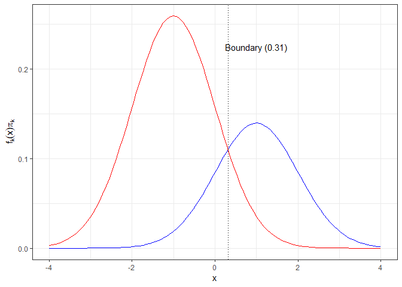
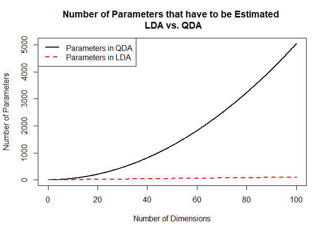

Linear vs. Quadratic Discriminant Analysis - Comparison of Algorithms
================
Pascal Schmidt
October 7, 2018

In this blog post we will be looking at the differences between Linear Discriminant Analysis (LDA) and Quadratic Discriminant Analysis (QDA). Both statistical learning methods are used for classifying observations to a class or category. So that means that our response variable is categorical. Let us get started with the **linear vs. quadratic discriminant analysis** tutorial.

What we will be covering:

-   The Bayes Classifier
-   A Quick Example of the Bayes Classifier
-   Assumptions for Linear Discriminant Analysis
-   Assumptions for Quadratic Discriminant Analysis
-   Linear vs. Quadratic Discriminant Analysis. What Algorithm Performs Better and in What Situations?


### Linear vs. Quadratic Discriminant Analysis - The Bayes Classifier

In theory, we would always like to predict a qualitative response with the Bayes classifier because this classifier gives us the lowest test error rate out of all classifiers. So why don’t we do that? Unfortunately for using the Bayes classifier, we need to know the true conditional population distribution of Y given X and the we have to know the true population parameters *σ* and *μ*.

### Linear vs. Quadratic Discriminant Analysis - An Example of the Bayes Classifier

In the plot below, we show two normal density functions which are representing two distinct classes. The variance parameters are *σ*<sub>1</sub> = *σ*<sub>2</sub> = 1 and the mean parameters are *μ*<sub>1</sub> = -1 and *μ*<sub>2</sub> = 1. There is some uncertainty to which class an observation belongs where the densities overlap. This means that the Bayes error rate will be greater than zero. We have specified *Π* = 0.35and *Π* = 0.65. By inspection of the decision boundary at 0.31 we see that the Bayes Classifier assigns the observation to class 1 if x &lt; 0.31 and to class 2 otherwise.

``` r
mu_1 <- 1
mu_2 <- (-1)
sigma <- 1
pi_1 <- 0.35
pi_2 <- 0.65
x <- seq(from = -4, to = 4, length = 100)
f_1 <- dnorm(x, mean = mu_1, sd = sigma)
f_2 <- dnorm(x, mean = mu_2, sd = sigma)
delta <- function(x, mu, sigma, pi) {
  x * mu / sigma^2 - mu^2 / (2 * sigma^2) + log(pi)
}
delta_1 <- delta(x, mu_1, sigma, pi_1)
delta_2 <- delta(x, mu_2, sigma, pi_2)
df <- data.frame(x = x, f_1 = f_1, f_2 = f_2, delta_1 = delta_1, delta_2 = delta_2)
```

``` r
library(ggplot2)
```

    ## Warning: package 'ggplot2' was built under R version 3.4.4

``` r
ggplot(df, aes(x = x)) +
  geom_line(aes(y = f_1 * pi_1), color = "blue") +
  geom_line(aes(y = f_2 * pi_2), color = "red") +
  labs(y = expression(f[k](x) * pi[k])) +
  theme_bw() +
  geom_vline(xintercept = (mu_1 + mu_2) / 2 + sigma^2 * log(pi_2 / pi_1) / (mu_1 - mu_2), linetype = "dotted") +
  annotate("text", x = 0.99, y = 0.225, label = "Boundary (0.31)")
```



In this case, the decision boundary is the Bayes decision boundary and we can compute the Bayes classifier because we know that X is drawn from a normal distribution within each class. In addition to that we know all our parameters (*σ*<sub>1</sub> = *σ*<sub>2</sub> = 1, *μ*<sub>1</sub> = -1 and *μ*<sub>2</sub> = 1, and *Π*<sub>1</sub> = 0.35 and *Π*<sub>2</sub> = 0.65).

In practice, we unfortunately cannot apply the Bayes classifier because we do not know if X is drawn from a normal distribution and we do not know our true population parameters. Therefore, we are tying to approximate the Bayes classifier with LDA and QDA. These two methods use the estimated $\\hat{\\mu}\_k$ (average of all training observations from the kth class), $\\hat{\\sigma}^2$ (weighted average of sample variances for each of the K classes), and $\\hat{\\Pi}\_k$ in the discriminant functions in order to assign an observation to a class.

### Linear Discriminant Analysis

Assumptions:

-   LDA assumes normal distributed data and a class-specific mean vector.
-   LDA assumes a common covariance matrix. So, a covariance matrix that is common to all classes in a data set.

When these assumptions hold, then LDA approximates the Bayes classifier very closely and the discriminant function produces a linear decision boundary. However, LDA also achieves good performances when these assumptions do not hold and a common covariance matrix among groups and normality are often violated.

### Quadratic Discriminant Analysis

Assumptions:

-   Observation of each class are drawn from a normal distribution (same as LDA).
-   QDA assumes that each class has its own covariance matrix (different from LDA).

When these assumptions hold, QDA approximates the Bayes classifier very closely and the discriminant function produces a quadratic decision boundary.

### Linear vs. Quadratic Discriminant Analysis

When the number of predictors is large the number of parameters we have to estimate with QDA becomes very large because we have to estimate a separate covariance matrix for each class. In the plot below, we show how many parameters we have to estimate for LDA versus QDA.

``` r
x <- seq(0, 100, length = 1000)
plot(x, ((x * (x + 1)) / 2),
  type = "l",
  col = 1,
  lwd = 2,
  main = "Number of Parameters that have to be Estimated \n LDA vs. QDA",
  xlab = "Number of Dimensions", ylab = "Number of Parameters"
)

lines(x, (x + 1),
  col = 2,
  lty = 2,
  lwd = 2
)

legend(
  x = "topleft",
  col = 1:2,
  lty = c(1, 2),
  c("Parameters in QDA", "Parameters in LDA"),
  lwd = c(2, 2)
)
```



The higher the dimension of the data set (the more predictors in a data set) the more parameters we have to estimate. This can lead to a high variance and so we have to be careful when using QDA.

In conclusion, LDA is less flexible than QDA because we have to estimate less parameters. This can be good when we have only a few observations in our training data set so we lower the variance. On the other hand, when the K classes have very different covariance matrices then LDA suffers from high bias and QDA might be a better choice. So, what is comes down to is the bias-variance trade-off. Therefore, it is crucial to test the underlying assumptions of LDA and QDA on the data set and then use both methods to decide which one is more appropriate.

### Additional resources for Linear vs. Quadratic Discriminant Analysis:

-   If you want to see the two algorithms in action, [this tutorial](http://thatdatatho.com/2018/02/19/assumption-checking-lda-vs-qda-r-tutorial-2/) presents the Pima Indians data set with the assumptions of LDA and QDA.
-   In [this tutorial](http://thatdatatho.com/2018/04/02/classification-quadratic-vs-linear-discriminant-analysis-pima-indians-data-set/), we implemented these two algorithms on the Pima Indians data set and evaluated which one performs better.
-   [Here](http://thatdatatho.com/2018/04/09/r-shiny-app-discriminant-analysis/), you can find a shiny app about linear vs. quadratic discriminant analysis for the Pima Indians data set.

I hope you have enjoyed the Linear vs. Quadratic Discriminant Analysis tutorial. If you have any questions, let me know in the comments below.
