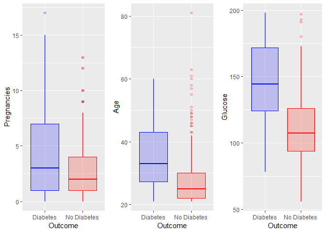
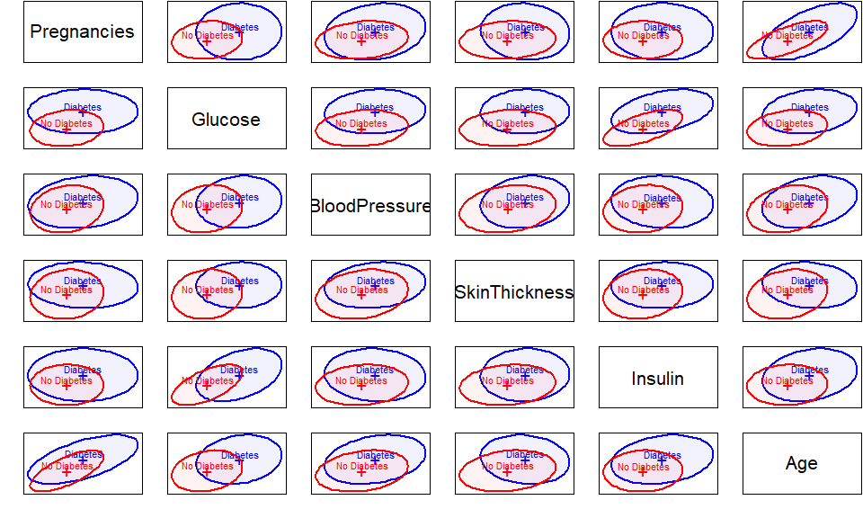
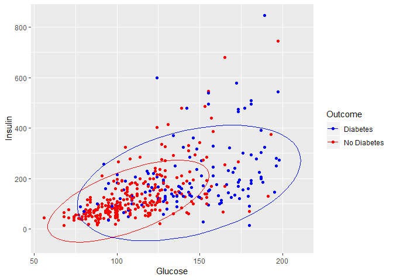
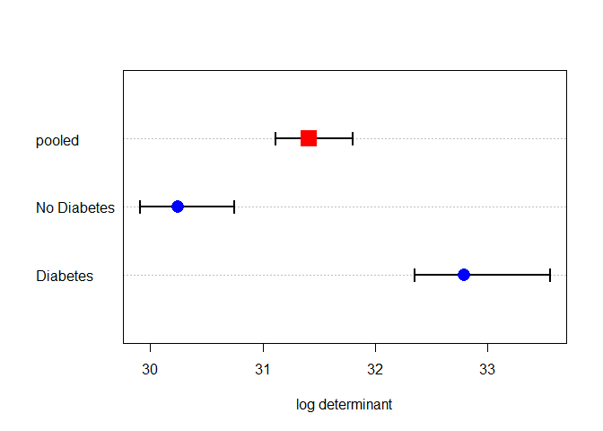
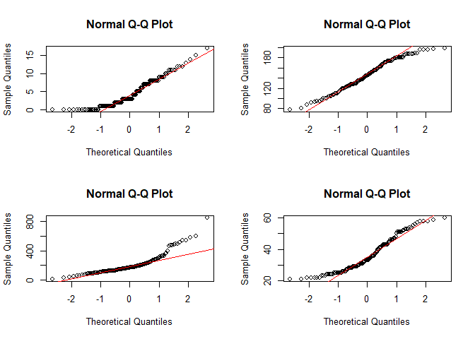
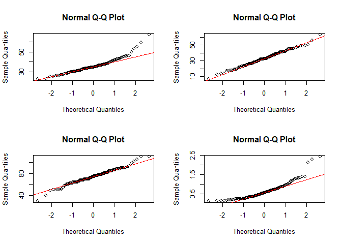
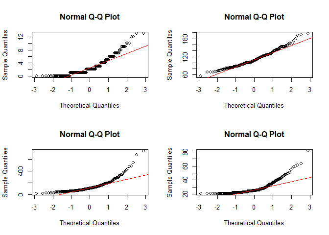
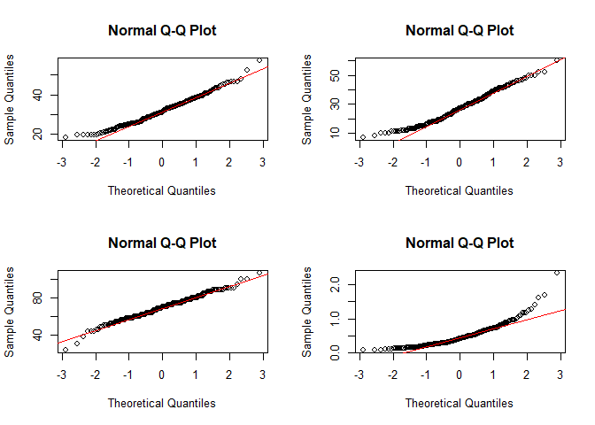
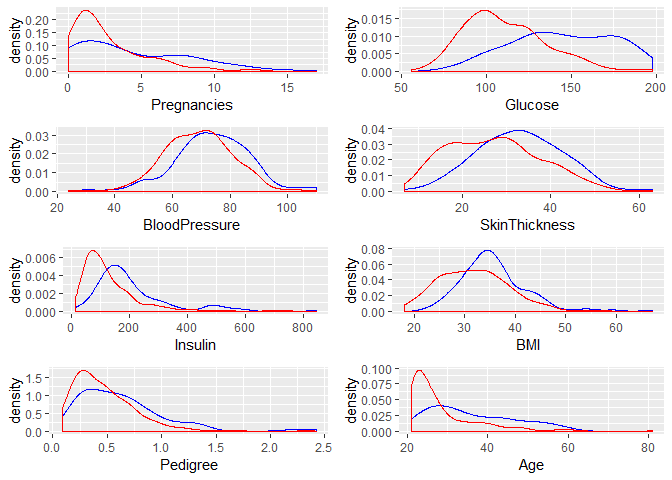

Assumption Checking LDA vs. QDA R Tutorial
================
Pascal Schmidt
January 5, 2018

``` r
library(heplots)
library(ggplot2)
library(dplyr)
library(gridExtra)
library(here)
```


``` r
# reading in the data
diabetes <- read.csv(here::here("docs", "diabetes.csv"))
```

### Data Preparation

``` r
head(diabetes, 3)
```

    ##   Pregnancies Glucose BloodPressure SkinThickness Insulin  BMI
    ## 1           6     148            72            35       0 33.6
    ## 2           1      85            66            29       0 26.6
    ## 3           8     183            64             0       0 23.3
    ##   DiabetesPedigreeFunction Age Outcome
    ## 1                    0.627  50       1
    ## 2                    0.351  31       0
    ## 3                    0.672  32       1

``` r
dim(diabetes)
```

    ## [1] 768   9

``` r
diabetes <- dplyr::rename(diabetes, Pedigree = DiabetesPedigreeFunction)
```

When examining the data frame, we notice that there are some people with an insulin level of zero. Insulin levels are very important in determining if someone has diabetes or not and an insulin level of 0 is not possible. Therefore, we are deciding to throw away all observations that have an insulin level of 0.

``` r
ins_zero <- subset(diabetes, Insulin == 0)
nrow(ins_zero)
```

    ## [1] 374

``` r
nrow(diabetes)
```

    ## [1] 768

Given that we only have 768 observation, it hurts very much that we have to throw away almost half of our observations. One could do the analysis without insulin or impute the missing insulin level based on the fact that someone has diabetes or not. In addition to the zero values in the insulin column, there are also zero values in columns two to six. We are going to remove these values as well.

``` r
diabetes[, 2:6][diabetes[, 2:6] == 0] <- NA # replaces all zero values from column two to six with NA

diabetes <- na.omit(diabetes) # now we omit all NA values

nrow(diabetes) # at the end, we are left with 392 observations for our analysis
```

    ## [1] 392

``` r
diabetes$Outcome <- ifelse(diabetes$Outcome == 1, "Diabetes", "No Diabetes") # we substitute ones with "Diabetes" and zeros with "No Diabetes"
```

### Ckecking Assumption of Equal Variance-Coavariance matrices

We want to use LDA and QDA in order to classify our observations into diabetes and no diabetes. From this post we know our assumptions of LDA and QDA so let's check them:

First, in order to get a sense of our data and if we have equal variances among each class, we can use a boxplots.

``` r
plot <- list()

box_variables <- c("Pregnancies", "Age", "Glucose")
for(i in box_variables) {
  plot[[i]] <- ggplot(diabetes, aes_string(x = "Outcome", y = i, col = "Outcome", fill = "Outcome")) + 
    geom_boxplot(alpha = 0.2) + 
    theme(legend.position = "none") + 
    scale_color_manual(values = c("blue", "red")) +
    scale_fill_manual(values = c("blue", "red"))
}

do.call(grid.arrange, c(plot, nrow = 1))
```



The three diferent boxplots show us that the length of each plot clearly differs. This is an indication for non equal variances.

We can examine further the assumption of homogeneity of variance covariance matrices by plotting covariance ellipses.

``` r
heplots::covEllipses(diabetes[,1:8], 
                     diabetes$Outcome, 
                     fill = TRUE, 
                     pooled = FALSE,  
                     col = c("blue", "red"), 
                     variables = c(1:5, 8), 
                     fill.alpha = 0.05)
```



From these plots, there might be a problem of heterogeneity because we can see that the Diabetes group has most of the time the largest variances. Meaning, that the ellipse of this group is most of the time wider than the one for the non diabetic group.

Let us examine the ellipseses for Glucose and Insulin.

``` r
ggplot(diabetes, aes(x = Glucose, y = Insulin, col = Outcome)) + 
  geom_point() +
  stat_ellipse() +
  scale_color_manual(values = c("blue", "red"))
```



From this scatterplot, we can clearly see that the varaince for the diabetes group is much wider than the variance from the non diabetes group. This is becuase the blue points have a wider spread. The red points in contrast do not have as wide of a spread as the blue points.

We are using the BoxM test in order to check our assumption of homogeneity of variance-covariance matrices.

*H*<sub>*o*</sub> = Covariance matrices of the outcome variable are equal across all groups

*H*<sub>*a*</sub> = Covariance matrices of the outcome variable are different for at least one group

``` r
boxm <- heplots::boxM(diabetes[, c(1:5, 8)], 
                      diabetes$Outcome) # using columns 1 to 5 and 8
boxm
```

    ## 
    ##  Box's M-test for Homogeneity of Covariance Matrices
    ## 
    ## data:  diabetes[, c(1:5, 8)]
    ## Chi-Sq (approx.) = 121.31, df = 21, p-value = 4.112e-16

When are choosing our alpha to be 0.05 then from our result we can conclude that we have a problem of heterogeneity of variance-covariance matrices. The plot below gives information of how the groups differ in the components that go into Box's M test.

``` r
plot(boxm)
```



The log determinants are ordered according to the sizes of the ellipses we saw in the covariance ellipse plots. This plot confirms our visualizations that we have ellipses of different sizes and therefore, no equal varoance-covariance matrices. It is worth noting that the Box M test is sensitive and can detect even small departures from homogeneity.

As an additional check, we can perform a levene test to check for equal variances.

``` r
leveneTest(Pregnancies ~ Outcome, diabetes)
```

    ## Levene's Test for Homogeneity of Variance (center = median)
    ##        Df F value    Pr(>F)    
    ## group   1  28.653 1.481e-07 ***
    ##       390                      
    ## ---
    ## Signif. codes:  0 '***' 0.001 '**' 0.01 '*' 0.05 '.' 0.1 ' ' 1

From this test, we can see how the variances of the groups differ for pregnancies. They also differ for the variables Age, Glucose, and Insulin (not shown).

``` r
leveneTest(BloodPressure ~ Outcome, diabetes)
```

    ## Levene's Test for Homogeneity of Variance (center = median)
    ##        Df F value Pr(>F)
    ## group   1  0.5761 0.4483
    ##       390

For BloodPressure, the variance seems to be equal. This is also the case for SkinThickness, and BMI (not shown).

``` r
diab.yes <- subset(diabetes, Outcome == "Diabetes")
diab.no <- subset(diabetes, Outcome == "No Diabetes")
```

### Checking Assumption of Normality

With the following qqplots, we are checking that the distribution of the predictors is normally distributed within the diabetes group and non diabetes group.

#### Diabetes Group

``` r
variable_1 <- c("Pregnancies", "Glucose", "Insulin", "Age")

par(mfrow = c(2, 2))
for(i in variable_1) {
  qqnorm(diab.yes[[i]]); qqline(diab.yes[[i]], col = 2)
}
```



When looking at the distribution of Glucose, we can see that it is roughly normally distributed because the dots fall on the red line. We can see that the tails of the distribution are thicker than the tails from a normal distribution because the points deviate from the line at the left and at the right from the plot.

We can see that the distribution of the variable Pregnancies is not normally distributed because the points deviate from the line very much.

Insulin and age are also not normally distributed. The curve pattern in the plot is in the shape of a bow which indicated skewing. The points are above the line, then below it, and then above it again. This indicated that the skewing is to the right.

``` r
variable_2 <- c("BMI", "SkinThickness", "BloodPressure", "Pedigree")

par(mfrow = c(2, 2))
for(i in variable_2) {
  qqnorm(diab.yes[[i]]); qqline(diab.yes[[i]], col = 2)
}
```



The variables skin thickness and blood pressure look like they are normally distributed. The down-swing at the left and up-swing at the right of the plot for the blood pressure variable suggests that the distribution is heavier-tailed than the theoretical normal distribution.

For the BMI variable, the points swing up substantially at the right of the plot. These points might be outliers but we cannot infer that by looking at these plots.

The distribution for the pedigree function variable looks again right skewed and not normally distributed.

If one wants to test for normality, the shapito.test function is an option. Here is an example of how to use it:

``` r
shapiro.test(diab.yes$SkinThickness)
```

    ## 
    ##  Shapiro-Wilk normality test
    ## 
    ## data:  diab.yes$SkinThickness
    ## W = 0.99547, p-value = 0.9571

The null hypothesis is that the data is normally distributed. Based on the results, we fail to reject the null hypothesis and conclude that the data is normally distributed for skin thickness.

#### Non Diabetes Group

``` r
par(mfrow = c(2, 2))
for(i in variable_1) {
  qqnorm(diab.no[[i]]); qqline(diab.no[[i]], col = 2)
}
```



All variables do not seem to be normally distributed and all distributions seem to be right skewed based on the bow shape of the points in all four plots

``` r
par(mfrow = c(2, 2))
for(i in variable_2) {
  qqnorm(diab.no[[i]]); qqline(diab.no[[i]], col = 2)
}
```



BMI, skin thickness, and bloodpressure seem to be roughly normally distributed whereas the pedigree function has this bow shape which suggests it is right skewed.

Another visualization technique is to plot the density of the predictors for each group. Through the plots below, we can detect if the predictors in each group are normally distributed and we can also check for equal variance.

``` r
plot <- list()
for(i in names(diabetes)[-9]){
  plot[[i]] <- ggplot(diabetes, aes_string(x = i, y = "..density..", col = "Outcome")) + 
    geom_density(aes(y = ..density..)) + 
    scale_color_manual(values = c("blue", "red")) + 
    theme(legend.position = "none")
}

do.call(grid.arrange, c(plot, nrow = 4))
```



From the plots above we can conclude, that a lot of distributions are right skewed and that the variance is often also different. One way to deal with right-skewed distributions is to take the log of the variables.
