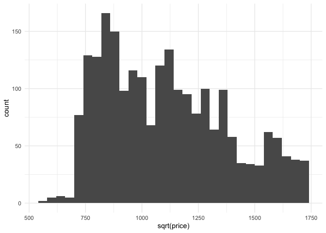
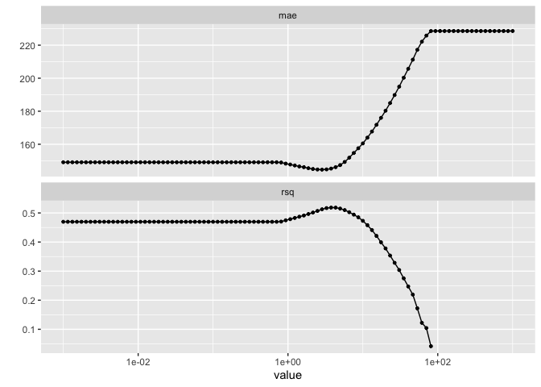
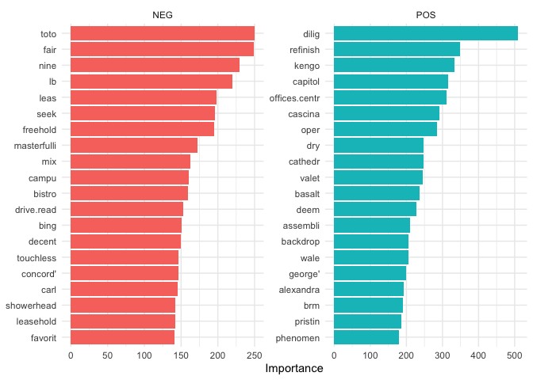
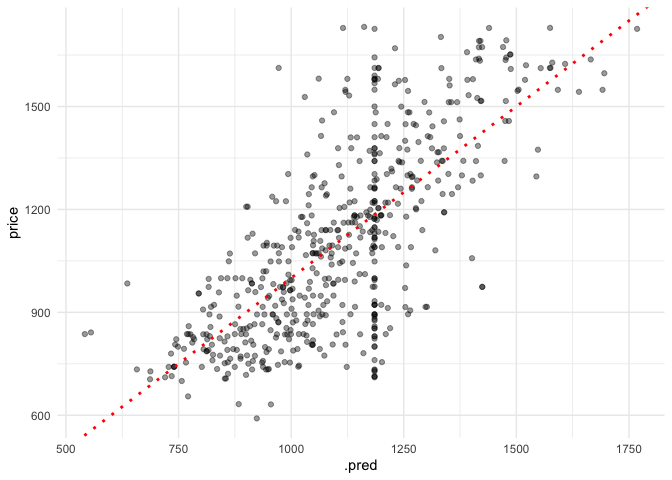

NLP Housing Predictions
================

In this tutorial we will be predicting housing prices based on their
descriptions. We will be using natural language processing, NLP, to
build a machine learning model. We will be using bag of words with
column vectors of ones and zeros. If you want to reproduce the analysis
or check out the code then you can check out my github.

First, let’s load the necessary libraries and load the data set.

``` r
library(tidyverse)
library(tidymodels)
library(textrecipes)
library(parallel)
```

``` r
housing <- readr::read_csv("data/df.csv")
```

``` r
# removes houses with missing (unrealistic) year_built values
housing <- housing[which(housing$year_built < 2030), ]

# remove houses that cost more than 3 million
housing <- housing[which(housing$price < 3000000), ]

# remove square feet that are too low 
housing <- housing[which(housing$sqft > 100), ]

housing <- housing %>% 
  dplyr::select(price, description, website) %>% 
  dplyr::filter(website == "buying") %>% 
  na.omit() %>% 
  dplyr::select(-website) %>% 
  dplyr::mutate(description = stringr::str_remove_all(description, "[0-9]+"))

dplyr::glimpse(housing)
```

    ## Rows: 2,244
    ## Columns: 2
    ## $ price       <dbl> 1188000, 1288000, 2399000, 1315000, 2850000, 2699000, 259…
    ## $ description <chr> "prestigious concrete air-conditioned boutique building i…

``` r
ggplot(housing, aes(x = sqrt(price))) +
  geom_histogram(binwidth = 40) +
  theme_minimal() 
```

<!-- -->

``` r
ggsave("pngs/histo.png")
```

We have the price of the condo and the description of the house.

Next, I am creating a vector with stop words that I want to exclude from
the analysis. These are words that I am not interested in and that seem
to add no value to the analysis.

``` r
remove_words <- c("https", "bldg", "covid", "sqft", "bdrms",
                  "only.read", "included.read", "moreview", "&amp",
                  "baths", "bdrm", "bath", "feet", "square", "amp",
                  "sq.ft", "beds", "you’ll", "uniqueaccommodations.com",
                  "rentitfurnished.com", "it’s", "http", "below:https",
                  "change.a", "january", "february", "march", "april", 
                  "may", "june", "july", "september", "october", "listing.to", 
                  "november", "december", "note:all", "property.to", "link:http",
                  "www.uniqueaccomm", "www.uniqueaccomm", "change.to", "furnishedsq",
                  "craigslist.rental", "craigslist.professional", "ft.yaletown",
                  "ft.downtown")

recipe_nlp <- recipe(price ~., data = housing) %>% 
  recipes::step_sqrt(price) %>% 
  textrecipes::step_tokenize(description) %>%  
  textrecipes::step_stem(description) %>% 
  textrecipes::step_stopwords(description) %>% 
  textrecipes::step_stopwords(description, 
                              custom_stopword_source = remove_words) %>%
  textrecipes::step_tokenfilter(description, max_tokens = 2500) %>%
  textrecipes::step_tf(description, weight_scheme = "binary") %>% 
  recipes::step_mutate_at(dplyr::starts_with("tf_"), fn = as.integer)
```

``` r
set.seed(123)

split <- rsample::initial_split(housing)
train <- rsample::training(split)
test <- rsample::testing(split)
folds <- rsample::vfold_cv(train, v = 10)
```

``` r
tune_spec <- parsnip::linear_reg(penalty = tune::tune(), mixture = 1) %>%
  parsnip::set_engine("glmnet")

lambda_grid <- dials::grid_regular(dials::penalty(range = c(-3, 3)), levels = 100)

nlp_wflow <-
  workflows::workflow() %>%
  workflows::add_recipe(recipe_nlp) %>%
  workflows::add_model(tune_spec)

all_cores <- parallel::detectCores()
all_cores
```

    ## [1] 12

``` r
library(doFuture)
#doFuture::registerDoFuture()
cl <- makeCluster(all_cores)
plan(cluster, workers = cl)
```

``` r
res <-
  nlp_wflow %>%
  tune::tune_grid(
    resamples = folds,
    grid = lambda_grid,
    metrics = yardstick::metric_set(yardstick::mae,
                                    yardstick::rsq)
    )

autoplot(res)
```

<!-- -->

``` r
tune::collect_metrics(res) %>% 
  dplyr::filter(.metric == "mae") %>% 
  dplyr::arrange() %>% 
  .[["mean"]] %>% 
  .[[1]] 
```

    ## [1] 149.0941

``` r
best_mae <- tune::select_best(res, "mae")

final_lasso <- tune::finalize_workflow(
  nlp_wflow, 
  best_mae
  )
final_lasso
```

    ## ══ Workflow ════════════════════════════════════════════════════════════════════
    ## Preprocessor: Recipe
    ## Model: linear_reg()
    ## 
    ## ── Preprocessor ────────────────────────────────────────────────────────────────
    ## 8 Recipe Steps
    ## 
    ## ● step_sqrt()
    ## ● step_tokenize()
    ## ● step_stem()
    ## ● step_stopwords()
    ## ● step_stopwords()
    ## ● step_tokenfilter()
    ## ● step_tf()
    ## ● step_mutate_at()
    ## 
    ## ── Model ───────────────────────────────────────────────────────────────────────
    ## Linear Regression Model Specification (regression)
    ## 
    ## Main Arguments:
    ##   penalty = 2.8480358684358
    ##   mixture = 1
    ## 
    ## Computational engine: glmnet

``` r
housing_final <- tune::last_fit(
  final_lasso, 
  split,
  metrics = yardstick::metric_set(yardstick::mae,
                                  yardstick::rsq)
)
tune::collect_metrics(housing_final)
```

    ## # A tibble: 2 x 4
    ##   .metric .estimator .estimate .config             
    ##   <chr>   <chr>          <dbl> <chr>               
    ## 1 mae     standard     146.    Preprocessor1_Model1
    ## 2 rsq     standard       0.528 Preprocessor1_Model1

``` r
tune::collect_metrics(housing_final)$.estimate
```

    ## [1] 146.368329   0.527883

``` r
housing_vip <- housing_final %>% 
  pull(.workflow) %>% 
  .[[1]] %>% 
  workflows::pull_workflow_fit() %>% 
  vip::vi()
```

``` r
housing_vip %>% 
  dplyr::mutate(Variable = stringr::str_remove(Variable, "tf_description_")) %>% 
  dplyr::group_by(Sign) %>%
  dplyr::slice_max(abs(Importance), n = 20) %>%
  ungroup() %>%
  mutate(
    Variable = fct_reorder(Variable, Importance)
  ) %>% 
  ggplot(aes(Importance, Variable, fill = Sign)) +
  geom_col() +
  facet_wrap(~Sign, scales = "free") +
  labs(y = NULL) +
  theme_minimal() +
  theme(legend.position = "none")
```

<!-- -->

``` r
ggsave("pngs/bar_words.png")
```

``` r
tune::collect_predictions(housing_final) %>%
  ggplot(aes(x = .pred, y = price)) +
  geom_point(alpha = 0.4) +
  geom_abline(slope = 1, linetype = "dotted", 
              col = "red", size = 1) +
  theme_minimal()
```

<!-- -->

``` r
ggsave("pngs/preds_scatter.png")

tune::collect_predictions(housing_final) %>% 
  dplyr::mutate(mae = abs(.pred^2 - price^2)) %>% 
  .[["mae"]] %>% 
  mean()
```

    ## [1] 332929.3
